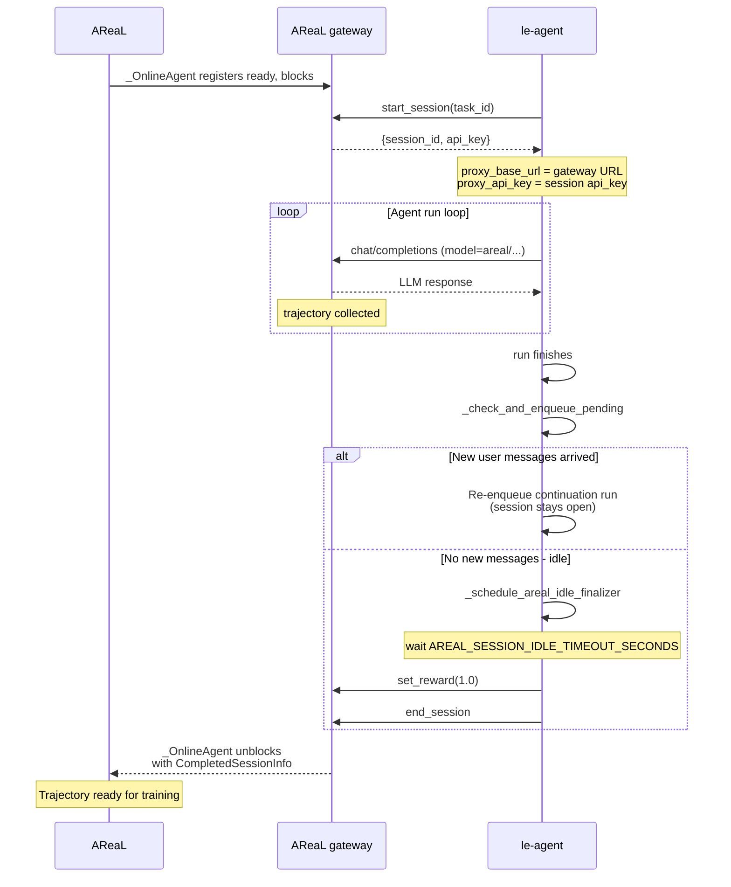

# Triggered Training

This directory configures online AReaL training from externally triggered le-agent
sessions. It still uses `areal.trainer.rl_trainer.PPOTrainer` for the rollout and
training loop, but `train_triggered_sft_loss.py` patches the actor update to use an
SFT-style masked negative-log-likelihood loss instead of the default PPO/GRPO objective.

Run it with:

```bash
uv run customized_areal/tiggered_training/train_triggered_sft_loss.py \
  --config customized_areal/tiggered_training/config_Qwen3-5L-9B_trggered_training.yaml
```

## Training Behavior

- `rollout.agent.mode: online` makes `PPOTrainer` use its internal empty dataloader and
  wait for external sessions through `OpenAIProxyWorkflow`.
- `workflow=None` tells the rollout engine to use the online proxy workflow instead of
  constructing a local agent.
- `TriggeredSFTFSDPPPOActor` is sent to RPC workers as the actor engine class, so
  worker-side `PPOActor._ppo_update` is patched before model training starts.
- `triggered_sft_loss_fn` trains on rollout completion tokens where `loss_mask == 1`,
  computing `-mean(log p_theta(token))`.
- Rewards are still logged for observability, but they do not scale the actor loss in
  this mode.

## Online Session Lifecycle

When AReaL runs in online mode, le-agent and AReaL cooperate through the bridge to
collect trajectories. Each training sample follows this lifecycle:

1. AReaL's `_OnlineAgent` registers as ready on the proxy gateway, then blocks waiting
   for an external session.
1. le-agent calls `start_session` and receives `session_id` plus `api_key`. That API key
   and gateway URL become the agent's `proxy_api_key` and `proxy_base_url`, routing LLM
   calls through AReaL's proxy gateway.
1. The agent runs and sends `/chat/completions` requests through the bridge using model
   names starting with `areal/`. AReaL records those interactions as the training
   trajectory.
1. When the agent run finishes, `_check_and_enqueue_pending` checks whether new user
   messages arrived during execution.
   - New messages found: re-enqueue a continuation run with the same session.
   - No new messages: schedule `_schedule_areal_idle_finalizer`.
1. After `AREAL_SESSION_IDLE_TIMEOUT_SECONDS` with no active run, the finalizer calls
   `set_reward(1.0)` and then `end_session`.
1. `_OnlineAgent` unblocks with `CompletedSessionInfo`, and AReaL exports the trajectory
   for the training step.



## Bridge Channels

| Channel              | Path                      | Group         | Stub host | Executor host |
| -------------------- | ------------------------- | ------------- | --------- | ------------- |
| `rl_start_session`   | `/rl/start_session`       | `gateway`     | le-agent  | AReaL         |
| `rl_set_reward`      | `/rl/set_reward`          | `gateway`     | le-agent  | AReaL         |
| `rl_end_session`     | `/rl/end_session`         | `gateway`     | le-agent  | AReaL         |
| `chat_completions`   | `/chat/completions`       | `gateway`     | le-agent  | AReaL         |
| `agent_start`        | `/api/agent/start`        | `leagent_api` | AReaL     | le-agent      |
| `agent_start_branch` | `/api/agent/start-branch` | `leagent_api` | AReaL     | le-agent      |

The le-agent SSE stream (`/api/tasks/{id}/stream`) is intentionally not bridged: AReaL's
`_wait_for_agent_run` already falls back to polling the shared `agent_runs` / `tasks`
tables directly.

## Files

- `config_Qwen3-5L-9B_trggered_training.yaml`: online rollout config using two GPUs, one
  for SGLang inference and one for FSDP training.
- `sft_loss.py`: local PPO actor patch and SFT-style loss implementation.
- `train_triggered_sft_loss.py`: explicit entrypoint that applies the patch and runs
  `PPOTrainer`.
