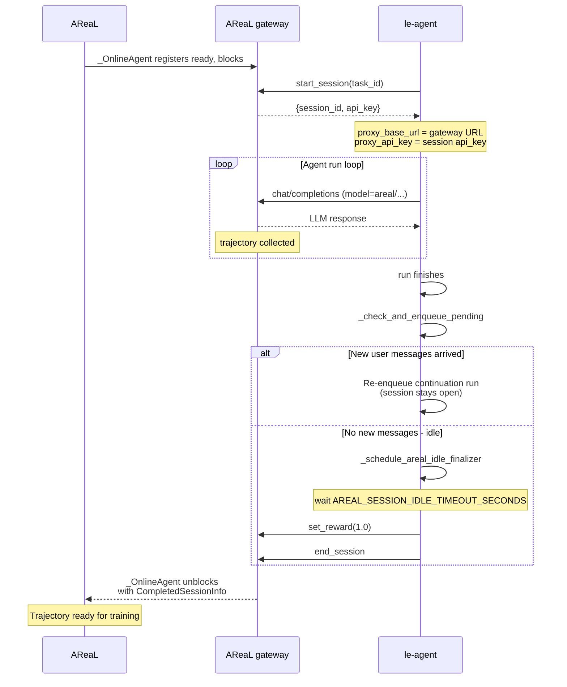

# Triggered Training

This directory configures online AReaL training from externally triggered le-agent
sessions. It still uses `areal.trainer.rl_trainer.PPOTrainer` for the rollout and
training loop. `train_triggered_sft_loss.py` supports two actor-loss modes:

- `--loss-mode sft` patches the actor update to use an SFT-style masked
  negative-log-likelihood loss. This is the default and preserves the original behavior.
- `--loss-mode grpo` keeps AReaL's stock PPO actor update, which calls `grpo_loss_fn`
  after computing group-normalized advantages.

Run it with:

```bash
uv run customized_areal/tiggered_training/train_triggered_sft_loss.py \
  --config customized_areal/tiggered_training/config_Qwen3-5L-9B_trggered_training.yaml \
  --loss-mode sft
```

Run online GRPO with a group size of 4:

```bash
uv run customized_areal/tiggered_training/train_triggered_sft_loss.py \
  --config customized_areal/tiggered_training/config_Qwen3-5L-9B_trggered_training.yaml \
  --loss-mode grpo \
  gconfig.n_samples=4 \
  train_dataset.batch_size=1
```

## Training Behavior

- `rollout.agent.mode: online` makes `PPOTrainer` use its internal empty dataloader and
  wait for external sessions through `OpenAIProxyWorkflow`.
- `workflow=None` tells the rollout engine to use the online proxy workflow instead of
  constructing a local agent.
- In SFT mode, `TriggeredSFTFSDPPPOActor` is sent to RPC workers as the actor engine
  class, so worker-side `PPOActor._ppo_update` is patched before model training starts.
  `triggered_sft_loss_fn` trains on rollout completion tokens where `loss_mask == 1`,
  computing `-mean(log p_theta(token))`. Rewards are logged for observability but do not
  scale the actor loss.
- In GRPO mode, no actor patch is installed. The standard `PPOActor._compute_advantages`
  and `PPOActor._ppo_update` path is used, and `_ppo_update` calls `grpo_loss_fn`. The
  launcher sets `actor.adv_norm` to group mean/std normalization and sets
  `actor.adv_norm.group_size = gconfig.n_samples`.

## GRPO Online Group Sampling

For online triggered training, one "query" is one item from PPOTrainer's internal empty
dataloader. The real prompt/user state comes from the external le-agent session, not
from the dataloader item.

When `gconfig.n_samples = K`, `PPOTrainer.train()` calls:

```python
actor.prepare_batch(..., group_size=config.gconfig.n_samples)
```

The rollout controller wraps the online proxy workflow in `GroupedRolloutWorkflow`. For
each dataloader item, that wrapper runs the inner workflow `K` times:

1. Each inner `OpenAIProxyWorkflow.arun_episode()` grants proxy capacity.
1. Because `rollout.agent.mode == "online"`, `_OnlineAgent` waits for one external
   le-agent session to start and finish.
1. The completed session is exported with `proxy_client.export_interactions(...)` as one
   trajectory.
1. After `K` valid sessions complete, `GroupedRolloutWorkflow` merges their exported
   interactions into one grouped trajectory.
1. During training, AReaL sees the grouped trajectory as `K` samples for the same query.
   Rewards are normalized within that group, producing relative GRPO advantages: roughly
   `(reward_i - mean(group_rewards)) / std(group_rewards)`.

Operationally, if `gconfig.n_samples=4`, one optimizer step with
`train_dataset.batch_size=1` waits for four completed online sessions before it has one
GRPO group. If one session returns no model interactions, it is rejected; the rollout
controller continues collecting until the batch contains accepted grouped trajectories.

## Online Session Lifecycle

When AReaL runs in online mode, le-agent and AReaL cooperate through the bridge to
collect trajectories. Each training sample follows this lifecycle:

1. AReaL's `_OnlineAgent` registers as ready on the proxy gateway, then blocks waiting
   for an external session.
1. le-agent calls `start_session` and receives `session_id` plus `api_key`. That API key
   and gateway URL become the agent's `proxy_api_key` and `proxy_base_url`, routing LLM
   calls through AReaL's proxy gateway.
1. The agent runs and sends `/chat/completions` requests through the bridge using model
   names starting with `areal/`. AReaL records those interactions as the training
   trajectory.
1. When the agent run finishes, `_check_and_enqueue_pending` checks whether new user
   messages arrived during execution.
   - New messages found: re-enqueue a continuation run with the same session.
   - No new messages: schedule `_schedule_areal_idle_finalizer`.
1. After `AREAL_SESSION_IDLE_TIMEOUT_SECONDS` with no active run, the finalizer calls
   `set_reward(1.0)` and then `end_session`.
1. `_OnlineAgent` unblocks with `CompletedSessionInfo`, and AReaL exports the trajectory
   for the training step.



## Bridge Channels

| Channel              | Path                      | Group         | Stub host | Executor host |
| -------------------- | ------------------------- | ------------- | --------- | ------------- |
| `rl_start_session`   | `/rl/start_session`       | `gateway`     | le-agent  | AReaL         |
| `rl_set_reward`      | `/rl/set_reward`          | `gateway`     | le-agent  | AReaL         |
| `rl_end_session`     | `/rl/end_session`         | `gateway`     | le-agent  | AReaL         |
| `chat_completions`   | `/chat/completions`       | `gateway`     | le-agent  | AReaL         |
| `agent_start`        | `/api/agent/start`        | `leagent_api` | AReaL     | le-agent      |
| `agent_start_branch` | `/api/agent/start-branch` | `leagent_api` | AReaL     | le-agent      |

The le-agent SSE stream (`/api/tasks/{id}/stream`) is intentionally not bridged: AReaL's
`_wait_for_agent_run` already falls back to polling the shared `agent_runs` / `tasks`
tables directly.

## Files

- `config_Qwen3-5L-9B_trggered_training.yaml`: online rollout config using two GPUs, one
  for SGLang inference and one for FSDP training.
- `sft_loss.py`: local PPO actor patch and SFT-style loss implementation.
- `train_triggered_sft_loss.py`: explicit entrypoint that applies the patch and runs
  `PPOTrainer`.
