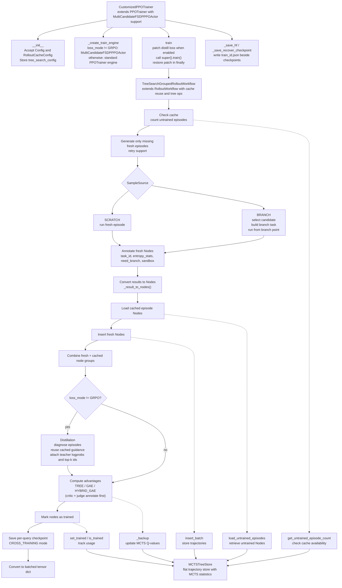
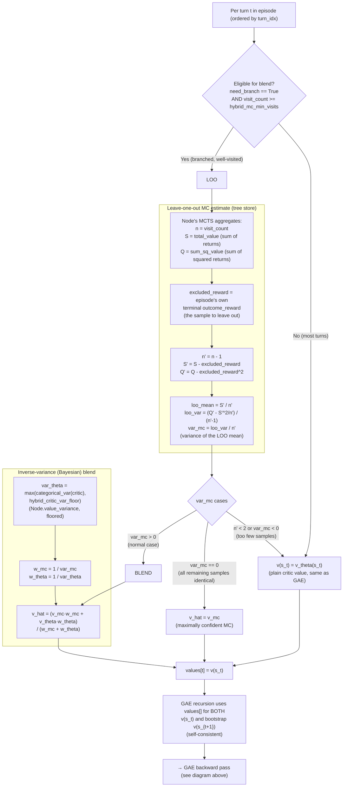
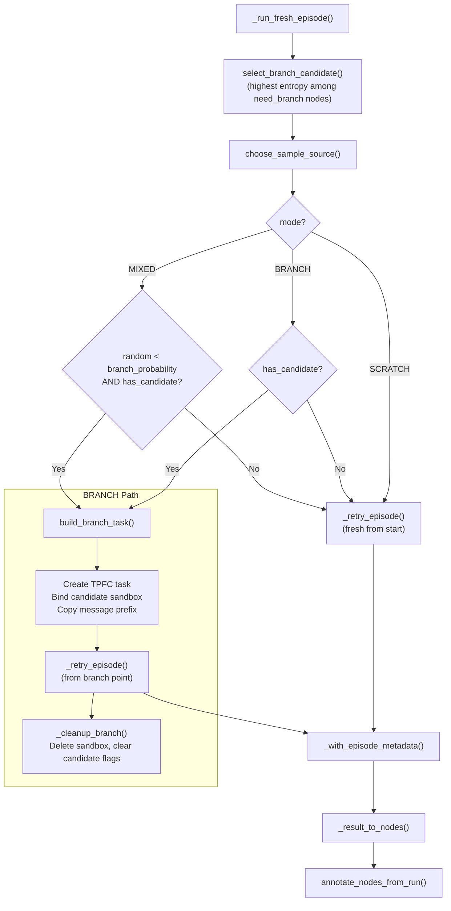
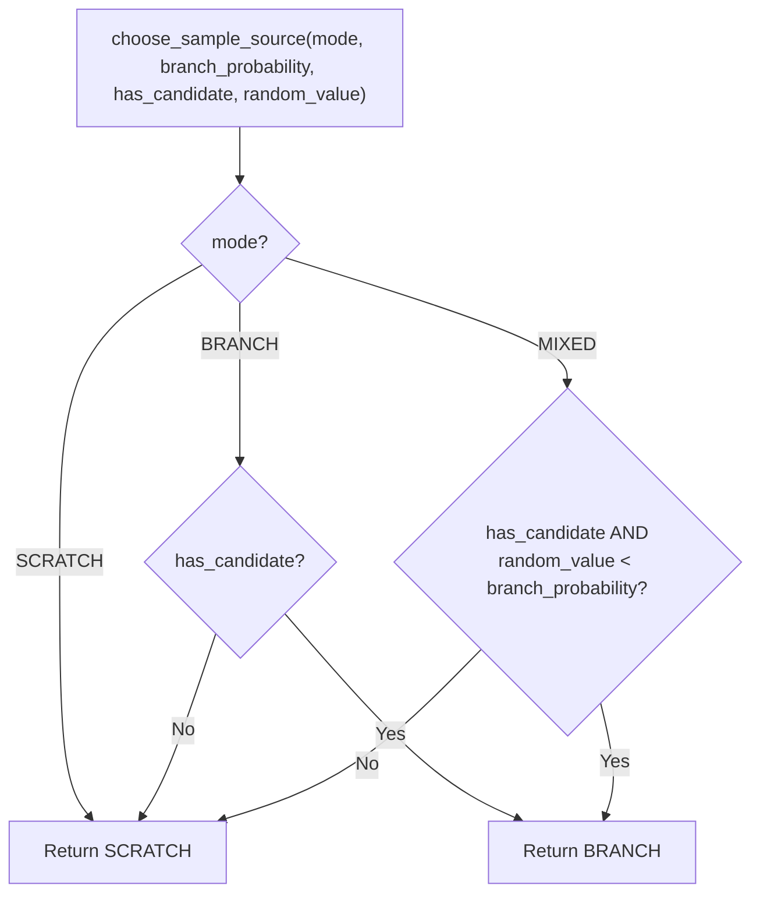
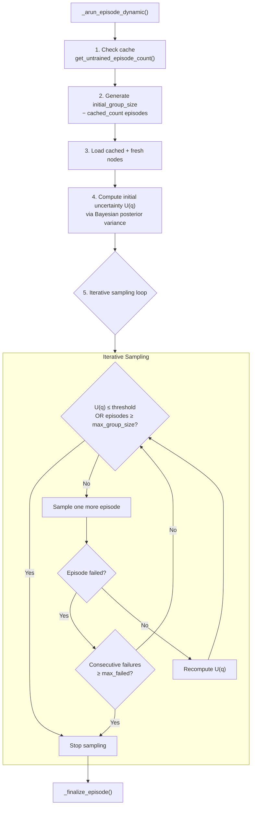
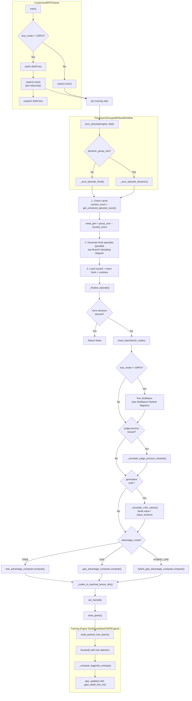
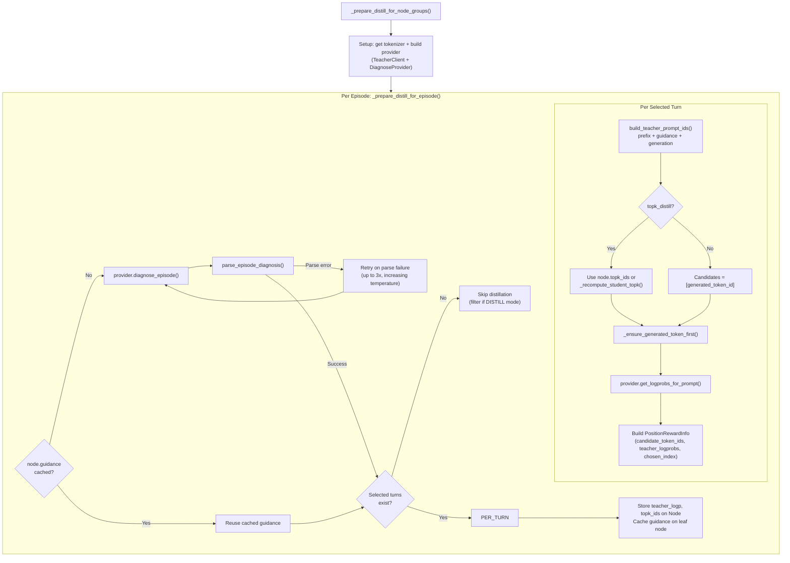
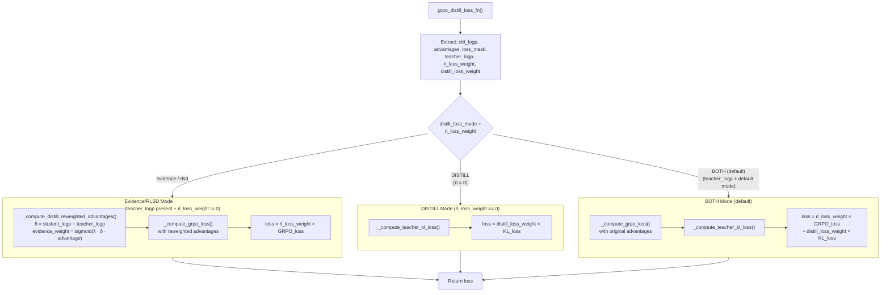

# Tree Search: MCTS Tree Cache, Branching, Backup for PPO Training, and Experience-Guided Distilling

This module replaces GAE advantage computation with MCTS tree backup Q-values, enabling
rollout caching across training steps. It also supports on-policy distillation with a
teacher model, and branch sampling from cached trajectories. It is a customization layer
on top of AReaL's `PPOTrainer`.

## Two "Tree" Concepts

This system uses **two distinct tree concepts** that work together:

1. **MCTS Tree Search** (`tree_search/core/`): Organizes rollouts into a tree structure
   for caching, advantage computation, and episode management. Each `Node` represents
   one turn with parent-child relationships.

1. **Tree Attention (Trie Packing)** (`areal/models/tree_attn/`): Packs sequences with
   shared prefixes into a compressed trie (`TrieNode`) for efficient attention
   computation during training. Shared prefix tokens are computed only once,
   dramatically reducing training cost.

These two trees are **unrelated data structures** that operate at different layers:

- **MCTS Tree** is a logical structure for RL (episodes, turns, rewards)
- **Trie** is a physical packing structure for efficient transformer attention

## Architecture Overview



## Component Reference

### 1. Config (`config.py`)

Dataclasses controlling tree backup, caching, and advantage computation.

| Class                | Field                     | Type            | Default                   | Description                                               |
| -------------------- | ------------------------- | --------------- | ------------------------- | --------------------------------------------------------- |
| `Config`             | `mode`                    | `CacheMode`     | `OFF`                     | Controls when/how tree backup activates                   |
|                      | `enabled`                 | `bool`          | `True`                    | Enable/disable tree backup                                |
|                      | `checkpoint_dir`          | `str`           | `""`                      | Directory for MCTS tree checkpoints                       |
|                      | `advantage_mode`          | `AdvantageMode` | `TREE`                    | TREE (Q-values), GAE, or HYBRID_GAE (LOO-MC blend)        |
|                      | `hybrid_mc_min_visits`    | `int`           | `5`                       | Min node visit count for LOO-MC substitution (HYBRID_GAE) |
|                      | `hybrid_critic_var_floor` | `float`         | `1e-3`                    | Floor on critic categorical variance in the blend         |
|                      | `branch_td_threshold`     | `float`         | `0.0`                     | Min \|TD-error\| for branch candidate eligibility (0 = entropy-only) |
|                      | `enable_generative_critic` | `bool`         | `False`                   | Enable shared-model generative critic (forces GAE/HYBRID_GAE) |
|                      | `critic_avg_success_rate` | `float`         | `0.29`                    | Avg dataset success rate embedded in the critic prompt    |
|                      | `critic_gamma`            | `float`         | `1.0`                     | GAE discount                                               |
|                      | `critic_lambda`           | `float`         | `0.95`                    | GAE lambda                                                 |
|                      | `critic_score_max`        | `int`           | `10`                      | Max integer score label (`0..score_max`)                   |
|                      | `critic_target_scale`     | `float`         | `1.0`                     | Divisor applied to `q_value` before clamping to `[0, 1]`   |
|                      | `critic_max_new_tokens`   | `int`           | `1024`                    | Max tokens for critic generation                           |
|                      | `critic_temperature`      | `float`         | `0.0`                     | Critic generation temperature                              |
|                      | `critic_loss_weight`      | `float`         | `1.0`                     | Weight of the critic regression term in the combined loss  |
|                      | `critic_mc_weight`        | `float`         | `1.0`                     | TD/MC blend weight `w` (1 = pure MCTS, 0 = pure n-step TD) |
|                      | `critic_td_n_steps`       | `int`           | `1`                       | TD horizon for the bootstrap component                     |
|                      | `critic_mc_adaptive`      | `bool`          | `False`                   | Per-node adaptive `w` from visit counts + critic error EMA |
|                      | `critic_mc_c`             | `float`         | `4.0`                     | Adaptive controller scale `c`                              |
|                      | `enable_judge_process_reward` | `bool`      | `False`                   | Enable LLM-judge step-level process rewards                |
|                      | `judge_process_reward_beta` | `float`       | `0.2`                     | Convex shaping weight `β` (0 = sparse terminal only)       |
|                      | `judge_model_name`        | `str`           | `""`                      | Judge model name (falls back to diagnose model)            |
|                      | `judge_max_concurrency`   | `int`           | `4`                       | Max concurrent judge requests per query                    |
|                      | `loss_mode`               | `LossMode`      | `GRPO`                    | GRPO, DISTILL, or BOTH                                    |
|                      | `max_reasoning_tokens`    | `int`           | `1000`                    | Max tokens for reasoning                                  |
|                      | `rl_loss_weight`          | `float`         | `1.0`                     | Weight for RL loss in BOTH mode                           |
|                      | `distill_loss_weight`     | `float`         | `0.005`                   | Weight for distillation loss                              |
|                      | `reward_bias`             | `float`         | `0.0`                     | Bias added to outcome rewards                             |
|                      | `reward_scaling`          | `float`         | `1.0`                     | Scaling factor for outcome rewards                        |
|                      | `reward_clip`             | `float`         | `20.0`                    | Reward clipping threshold                                 |
|                      | `overlong_reward_penalty` | `bool`          | `False`                   | Apply penalty for overlong episodes                       |
|                      | `overlong_tokens`         | `int \| None`   | `None`                    | Token threshold for overlong penalty                      |
|                      | `overlong_penalty_factor` | `float \| None` | `None`                    | Penalty factor for overlong episodes                      |
|                      | `topk_distill`            | `bool`          | `False`                   | Use top-k distillation                                    |
|                      | `teacher_provider`        | `str`           | `"external"`              | Teacher provider type (`"external"` or `"engine"`)        |
|                      | `teacher_base_url`        | `str`           | `"http://localhost:8001"` | Teacher API endpoint                                      |
|                      | `teacher_backend`         | `str`           | `"openai"`                | Teacher backend type (`"openai"` or `"sglang"`)           |
|                      | `teacher_model_name`      | `str`           | `""`                      | Teacher model identifier                                  |
|                      | `teacher_api_key`         | `str`           | `""`                      | API key for teacher endpoint                              |
|                      | `teacher_top_k`           | `int`           | `10`                      | Top-k tokens from teacher                                 |
|                      | `teacher_max_retries`     | `int`           | `3`                       | Max retries for teacher requests                          |
|                      | `teacher_timeout`         | `float`         | `300.0`                   | Timeout for teacher requests                              |
|                      | `teacher_missing_logprob` | `float`         | `-23.0`                   | Default logprob for missing teacher tokens                |
|                      | `diagnose_model_name`     | `str`           | `""`                      | Model name for episode diagnosis                          |
|                      | `diagnose_max_tokens`     | `int`           | `1024`                    | Max tokens for diagnosis responses                        |
|                      | `diagnose_temperature`    | `float`         | `0.0`                     | Temperature for diagnosis sampling                        |
|                      | `diagnose_base_url`       | `str`           | `""`                      | Base URL for diagnosis API                                |
|                      | `diagnose_api_key`        | `str`           | `""`                      | API key for diagnosis endpoint                            |
|                      | `strict_distill_json`     | `bool`          | `True`                    | Enforce strict JSON parsing in distillation               |
|                      | `sample_source`           | `SampleSource`  | `SCRATCH`                 | Episode sampling strategy                                 |
|                      | `branch_probability`      | `float`         | `0.5`                     | Probability of branch when MIXED                          |
|                      | `use_fresh_query`         | `bool`          | `False`                   | Enable database-backed query loading                      |
|                      | `fresh_query_table`       | `str`           | `""`                      | DB table name (or `FRESH_QUERY_TABLE` env var)            |
| `RolloutCacheConfig` | `cache_dir`               | `str`           | `""`                      | Directory for rollout cache                               |
|                      | `enabled`                 | `bool`          | `True`                    | Enable/disable caching                                    |
|                      | `n_samples`               | `int`           | `1`                       | Number of rollout samples per prompt                      |

**`CacheMode`** values:

- `OFF` — standard PPOTrainer, no tree backup
- `IN_TRAINING` — tree backup within a single training run (no checkpoint save/load)
- `CROSS_TRAINING` — tree persists across runs; checkpoint is saved/loaded

**`AdvantageMode`** values:

- `GAE` — standard GAE advantages (tree store is still populated for caching); requires
  generative-critic state values `v_phi(s_t)` on `Node.value`
- `TREE` — MCTS Q-value advantages override GAE
- `HYBRID_GAE` — GAE with inverse-variance blend of critic and leave-one-out MC on
  branched nodes (subclass of `GAEAdvantageComputer`)

**`LossMode`** values:

- `GRPO` — standard GRPO loss
- `DISTILL` — distillation loss only (rl_loss_weight=0)
- `BOTH` — combined GRPO + distillation loss

**`SampleSource`** values:

- `SCRATCH` — always generate fresh episodes from scratch
- `BRANCH` — branch from cached trajectories when candidates exist
- `MIXED` — probabilistically choose between scratch and branch (controlled by
  `branch_probability`)

### 2. MCTS Tree Store (`core/tree_store.py`)

The central data structure. Manages a flat per-query list of `Node` objects, tracks MCTS
statistics per trajectory, and provides cached trajectory loading.

#### Node Dataclass

A `Node` represents one assistant response turn with its full conversation context (all
tokens from the beginning through this turn's response). Nodes are linked via `node_id`
/ `parent_node_id` and grouped into episodes via `episode_id`.

| Field               | Type                        | Description                                          |
| ------------------- | --------------------------- | ---------------------------------------------------- |
| `input_ids`         | `list[int]`                 | Full token sequence (prompt + response)              |
| `loss_mask`         | `list[int]`                 | 0=prompt tokens, 1=response tokens                   |
| `logprobs`          | `list[float]`               | Per-token log probabilities                          |
| `versions`          | `list[int]`                 | Policy version per token (-1 on prompt)              |
| `node_id`           | `str`                       | Globally unique interaction ID (UUID)                |
| `parent_node_id`    | `str \| None`               | Parent interaction ID (None for root)                |
| `episode_id`        | `str`                       | Groups turns into a trajectory path                  |
| `turn_idx`          | `int`                       | 1-based turn position within episode                 |
| `query_id`          | `str`                       | Dataset query identifier                             |
| `train_id`          | `str`                       | Training run that trained this node ("" = untrained) |
| `discarded`         | `bool`                      | Excluded from cache reuse without marking as trained |
| `task_id`           | `str`                       | TPFC backend task that produced this node            |
| `entropy_stats`     | `dict \| None`              | Entropy statistics from TPFC assistant metadata      |
| `need_branch`       | `bool`                      | Whether this node is a candidate for branch sampling |
| `branch_sandbox_id` | `str \| None`               | Sandbox ID for branch task creation                  |
| `outcome_reward`    | `float`                     | Trajectory-level reward                              |
| `value`             | `float`                     | Generative-critic state value `v_phi(s_t)` (0.0 if disabled) |
| `value_variance`    | `float`                     | Critic categorical variance `var_theta(s_t)` (0.0 if one-hot/disabled) |
| `advantages`        | `torch.Tensor \| None`      | Tree-computed per-token advantages                   |
| `returns`           | `torch.Tensor \| None`      | Tree-computed per-token returns                      |
| `topk_ids`          | `list[list[int]] \| None`   | Top-k candidate token IDs per response position      |
| `topk_logp`         | `list[list[float]] \| None` | Top-k candidate log probabilities                    |
| `distill_reward`    | `list[list[float]] \| None` | Per-position distillation rewards                    |
| `teacher_logp`      | `list[list[float]] \| None` | Teacher log probabilities per position               |
| `guidance`          | `dict[int, str] \| None`    | Turn index → guidance text map (on leaf nodes)       |

**Turn boundaries** are derived from `loss_mask` transitions (0→1 = response start, 1→0
= response end) via `_find_turn_boundaries()`, rather than using tokenizer-specific
assistant markers.

#### Store Methods

| Method                                          | Description                                                                |
| ----------------------------------------------- | -------------------------------------------------------------------------- |
| `insert_batch(trajectories)`                    | Insert trajectories (Node objects) from rollout; skip already-cached nodes |
| `get_q_value(node_id)`                          | Raw Q-value (mean reward) for a trajectory                                 |
| `get_visit_count(node_id)`                      | Number of episodes whose root-ward backup passed through this node         |
| `get_total_value(node_id)` / `get_sum_sq_value(node_id)` | Sum / sum-of-squares of backed-up returns (numerator + variance feedstock) |
| `get_loo_value_and_variance(node_id, excluded_reward)` | Leave-one-out MC mean, variance-of-the-mean, and LOO sample size |
| `set_value` / `get_value` / `has_value`         | Store/retrieve generative-critic `v_phi(s_t)`                              |
| `set_value_variance` / `get_value_variance`     | Store/retrieve critic categorical variance `var_theta(s_t)`                |
| `add_judge_score` / `get_judge_scores` / `get_mean_judge_score` | Accumulate/query raw LLM-judge credit scores per node (None = unjudged) |
| `set_trained(node_id)` / `is_trained(node_id)`  | Mark/check whether a single node has been trained                          |
| `set_discarded(node_id)` / `is_discarded(node_id)` | Mark/check exclusion from cache reuse without marking as trained        |
| `get_untrained_count(query_id)`                 | Count untrained nodes for a query                                          |
| `get_untrained_episode_count(query_id)`         | Count untrained episodes for a query (used by workflow)                    |
| `get_untrained_node_ids(query_id, n)`           | Get up to N untrained node IDs                                             |
| `load_untrained_episodes(query_id, n_episodes)` | Load untrained Node objects grouped by episode (used by workflow)          |
| `load_trajectories(query_id, n_samples)`        | Load untrained Node objects by sample count                                |
| `reset_trained_flags()`                         | Reset all trained flags (for fresh training run)                           |
| `mark_episodes_trained(episode_ids)`            | Mark trained by episode ID set (for recover checkpoint restore)            |
| `clear()`                                       | Reset all state                                                            |
| `set/get_normalized_advantage(node_id)`         | Store/retrieve GRPO-normalized advantage                                   |
| `set/get_normalized_return(node_id)`            | Store/retrieve GRPO-normalized return                                      |

**MCTS backup** (`_backup_path` → `_backup_node`): One root-ward walk per freshly
inserted episode, starting at the terminal node and following `parent_node_id` up to the
root. Each node on the path receives one Monte-Carlo sample (the episode's return), so
`_visit_counts[node_id]` is the number of episodes that traversed state `s_t` and
`_q_values[node_id]` is their mean return. `_sum_sq_values` is tracked alongside so the
LOO variance is recoverable without storing every sample. Branch episodes link their
first turn's `parent_node_id` to the branch-point node, so shared prefix nodes aggregate
returns across all episodes that traverse them.

**Node ID assignment** (`_insert_single`): Each Node receives its `node_id` from the
inference engine (a UUID string). The Node's `query_id` is set during insertion.

### 3. Advantage Computer (`core/advantage.py`)

Three advantage computers are selectable via `advantage_mode`. All three set
`node.advantages` and `node.returns` in-place (broadcast over `loss_mask==1` positions,
0 on prompt tokens) and persist normalized values on the tree store.

#### `TreeAdvantageComputer` (`advantage_mode=TREE`)

Replaces GAE with per-query GRPO-normalized MCTS Q-values. For each trajectory:

1. Group nodes by `(query_id, episode_id)`; each episode contributes one reward (all
   nodes in an episode share the same `outcome_reward`).
1. **Per-query GRPO normalization**: across episodes within each query group, normalize
   rewards to zero-mean unit-variance (`(r - mean) / (std + eps)`). Single-episode
   query groups get `0.0`.
1. Broadcast the normalized return to every response position: `advantages = returns =
   loss_mask.float() * norm_return`.

Does not consume critic values — purely outcome-reward-driven.

#### `GAEAdvantageComputer` (`advantage_mode=GAE`)

Generalized Advantage Estimation over episode turns. Each `Node` is one turn (one state
`s_t`); the generative critic supplies a bootstrapped state value `v_phi(s_t)` read from
`Node.value`. Episodes are grouped by `(query_id, episode_id)` and ordered by
`turn_idx`; the terminal bootstrap is `v(s_{T+1}) = 0`:

```
delta_t = r_t + gamma * v(s_{t+1}) - v(s_t)
A_t     = delta_t + gamma * lam * A_{t+1}       (A_{T+1} = 0)
ret_t   = A_t + v(s_t)
```

Rewards are sparse by default: `r_t = 0` for intermediate turns, `r_T = outcome_reward`
at the terminal turn. When `enable_judge_process_reward=True` and `judge_beta > 0`, the
LLM-judge dense per-turn process reward is used instead (see
[LLM-Judge Step-Level Process Reward](#llm-judge-step-level-process-reward-critic--actor));
with no judge signal the helper falls back to the sparse array, so `judge_beta == 0` is
byte-for-byte unchanged. Defaults: `gamma=1.0`, `lam=0.95`.

Requires `enable_generative_critic=True` (the config auto-switches `advantage_mode` to
`GAE` if a conflicting mode was set).

#### Theoretical Foundation: GAE as λ-Return for Advantage Estimation

Generalized Advantage Estimation (GAE) is the λ-return method applied to estimating the
advantage function. Following the n-step return idea used in the λ-return formulation, we
can list N advantage estimators of increasing horizon:

```
A_t^{(1)} = -V_θ(S_t) + R_t + γ·V_θ(S_{t+1})                              = δ_t
A_t^{(2)} = -V_θ(S_t) + R_t + γ·R_{t+1} + γ²·V_θ(S_{t+2})                 = δ_t + γ·δ_{t+1}
...                                                                        ...
A_t^{(n)} = -V_θ(S_t) + R_t + γ·R_{t+1} + ... + γⁿ·V_θ(S_{t+n})           = Σ_{k=0}^{n} γ^k·δ_{t+k}
...                                                                        ...
A_t^{(N)} = -V_θ(S_t) + R_t + γ·R_{t+1} + ... + γ^N·R_{t+N}               = Σ_{k=0}^{N} γ^k·δ_{t+k}
```

- `A_t^{(1)}` is the 1-step TD advantage (the TD error `δ_t`).
- `A_t^{(n)}` is the n-step advantage, trading critic bias for return variance as `n`
  grows.
- `A_t^{(N)}` (with `N` = episode horizon) is the pure Monte-Carlo advantage: no
  bootstrap value, zero critic bias, but the highest variance and no credit assignment
  within the episode.

GAE's `A_t^{GAE(γ,λ)}` is the exponentially-weighted average of these n-step estimators,
`A_t^{GAE} = (1−λ)·Σ_{n=1}^∞ λ^{n−1}·A_t^{(n)}`, which collapses to
`(1−λ)·Σ_{k=0}^∞ (γλ)^k·δ_{t+k}` — the backward recursion implemented in
`GAEAdvantageComputer` above. So GAE sits on a continuum between `A_t^{(1)}` (λ=0,
pure TD) and `A_t^{(N)}` (λ=1, pure MC), interpolated by `λ`.

##### Replacing `V_θ(S_t)` with Monte-Carlo estimation when the critic is untrustworthy

In `A_t^{(N)} = −V_θ(S_t) + Σ_{k=0}^{N} γ^k·R_{t+k}`, the learned critic enters only
through the leading `−V_θ(S_t)` baseline (the `+γⁿ·V_θ(S_{t+n})` bootstrap vanishes once
`n` reaches the horizon). When `V_θ` is not trustworthy — early in training before the
critic has regressed, on states the critic has never seen, or whenever
`var_theta(s_t)` is large — that `−V_θ(S_t)` term injects bias directly into every
finite-horizon estimator `A_t^{(n)}` for `n < ∞`, and even the MC estimator `A_t^{(N)}`
inherits the bias through the baseline.

The fix is to **replace `V_θ(S_t)` with a Monte-Carlo estimate of `V(s_t)`** built from
empirical returns observed from `s_t`. In the tree-search setting, every episode that
traverses `s_t` contributes one backed-up return, so the MCTS store already maintains
the MC value:

```
V_mc(s_t) = (1 / N_t) · Σ_{i=1}^{N_t} G_i           # mean of returns observed from s_t
```

Substituting `V_mc(s_t)` for `V_θ(S_t)` in the N-step advantage,

```
Â_t^{(N)} = −V_mc(s_t) + Σ_{k=0}^{N} γ^k·R_{t+k}
```

removes the critic's approximation error from the baseline. Two practical refinements
make this substitution safe in code:

1. **Leave-one-out MC.** The current episode's own return `G_i` is one of the `N_t`
   samples, so the naive `V_mc(s_t)` is self-referential when the same episode is being
   trained. The LOO estimator `V_mc^{(-i)}(s_t) = (1/(N_t−1))·Σ_{j≠i} G_j` excludes the
   current episode and is what `MCTSTreeStore.get_loo_value_and_variance` returns. This
   is exactly the substitution `HybridGAEAdvantageComputer` performs on eligible
   branched nodes.

1. **Inverse-variance blending (don't fully trust MC either).** MC has high variance
   when `N_t` is small. Rather than always replacing `V_θ` with `V_mc`, the hybrid
   estimator uses

   ```
   v_hat = (v_mc/var_mc + v_theta/var_theta) / (1/var_mc + 1/var_theta)
   ```

   which collapses to `v_mc` when the critic variance is large (untrustworthy critic)
   and to `v_theta` when the MC variance is large (too few samples). This is the
   `_blended_value` override in `HybridGAEAdvantageComputer`.

So the N-step → MC substitution is not a single hard swap; it is a continuum gated by
eligibility (`need_branch` + `visit_count >= hybrid_mc_min_visits`) and weighted by
relative variance. Mapping the theory back to the three `AdvantageMode` values:

| Mode        | N-step analogue                                     | `V_θ(S_t)` treatment                            |
| ----------- | --------------------------------------------------- | ----------------------------------------------- |
| `GAE`       | λ-weighted blend of `A_t^{(1..N)}`                 | raw critic `v_theta(s_t)` everywhere            |
| `HYBRID_GAE`| same λ-weighted blend, with `V_mc` baseline on eligible nodes | inverse-variance `v_hat` on branched nodes, `v_theta` elsewhere |
| `TREE`      | `A_t^{(N)}` extreme (pure MC, no bootstrap)        | `V_mc(s_t)` (MCTS Q-value) on every node        |

With `advantage_mode=HYBRID_GAE` and eligible branched nodes, the recursion effectively
runs `A_t` with `V_mc^{(-i)}` in place of `V_θ`; with `advantage_mode=TREE`, every node
uses the pure MC Q-value as both value and return (the `A_t^{(N)}` extreme with no
critic at all).

#### `HybridGAEAdvantageComputer` (`advantage_mode=HYBRID_GAE`)

A strict subclass of `GAEAdvantageComputer` that overrides only `_blended_value`. The
GAE recursion is identical; the difference is that, before running it, each turn's state
value is (optionally) replaced by an **inverse-variance blend** of the learned critic
`v_theta(s_t)` and a **leave-one-out** Monte-Carlo estimate `v_mc^{(-i)}(s_t)`
accumulated in the tree.

**Eligibility gate.** The substitution applies only to **branched** nodes that have
enough MCTS samples:

- `node.need_branch` is `True`, **and**
- `tree_store.get_visit_count(node_id) >= hybrid_mc_min_visits`.

All other turns keep the raw critic value, so with no eligible node the output is
identical to plain GAE.

**LOO estimate.** The current episode's own backed-up return is its terminal
`outcome_reward` (shared across all turns of the episode). `get_loo_value_and_variance`
removes that one sample from the node's aggregates and returns
`(loo_mean, var_mc, n_loo)`:

```
n'        = n - 1
S'        = S - r_i
Q'        = Q - r_i^2
loo_mean  = S' / n'
loo_var   = (Q' - S'^2 / n') / (n' - 1)        # unbiased sample variance
var_mc    = loo_var / n'                        # variance of the LOO mean
```

**Blend cases** (in code order):

| Condition                             | Result                              |
| ------------------------------------- | ----------------------------------- |
| `n_loo < 2` or `var_mc < 0`           | keep `v_theta` (not enough samples) |
| `var_mc == 0.0` (all remaining equal) | `v_hat = v_mc` (maximally confident) |
| otherwise                             | inverse-variance blend (below)      |

```
var_theta = max(categorical_var(critic), hybrid_critic_var_floor)
v_hat     = (v_mc/var_mc + v_theta/var_theta) / (1/var_mc + 1/var_theta)
```

The blended array is used for **both** `v(s_t)` and the bootstrap `v(s_{t+1})` so the
recursion stays self-consistent. `A_t` and `ret_t` are still written via the parent
class's `_assign`, and `set_normalized_advantage` / `set_normalized_return` are updated
with the hybrid values.

> **Critic variance caveat.** A meaningful (non-floored) `var_theta` requires the soft
> top-k `logprob_query_fn` path on `CriticValueClient`. Without it the critic emits a
> one-hot distribution with zero categorical variance, so `hybrid_critic_var_floor`
> dominates `var_theta` and the blend collapses toward the MC value on eligible nodes.

> **MC-value scale & estimand caveat.** The LOO MC value
> (`get_loo_value_and_variance`) is the mean of backed-up `outcome_reward`, while the
> critic value `v_theta` lives in `[0, 1]` (`i / score_max`). `_blended_value` mixes the
> two **without** applying `critic_target_scale` or clamping.
>
> - *Scale (a non-issue in the standard setup).* When `outcome_reward ∈ {0, 1}`, the
>   judge process reward is per-episode normalized so `Σ_t jbar_t = 1`, and the episode
>   return `G = β + (1−β)·outcome ∈ [0, 1]`, every quantity is already in `[0, 1]` and
>   `critic_target_scale = 1.0`. The blend is then scale-consistent and **no rescaling is
>   needed**. (Rescaling/clamping `v_mc` only matters if a future reward scheme moves
>   `outcome_reward` outside `[0, 1]` or sets `critic_target_scale != 1.0`.)
> - *Estimand mismatch (the real issue when `judge_beta > 0`).* The MCTS backup
>   (`_backup_inserted_episodes`) propagates **only `outcome_reward`**, so
>   `v_mc(s_t) = P(success | s_t)`. But with `judge_beta > 0` the GAE recursion
>   accumulates the **dense** shaped rewards, whose value-to-go is
>   `V(s_t) = β·(credit-to-go) + (1−β)·P(success | s_t)`. Both are in `[0, 1]`, but they
>   are **different quantities**, so substituting `v_mc` for `v(s_t)` on eligible nodes
>   injects a systematic bias of ≈ `β·(credit-to-go) − β·jbar`-style terms (e.g. it
>   under-credits a failed episode by ≈ `β·(1−P)` at the start). When `judge_beta = 0`
>   (sparse, `γ = 1`) the return-to-go from every turn *is* `outcome`, so
>   `v_mc = V(s_t)` exactly and HybridGAE is fully consistent.
> - *Mitigation.* The backup runs inside `insert_batch` **before** judge scores exist, so
>   `G` cannot be backed up at insert time. Either (a) re-run the backup after judging
>   using per-turn return-to-go `Σ_{k≥t} r_k`, or (b) correct `v_mc` analytically in
>   `_blended_value` via `v_mc_consistent = (1−β)·v_mc + β·credit_to_go_t` (and scale
>   `var_mc` by `(1−β)^2`), which reduces to a no-op when `β = 0`.

#### GAE recursion diagram

Each `Node` is one turn (`s_t`). The critic supplies `v(s_t)`; rewards are sparse
(`r_T = outcome_reward`, else `0`). The recursion walks turns **backward** from the
terminal `T`, accumulating the TD error `delta_t` into `A_t` with GAE's exponential
decay `gamma * lam`. The terminal bootstrap is `v(s_{T+1}) = 0`. `A_t` and
`ret_t = A_t + v(s_t)` are then broadcast over the node's response positions
(`loss_mask == 1`).

```mermaid
flowchart TD
    subgraph episode["Episode (turns ordered by turn_idx)"]
        T1["Turn 1: s_1<br/>v(s_1) from critic"]
        T2["Turn 2: s_2<br/>v(s_2) from critic"]
        TDOTS["..."]
        TT["Turn T: s_T<br/>v(s_T) from critic<br/>r_T = outcome_reward"]
    end

    T1 --> T2 --> TDOTS --> TT

    subgraph gae["GAE backward pass (T → 1)"]
        BOOT["next_value = 0<br/>next_adv = 0<br/>(terminal bootstrap v(s_T+1) = 0)"]
        DT["delta_T = r_T + gamma·next_value − v(s_T)<br/>A_T = delta_T + gamma·lam·next_adv<br/>next_value ← v(s_T)<br/>next_adv ← A_T"]
        DTM1["delta_{T-1} = 0 + gamma·v(s_T) − v(s_{T-1})<br/>A_{T-1} = delta_{T-1} + gamma·lam·A_T<br/>next_value ← v(s_{T-1})<br/>next_adv ← A_{T-1}"]
        D1["delta_1 = 0 + gamma·v(s_2) − v(s_1)<br/>A_1 = delta_1 + gamma·lam·A_2"]
        BOOT --> DT --> DTM1 --> D1
    end

    TT -.->. DT
    TDOTS -.->. DTM1
    T1 -.->. D1

    subgraph assign["Per-node assignment"]
        A1["Node_1: A_1, ret_1 = A_1 + v(s_1)<br/>broadcast over loss_mask==1 positions"]
        A2["Node_2: A_2, ret_2 = A_2 + v(s_2)"]
        AT["Node_T: A_T, ret_T = A_T + v(s_T)"]
        STORE["tree_store.set_normalized_advantage(node_id, A_t)<br/>tree_store.set_normalized_return(node_id, ret_t)"]
    end

    D1 --> A1
    DTM1 --> A2
    DT --> AT
    A1 --> STORE
    A2 --> STORE
    AT --> STORE
```

With `enable_judge_process_reward=True` and `judge_beta > 0`, the sparse `r_t` row is
replaced by the dense LLM-judge process reward (intermediate turns get
`beta * jbar_t`, terminal gets `(1-beta) * outcome_reward + beta * jbar_T`); the
recursion structure above is unchanged.

#### HybridGAE: LOO-MC blend with critic estimation

`HybridGAEAdvantageComputer` overrides only the **value source** for eligible nodes.
Before the GAE recursion runs, each turn's `v(s_t)` is optionally replaced by an
inverse-variance blend of the critic and a **leave-one-out** MC estimate. The current
episode's own return is excluded from the MC aggregate so the bootstrap is not
self-referential.



**Key invariants:**

- The LOO set has `n' = visit_count - 1` samples because the episode's own return is
  excluded; `visit_count >= hybrid_mc_min_visits` (default `5`) guarantees `n' >= 4`.
- The blend is **inverse-variance**: the estimator with lower variance gets more weight.
  When the critic is one-hot (`var_theta` floored to `1e-3`) and the MC samples are
  tight (`var_mc` small), the blend collapses toward the MC value — this is the intended
  behavior on well-visited branched nodes where MCTS has accumulated reliable statistics.
- `excluded_reward` is the episode's terminal `outcome_reward` (shared across all turns
  of the episode, since the MCTS backup walks the full parent chain from the terminal).
- Self-consistency: the blended `values[]` array is used for **both** `v(s_t)` in
  `delta_t` and the bootstrap `v(s_{t+1})` from the previous iteration, so the GAE
  recursion never mixes blended and raw-critic values for the same state.

#### Branch-selection gate (`branch_td_threshold`)

Independent of the advantage computer, `branch_td_threshold` concentrates branch budget
where the critic disagrees with reality. A `need_branch` candidate is kept only if
`|r_t + gamma*v(s_{t+1}) - v(s_t)| >= branch_td_threshold` (computed from critic values),
then survivors are ranked by entropy. `branch_td_threshold = 0.0` keeps the previous
entropy-only behavior.

### 4. Checkpoint Manager (`core/checkpoint.py`)

Serializes/deserializes the full MCTS tree state to disk.

| Method                              | Description                                                                                                   |
| ----------------------------------- | ------------------------------------------------------------------------------------------------------------- |
| `save(tree_store)`                  | Save self-contained per-query trajectory records as `query_{sanitized_id}.json` files with per-query metadata |
| `save_query(tree_store, query_id)`  | Save checkpoint for a single query (used per-episode in the workflow)                                         |
| `load()`                            | Restore `MCTSTreeStore` from disk. No rebuild needed — stats keyed by string node_id.                         |
| `exists()`                          | Check if a checkpoint directory exists                                                                        |
| `save_trained_episodes(dir, store)` | Save trained episode IDs to recover checkpoint directory                                                      |
| `load_trained_episodes(dir)`        | Load trained episode IDs from recover checkpoint directory                                                    |

### 5. Tree Search Grouped Rollout Workflow (`core/customized_grouped_workflow.py`)

`TreeSearchGroupedRolloutWorkflow` is the core component that extends `RolloutWorkflow`
to provide tree-search-aware rollout with cache reuse and branch sampling.

**Initialization (`__init__`):**

Accepts the full set of configuration parameters (see `Config` above), plus:

| Parameter            | Type              | Description                                      |
| -------------------- | ----------------- | ------------------------------------------------ |
| `workflow`           | `RolloutWorkflow` | Base workflow for episode generation             |
| `group_size`         | `int`             | Number of episodes per query (must be >= 1)      |
| `checkpoint_dir`     | `str`             | Directory for tree checkpoint persistence        |
| `advantage_mode`     | `AdvantageMode`   | TREE or GAE advantage computation                |
| `loss_mode`          | `LossMode`        | GRPO, DISTILL, or BOTH                           |
| `cache_mode`         | `CacheMode`       | OFF, IN_TRAINING, or CROSS_TRAINING              |
| `tokenizer_path`     | `str`             | Path to HF tokenizer (required for distillation) |
| `max_tokens`         | `int`             | Max tokens per node sequence (0 = no truncation) |
| `sample_source`      | `SampleSource`    | SCRATCH, BRANCH, or MIXED                        |
| `branch_probability` | `float`           | Probability of branch in MIXED mode              |
| ...                  | ...               | All `Config` fields (see config table)           |

- Creates `TreeCheckpointManager` and `MCTSTreeStore`
- On `CROSS_TRAINING` mode, loads existing tree checkpoint if available
- Creates `TreeAdvantageComputer`

**Per-episode flow (`arun_episode`):**

1. **Check cache**: Count untrained episodes for the query via
   `tree_store.get_untrained_episode_count()`
1. **Generate fresh episodes** if needed: For each of `group_size - cached_count`
   episodes, decide the sampling strategy:
   - **SCRATCH**: Run a fresh episode from scratch via `_retry_episode()`
   - **BRANCH**: Select a branch candidate node (highest max-entropy), build a branch
     task from its sandbox, run the episode from the branch point, then clean up the
     branch sandbox via `_cleanup_branch()`
   - **MIXED**: Probabilistically choose between SCRATCH and BRANCH based on
     `branch_probability`
   - Each fresh episode result is wrapped in `EpisodeRunResult` (carrying `task_id` and
     `raw_messages` from the TPFC backend)
1. **Annotate Nodes**: `annotate_nodes_from_run()` copies TPFC assistant-message
   metadata (task_id, entropy_stats, need_branch, branch_sandbox_id) onto fresh Nodes
1. **Convert results to Nodes**: `_result_to_nodes()` converts each arun_episode result
   (dict or list of `InteractionWithTokenLogpReward`) to `list[Node]`, assigning
   `episode_id`, `query_id`, and `turn_idx`
1. **Load cached nodes**: `tree_store.load_untrained_episodes(query_id, cached_count)`
1. **Insert fresh nodes**: `tree_store.insert_batch(fresh_nodes)`
1. **Combine**: Merge fresh and cached nodes (total = group_size)
1. **Teacher model reward computation** (if `loss_mode != GRPO`):
   - Load tokenizer from `tokenizer_path`
   - Build teacher provider (external API or engine-based) via
     `_setup_distill_provider()`
   - Apply distillation on combined node groups via `_prepare_distill_for_node_groups()`
   - For each episode group, diagnose to find turns needing improvement
     (`_prepare_distill_for_episode()` → `provider.diagnose_episode()`)
   - Reuse cached guidance from previous diagnoses when available
   - For selected turns, get teacher logprobs for candidate tokens
     (`selected_turn_to_position_rewards()`)
   - Store distillation data in `node.teacher_logp` and `node.topk_ids`
   - Also store diagnosis guidance in `node.guidance` on leaf nodes
   - In `DISTILL` mode, episodes with no diagnosis or no selected turns are filtered out
1. **Compute advantages** (dispatched by `advantage_mode`): `TREE` →
   `tree_advantage_computer.compute(all_nodes)`; `GAE` →
   `gae_advantage_computer.compute(all_nodes)`; `HYBRID_GAE` →
   `hybrid_gae_advantage_computer.compute(all_nodes)`. When `enable_generative_critic`
   is on, `_annotate_critic_values(engine, all_nodes)` runs first to populate
   `Node.value` / `Node.value_variance`; when `enable_judge_process_reward` is on,
   `_annotate_judge_process_rewards(...)` runs first to populate per-node judge scores.
1. **Mark trained**: `tree_store.set_trained(node.node_id, True)` for all nodes
1. **Save checkpoint**: `tree_checkpoint_manager.save_query(tree_store, query_id)`
   (CROSS_TRAINING mode)
1. **Convert to tensor dict**: `_nodes_to_batched_tensor_dict()` converts `list[Node]`
   to batched tensor dict

**Utility functions and dataclasses:**

| Name                                    | Description                                                                                                                                                   |
| --------------------------------------- | ------------------------------------------------------------------------------------------------------------------------------------------------------------- |
| `EpisodeRunResult`                      | Dataclass wrapping an episode result with `task_id` and `raw_messages` from the TPFC backend                                                                  |
| `choose_sample_source()`                | Decide SCRATCH/BRANCH/MIXED based on mode, candidate availability, and random value                                                                           |
| `select_branch_candidate()`             | Select the best node for branching: highest max-entropy among `need_branch` nodes with a sandbox, optionally gated by critic TD-error (`branch_td_threshold`) |
| `build_branch_task()`                   | Create a TPFC branch task from a candidate node's sandbox and truncated message prefix                                                                        |
| `annotate_nodes_from_run()`             | Copy TPFC assistant-message metadata (task_id, entropy_stats, need_branch, branch_sandbox_id) onto Nodes by turn_idx                                          |
| `_with_episode_metadata()`              | Wrap an episode result in `EpisodeRunResult` if backend metadata is available                                                                                 |
| `_max_entropy()`                        | Extract max_entropy value from a Node's entropy_stats                                                                                                         |
| `interactions_dict_to_nodes()`          | Convert `dict[str, InteractionWithTokenLogpReward]` to `list[Node]` (also handles proxy-deserialized data where `model_response` is None)                     |
| `_result_to_nodes()`                    | Convert a single arun_episode result (dict or list) to `list[Node]` with episode metadata                                                                     |
| `_nodes_to_batched_tensor_dict()`       | Convert `list[Node]` to batched tensor dict via `concat_padded_tensors`                                                                                       |
| `_input_ids_to_messages()`              | Convert full-context token IDs to a list of role/content message dicts using chat template markers                                                            |
| `_retry_episode()`                      | Retry a failed episode with exponential backoff (up to 1 retry)                                                                                               |
| `_prepare_distill_for_episode()`        | Diagnose one episode and compute position-level teacher rewards (with diagnosis retry and cached guidance reuse)                                              |
| `_prepare_distill_for_node_groups()`    | Apply distillation to multiple episode groups with error handling                                                                                             |
| `_group_nodes_by_episode()`             | Group a flat list of Nodes by `episode_id`                                                                                                                    |
| `_filter_distill_episode_failure()`     | In DISTILL mode, return empty list on failure (drop episode); otherwise return nodes unchanged                                                                |
| `_set_position_reward_sample_indices()` | Assign `sample_index` to each `PositionRewardInfo` based on node position in batch                                                                            |

**Methods:**

| Method                      | Description                                                                          |
| --------------------------- | ------------------------------------------------------------------------------------ |
| `_run_fresh_episode()`      | Run a single fresh episode, deciding between scratch and branch sampling             |
| `_prepare_branch_task()`    | Create a TPFC branch task from a branch candidate node                               |
| `_cleanup_branch()`         | Delete branch sandbox and mark node as branched to prevent re-use                    |
| `_get_tokenizer()`          | Lazy-load and cache HF tokenizer (shared across episodes via class-level cache)      |
| `_setup_distill_provider()` | Build `ExternalTeacherProvider` with auto-detected engine addresses and backend type |

### 6. Trainer (`training/trainer.py`)

#### `CustomizedPPOTrainer`

PPO trainer with tree-search-aware rollout support. Extends `PPOTrainer` directly.

**Key design**: All cache logic, tree ops, and checkpoint saving happen inside
`TreeSearchGroupedRolloutWorkflow` (activated by the `.env` flag in
`customized_areal/.env`). The trainer itself is minimal:

**Initialization (`__init__`):**

- Accepts `tree_search_config` and stores it
- Delegates to `PPOTrainer.__init__()`

**`_create_train_engine`:**

- When `loss_mode != GRPO`: Returns `MultiCandidateFSDPPPOActor` (requires FSDP backend)
- Otherwise: Delegates to standard `PPOTrainer._create_train_engine()`

**`train()`:**

- When `loss_mode != GRPO`: Applies distill loss patch, calls `super().train()`,
  restores patch in `finally`
- Otherwise: Delegates to `super().train()`

**`_save_hf` / `_save_recover_checkpoint`:**

- Override to write `train_id.json` sidecar alongside each model checkpoint
- Enables tracking which training run produced each checkpoint

### 7. Tree Attention (Trie Packing)

The `areal/models/tree_attn/` module provides efficient attention for sequences with
shared prefixes. This is **independent** of the MCTS tree but is used during training to
compute attention efficiently.

#### How It Works

1. **Build Trie**: `build_packed_tree_batch()` in `tree.py` takes multiple sequences and
   builds a compressed trie (`TrieNode`) where sequences with shared prefixes share
   nodes.

1. **Pack Inputs**: Sequences are packed into a single tensor where shared prefix tokens
   appear only once. Each token's position IDs are computed from the tree structure.

1. **Tree Attention Mask**: A custom attention mask is built where each token can only
   attend to its ancestors in the trie (causal + tree structure). This is represented
   as:

   - `tree_triton_data` for Triton kernel (fast path)
   - `tree_block_mask` (BlockMask) for PyTorch flex attention

1. **Forward Pass**: In `FSDPEngine.forward_backward_batch()`, tree attention kwargs are
   injected into model inputs:

   ```python
   tree_kwargs = build_tree_attn_kwargs(ctx.trie_node, padded_size, self.device)
   inputs.update(tree_kwargs)
   ```

1. **Tree Attention Function**: `_tree_attn_fwd_func()` in `module_fsdp.py` handles the
   actual attention computation:

   - Triton path: Custom kernel with O(1) memory for tree attention
   - Flex Attention path: Uses BlockMask with PyTorch's compiled flex_attention

#### Key Data Structures

| Class/Function                          | Purpose                                                             |
| --------------------------------------- | ------------------------------------------------------------------- |
| `TrieNode`                              | Compressed trie node with token sequences, sequence IDs, children   |
| `build_packed_tree_batch()`             | Main entry point: packs batch into trie structure                   |
| `build_tree_attn_kwargs()`              | Builds kwargs for model forward (selects Triton or Flex)            |
| `build_block_mask_from_trie()`          | Creates BlockMask for flex attention                                |
| `build_triton_attn_data_from_trie()`    | Precomputes Triton kernel data structures                           |
| `gather_packed_tree_logprobs()`         | Computes logprobs respecting tree structure (shared prefix caching) |
| `gather_packed_tree_logprobs_entropy()` | Computes logprobs + entropy for tree-packed sequences               |
| `patch_fsdp_for_tree_training()`        | Monkey-patches FSDP attention to use tree attention                 |

#### Tree Logprob Gathering

For tree-packed sequences, standard rolling of `input_ids` doesn't work because
sequences share prefixes. The `functional.py` module provides tree-aware logprob
computation:

- `_gather_packed_tree_logprobs()`: Computes logprobs for all sequences with
  **node-level caching** (shared prefix logprobs are computed once and reused)
- `_compute_internal_node_logprobs()`: Logprobs within a single trie node
- `_compute_transition_logprob()`: Logprobs for transitions between nodes
- `gather_packed_tree_vocab_stats()`: Vocab min/max logits for tree-packed sequences

### 8. Distillation Support

#### `distilling/distill_types.py`

| Class                             | Description                                                       |
| --------------------------------- | ----------------------------------------------------------------- |
| `PositionRewardInfo`              | Per-position candidate tokens, logprobs, and rewards              |
| `DiagnosisTurn`                   | Single turn diagnosis with `should_improve` flag and guidance     |
| `EpisodeDiagnosis`                | Collection of `DiagnosisTurn`s with `selected_turns` property     |
| `InteractionWithTokenLevelReward` | Extended interaction with `token_rewards` and `token_reward_mask` |

#### `distilling/` — On-Policy Distillation

| File                                  | Purpose                                                                        |
| ------------------------------------- | ------------------------------------------------------------------------------ |
| `distilling/config.py`                | `OnPolicyDistillConfig` (extends PPOConfig) and `AgentConfig`                  |
| `distilling/agent.py`                 | `OnPolicyDistillAgent` — agent class for distillation training                 |
| `distilling/reward_compute.py`        | `_compute_token_rewards()` — student vs teacher logprob comparison             |
| `distilling/teacher_client.py`        | `TeacherConfig`, `TeacherClient` — async teacher model inference               |
| `distilling/teacher_provider.py`      | `TeacherProvider` protocol, `ExternalTeacherProvider`, `EngineTeacherProvider` |
| `distilling/selected_turn_distill.py` | Diagnoses episodes and builds position-level teacher rewards                   |

#### `engine/` — Multi-Candidate Engine

| File                    | Purpose                                                                         |
| ----------------------- | ------------------------------------------------------------------------------- |
| `engine/fsdp_engine.py` | `MultiCandidateFSDPEngine` — FSDP engine with multi-candidate logprob gathering |

**Key capabilities of `MultiCandidateFSDPEngine`:**

- `_compute_logprobs_entropy()`: Computes logprobs for multiple candidate tokens per
  position using `gather_logprobs_entropy_multi_candidates`
- `_prepare_multi_candidate_labels()`: Creates 2D labels tensor
  `[seq_len, max_candidates]` from `position_rewards`
- `_compute_logprobs_and_loss()`: Prepares multi-candidate labels and passes them to
  loss function
- Supports vocab-parallel logprob gathering with TP (tensor parallelism)
- Handles Ulysses sequence parallelism for multi-candidate tensors
- **Tree training support**: When `enable_tree_training=True`, works with trie-packed
  inputs and tree attention

#### `training/` — Distillation Training

| File                   | Purpose                                                                                                          |
| ---------------------- | ---------------------------------------------------------------------------------------------------------------- |
| `training/loss.py`     | `grpo_distill_loss_fn()` — combined GRPO + position-level distillation loss                                      |
| `training/actor.py`    | `MultiCandidateFSDPPPOActor`, `patch_ppo_actor_class_to_use_distill_loss()` / `unpatch_ppo_actor_distill_loss()` |
| `training/logprobs.py` | `gather_logprobs_entropy_multi_candidates()` — multi-candidate logprob gathering                                 |
| `training/trainer.py`  | `CustomizedPPOTrainer` — PPO trainer with distillation engine support                                            |

**`grpo_distill_loss_fn` computes:**

1. Standard GRPO loss using chosen token logprobs
1. Teacher KL distillation loss from `position_rewards`:
   - For each position with teacher logprobs: `student_logp - teacher_logp`
   - Mean over all positions and candidates
   - Added to the actor loss with weight `distill_loss_weight`
1. Combined loss: `rl_loss_weight * grpo_loss + distill_loss_weight * teacher_kl_loss`

## Branch Sampling

When `sample_source` is `BRANCH` or `MIXED`, the workflow can reuse cached trajectories
as starting points for new episodes instead of always starting from scratch. This
leverages TPFC backend infrastructure to create branch tasks from existing sandboxes.

### How Branch Sampling Works

1. **Candidate Selection**: `select_branch_candidate()` picks the best node for
   branching among cached nodes for the query. Candidates must have `need_branch=True`,
   a `task_id`, and a `branch_sandbox_id`. The candidate with the highest `max_entropy`
   is chosen (entropy signals uncertainty where branching is most valuable).

1. **Branch Task Creation**: `build_branch_task()` creates a new TPFC task, binds the
   candidate's sandbox to it, and copies the conversation prefix (messages up to the
   branch point) into the new task. This allows the episode to resume from the branch
   point.

1. **Episode Execution**: The episode runs from the branch point, generating new
   responses from the selected turn onward.

1. **Cleanup**: `_cleanup_branch()` deletes the branch sandbox and clears the candidate
   node's `need_branch` and `branch_sandbox_id` to prevent re-use.

### Episode Generation Flow



### SampleSource Decision Logic



### Dynamic Group Size

When `dynamic_group_size=True`, the workflow iteratively samples episodes until
uncertainty drops below a threshold, rather than using a fixed `group_size`:



The uncertainty metric U(q) uses Bayesian posterior variance adjusted by mean episode
steps. For binary rewards it uses a Beta(1,1) posterior; for continuous rewards it uses
a Normal-Inverse-Gamma posterior with weak priors.

## Fresh Query Mode

When `use_fresh_query=True`, the training pipeline dynamically loads training queries
from a shared database table instead of iterating over a static local dataset. This is
designed for distributed training where multiple runs need non-overlapping samples, or
when training data is populated in real time by an external pipeline.

### Configuration

| Field               | Type   | Default | Description                                                          |
| ------------------- | ------ | ------- | -------------------------------------------------------------------- |
| `use_fresh_query`   | `bool` | `False` | Enable database-backed query loading                                 |
| `fresh_query_table` | `str`  | `""`    | Database table name (or set `FRESH_QUERY_TABLE` env var)             |
| `TRAIN_ID` env var  | `str`  | —       | **Required when enabled**. Unique training-run ID for claim tracking |

Validation in `Config.__post_init__`:

- `fresh_query_table` must be non-empty when `use_fresh_query=True` (falls back to
  `FRESH_QUERY_TABLE` env var, then raises `ValueError` if still empty).
- `TRAIN_ID` env var must be set at runtime (checked in `_load_fresh_query_data`).
- `total_train_steps` must be set in the training config (checked in
  `CustomizedPPOTrainer.__init__`).
- `total_train_steps // total_train_epochs >= 1` (at least one step per epoch).

### Database Table Schema

The expected table schema (see `core/fresh_query.sql`):

```sql
CREATE TABLE IF NOT EXISTS public.query_bank (
    query_id         TEXT PRIMARY KEY,
    query            TEXT NOT NULL,
    gold_answer      TEXT NOT NULL,
    evaluation_rubric TEXT[] NOT NULL DEFAULT '{}',
    used4train       TEXT[] NOT NULL DEFAULT '{}',   -- array of TRAIN_IDs that claimed this row
    synthetic        BOOLEAN DEFAULT NULL,
    level            TEXT,
    task_id          TEXT,
    label            TEXT[] NOT NULL DEFAULT '{}',
    file_paths       TEXT[] NOT NULL DEFAULT '{}',
    created_at       TIMESTAMPTZ NOT NULL DEFAULT now(),
    updated_at       TIMESTAMPTZ NOT NULL DEFAULT now()
);
```

The `used4train` column is the claim mechanism: each training run appends its `TRAIN_ID`
to this array when it claims a row, preventing other runs from picking the same query.

### How It Works

1. **Trainer side** — `CustomizedPPOTrainer` detects `use_fresh_query=True` in
   `__init__`:

   - Replaces the training dataset with `_FreshQueryDatasetPlaceholder` (a 1-item dummy
     so `PPOTrainer` enters dataset-backed setup).
   - Overrides `_create_dataloader` to return `_EmptyDataLoader`, which yields empty
     dicts for exactly `total_train_steps // total_train_epochs` steps per epoch. The
     actual query content comes from the database, not the dataloader.

1. **Workflow side** — At the start of each `arun_episode` call, if
   `use_fresh_query=True`:

   - Calls `_load_fresh_query_data(data)` which fetches an eligible row from
     `fresh_query_table` and atomically claims it.
   - If no eligible row is found, returns `None` (episode skipped).
   - The claimed row's fields overwrite the placeholder data dict.

1. **Claim flow** (`_load_fresh_query_data`):

   ```mermaid
   flowchart TD
       START["_load_fresh_query_data(data)"]
       ENV["Get TRAIN_ID from env<br/>(raise ValueError if missing)"]
       CLIENT["Get Supabase client<br/>via DBConnection"]
       SELECT["SELECT query_id, query, gold_answer,<br/>evaluation_rubric, used4train<br/>FROM fresh_query_table<br/>LIMIT 100"]
       FILTER["Filter: used4train NOT CONTAINS TRAIN_ID"]
       ROWS["Iterate returned rows"]
       SKIP{"train_id in<br/>used4train?"}
       CLAIM["UPDATE used4train = [..., train_id]<br/>WHERE query_id = row.query_id"]
       RACE{"Affected rows >= 1?"}
       WIN["Claimed! Return merged data"]
       LOSE["Lost race → try next row"]
       EXHAUSTED["No eligible rows found → return None"]

       START --> ENV --> CLIENT --> SELECT --> FILTER --> ROWS
       ROWS --> SKIP
       SKIP -- Yes --> ROWS
       SKIP -- No --> CLAIM --> RACE
       RACE -- Yes --> WIN
       RACE -- No --> LOSE --> ROWS
       ROWS -- exhausted --> EXHAUSTED
   ```

   The claim is **optimistic**: the `not_.contains("used4train", [train_id])` filter
   excludes already-claimed rows at select time, and the update-result row-count check
   handles concurrent races. If two workers select the same row simultaneously, only one
   update succeeds (the other sees `< 1` affected rows) and the loser retries with the
   next row.

1. **Data merge** (`_apply_fresh_query_row`): The claimed row's fields overwrite the
   placeholder data:

   | Claimed DB field    | Merged data key     |
   | ------------------- | ------------------- |
   | `query_id`          | `query_id`          |
   | `query`             | `query`             |
   | `gold_answer`       | `answer`            |
   | `evaluation_rubric` | `evaluation_rubric` |
   | `used4train`        | `used4train`        |
   | `file_paths`        | `file_paths`        |

### Comparison: Static vs Fresh Query

| Aspect                  | `use_fresh_query=False`                       | `use_fresh_query=True`                                   |
| ----------------------- | --------------------------------------------- | -------------------------------------------------------- |
| **Data source**         | Local parquet files via `get_tpfc_rl_dataset` | Database table (`fresh_query_table`)                     |
| **Dataloader**          | Standard dataset-backed                       | `_EmptyDataLoader` (empty dicts, step-count driven)      |
| **Query selection**     | Sequential iteration over dataset             | Dynamic fetch + atomic claim per step                    |
| **Deduplication**       | N/A (single-run)                              | `used4train` array + `TRAIN_ID` prevents cross-run reuse |
| **Env requirements**    | Standard training variables                   | `TRAIN_ID` + `FRESH_QUERY_TABLE` + DB access             |
| **On query exhaustion** | N/A (wraps around)                            | Episode skipped (returns `None`), training continues     |

### Example YAML Configuration

```yaml
tree_search:
  use_fresh_query: true
  fresh_query_table: query_bank
  # ... other tree_search fields ...
```

And the required environment variables:

```bash
export TRAIN_ID="run-2026-06-16-abc123"
export FRESH_QUERY_TABLE=query_bank   # optional if set in config
```

## Data Flow

### Cache-Aware Training



### Metadata Propagation

Key metadata fields attached to trajectory dicts throughout the pipeline:

| Field                 | Attached by                         | Type                       | Used by                                         |
| --------------------- | ----------------------------------- | -------------------------- | ----------------------------------------------- |
| `query_id`            | `TreeSearchGroupedRolloutWorkflow`  | `str`                      | Tree lookup, cache splitting, advantage compute |
| `node_id`             | `insert_batch()` / inference engine | `str`                      | Advantage lookup, mark trained                  |
| `position_rewards`    | `TreeSearchGroupedRolloutWorkflow`  | `list[PositionRewardInfo]` | Multi-candidate logprob computation             |
| `distill_loss_weight` | `TreeSearchGroupedRolloutWorkflow`  | `float`                    | Weight for teacher KL loss                      |
| `rl_loss_weight`      | `TreeSearchGroupedRolloutWorkflow`  | `float`                    | Weight for GRPO loss                            |

## How Distillation Works with Tree Attention

When distillation is enabled (`loss_mode` = `DISTILL` or `BOTH`), the system combines
tree attention efficiency with teacher supervision:

1. **Episode Generation**: The workflow generates episodes and stores them as `Node`
   objects in the MCTS tree.

1. **Teacher Diagnosis**: For each episode, a teacher model (or external API) diagnoses
   which turns need improvement and provides guidance. Cached guidance from previous
   diagnoses is reused to avoid redundant teacher calls.

1. **Selected-Turn Distillation**: For selected turns:

   - Builds teacher prompt with guidance
   - Gets teacher logprobs for candidate tokens at each position
   - Creates `PositionRewardInfo` with `candidate_token_ids`, `teacher_logprobs`, and
     `rewards`

1. **Tree Packing**: During training, sequences are packed into a trie for efficient
   attention. The `TrieNode` structure ensures shared prefixes are computed only once.

1. **Multi-Candidate Logprobs**: The engine computes logprobs for **all candidate
   tokens** (not just the chosen one) at each position using
   `gather_logprobs_entropy_multi_candidates()`. This is necessary for the distillation
   loss which needs logprobs for all candidates.

1. **Tree-Aware Logprob Gathering**: For tree-packed sequences, logprobs are gathered
   respecting the trie structure via `gather_packed_tree_logprobs()` in `functional.py`.
   Shared prefix logprobs are cached and reused across sequences.

1. **Combined Loss**: The loss function combines:

   - **GRPO loss**: Standard policy gradient on chosen tokens
   - **Teacher KL loss**: `mean(student_logp - teacher_logp)` for all candidates,
     weighted by `distill_loss_weight`

1. **Tree Attention in Forward**: During the forward pass, tree attention metadata
   (`tree_triton_data` or `tree_block_mask`) is injected into the model inputs, allowing
   the transformer to attend according to the trie structure.

### Distillation Pipeline



### Loss Computation

The `grpo_distill_loss_fn` operates in three modes depending on `distill_loss_mode` and
`rl_loss_weight`:



## Public API

### Direct Imports

```python
from customized_areal.tree_search import (
    CustomizedPPOTrainer,
    MCTSTreeStore,
    Node,
    Config,
    RolloutCacheConfig,
    CacheMode,
    AdvantageMode,
    LossMode,
    SampleSource,
    TreeAdvantageComputer,
    TreeCheckpointManager,
    TreeSearchGroupedRolloutWorkflow,
    PositionRewardInfo,
    DiagnosisTurn,
    EpisodeDiagnosis,
    InteractionWithTokenLevelReward,
)
```

### Lazy Imports

The following are available via `__getattr__` for reduced import overhead:

```python
from customized_areal.tree_search import (
    OnPolicyDistillConfig,              # from distilling.config
    OnPolicyDistillAgent,               # from distilling.agent
    TeacherConfig,                       # from distilling.teacher_client
    TeacherClient,                       # from distilling.teacher_client
    TeacherProvider,                     # from distilling.teacher_provider
    EngineTeacherProvider,              # from distilling.teacher_provider
    ExternalTeacherProvider,            # from distilling.teacher_provider
    MultiCandidateFSDPEngine,           # from engine
    MultiCandidateFSDPPPOActor,         # from training (via engine)
    grpo_distill_loss_fn,               # from training.loss
    gather_logprobs_entropy_multi_candidates,  # from training.logprobs
    _compute_token_rewards,             # from distilling.reward_compute
)
```

## Usage Example

```python
from customized_areal.tree_search.config import (
    AdvantageMode,
    CacheMode,
    LossMode,
    RolloutCacheConfig,
    SampleSource,
    Config,
)
from customized_areal.tree_search.training.trainer import CustomizedPPOTrainer

cache_config = RolloutCacheConfig(
    cache_dir="/path/to/tree_cache",
    enabled=True,
    n_samples=8,
)

tree_search_config = Config(
    mode=CacheMode.CROSS_TRAINING,
    checkpoint_dir="/path/to/tree_cache",
    advantage_mode=AdvantageMode.TREE,
    loss_mode=LossMode.BOTH,  # or DISTILL for distillation only
    distill_loss_weight=0.005,
    teacher_provider="external",
    teacher_base_url="http://localhost:8001",
    teacher_backend="openai",
    teacher_model_name="teacher-model",
    sample_source=SampleSource.MIXED,
    branch_probability=0.5,
)

with CustomizedPPOTrainer(
    config,
    cache_config=cache_config,
    tree_search_config=tree_search_config,
    train_dataset=train_dataset,
    valid_dataset=valid_dataset,
) as trainer:
    trainer.train(
        workflow=config.workflow,
        eval_workflow=config.eval_workflow,
        workflow_kwargs=workflow_kwargs,
        eval_workflow_kwargs=eval_workflow_kwargs,
    )
```

## File Index

| File                                  | Purpose                                                                                      |
| ------------------------------------- | -------------------------------------------------------------------------------------------- |
| `__init__.py`                         | Public API exports and lazy imports for distillation components                              |
| `config.py`                           | `Config`, `RolloutCacheConfig`, `CacheMode`, `AdvantageMode`, `LossMode`, `SampleSource`     |
| `core/advantage.py`                   | `TreeAdvantageComputer`, `GAEAdvantageComputer`, `HybridGAEAdvantageComputer`                |
| `core/checkpoint.py`                  | `TreeCheckpointManager` — serialize/deserialize tree state to JSON                           |
| `core/tree_store.py`                  | `MCTSTreeStore`, `Node` — flat trajectory store with MCTS statistics                         |
| `core/customized_grouped_workflow.py` | `TreeSearchGroupedRolloutWorkflow` — core workflow with cache reuse + tree ops               |
| `core/critic_prompt.py`               | Critic instruction/message construction, digit-token resolution, soft expected value + variance |
| `core/critic_value_client.py`         | `CriticValueClient` — rollout-time critic value + variance via shared inference engine       |
| `core/process_reward.py`              | `build_episode_process_rewards` — dense per-turn LLM-judge reward construction               |
| `core/judge_prompt.py`                | LLM-judge prompt template and XML score parsing                                              |
| `core/uncertainty.py`                 | Bayesian-posterior uncertainty metric for dynamic group sizing                               |
| `distilling/__init__.py`              | Distilling subpackage exports                                                                |
| `distilling/config.py`                | `OnPolicyDistillConfig`, `AgentConfig`                                                       |
| `distilling/agent.py`                 | `OnPolicyDistillAgent` — agent for distillation training                                     |
| `distilling/diagnose_provider.py`     | `ExternalDiagnoseProvider` — episode diagnosis + judge scoring via OpenAI-compatible API     |
| `distilling/distill_types.py`         | `PositionRewardInfo`, `DiagnosisTurn`, `EpisodeDiagnosis`, `InteractionWithTokenLevelReward` |
| `distilling/reward_compute.py`        | Student vs teacher logprob reward computation                                                |
| `distilling/teacher_client.py`        | `TeacherConfig`, `TeacherClient` — async teacher model inference client                      |
| `distilling/teacher_provider.py`      | `TeacherProvider` protocol, `ExternalTeacherProvider`, `EngineTeacherProvider`               |
| `distilling/selected_turn_distill.py` | Diagnoses episodes and builds position-level teacher rewards                                 |
| `engine/__init__.py`                  | Engine subpackage exports                                                                    |
| `engine/fsdp_engine.py`               | `MultiCandidateFSDPEngine` — multi-candidate logprob gathering                               |
| `training/__init__.py`                | Training subpackage exports                                                                  |
| `training/actor.py`                   | `MultiCandidateFSDPPPOActor`, distill-loss + combined-critic-loss patching functions         |
| `training/critic_update.py`           | `run_critic_regression_step`, `build_critic_minibatch` — shared-model critic train step      |
| `training/loss.py`                    | Compatibility exports re-exporting `grpo_distill_loss_fn` and critic helpers                  |
| `training/losses/`                    | `grpo`, `distill`, `combined`, `critic` loss implementations + `compute_critic_targets`/`AdaptiveMCWeight` |
| `training/logprobs.py`                | Multi-candidate logprob/entropy gathering utilities                                          |
| `training/trainer.py`                 | `CustomizedPPOTrainer` — PPO trainer with distillation engine + critic support               |

## Generative Critic (Shared Model) with GAE

When `tree_search.enable_generative_critic=true`, the **actor's own model** (same
weights, same SGLang server) doubles as a **generative critic** that scores
partial-solution states, and those scores drive **GAE** advantages for the actor.

### How it works

1. **Value computation (rollout).** For each turn `t` of an episode, the critic prompt
   is built from the actual conversation messages through that turn plus an appended
   instruction:

   ```
   [system, turn 1, turn 2, ... turn t]  +  [critic_instruction]
   ```

   The `critic_instruction` asks the model to estimate its probability of eventual
   success as an integer in `[0, critic_score_max]` (the average dataset success rate
   `critic_avg_success_rate`, default `0.29`, is embedded in the prompt). The model is
   queried for the answer-position distribution over the digit tokens and the **soft
   expected value** `v_phi(s_t) = Σ_i p_i · (i / score_max)` is stored on `Node.value`.
   The **categorical variance** of the same distribution is stored on
   `Node.value_variance` (used as `var_theta` by `HybridGAEAdvantageComputer`).

   `CriticValueClient` exposes a `logprob_query_fn` seam: when a top-k logprob query is
   wired to the serving stack, the rollout value is genuinely soft; otherwise the
   default path greedily generates the answer and parses the trailing integer, yielding
   a degenerate one-hot distribution (`value = label / score_max`,
   `value_variance = 0.0`). The critic **training** objective always uses the true soft
   expected value from train-engine logits, so the soft-regression target is unaffected
   by this rollout-time fallback.

1. **GAE advantages.** With `enable_generative_critic=true`, `advantage_mode` is forced
   to `GAE` (or `HYBRID_GAE` if set). `GAEAdvantageComputer` treats each turn as a step
   `s_t`, with sparse rewards (`r_t = 0` intermediate, `r_T = outcome_reward` at the
   leaf) and a zero terminal bootstrap:

   ```
   delta_t = r_t + gamma · v(s_{t+1}) - v(s_t)
   A_t     = delta_t + gamma · lambda · A_{t+1}
   ret_t   = A_t + v(s_t)
   ```

   Defaults `gamma=1.0`, `lambda=0.95`. `A_t`/`ret_t` are broadcast over each node's
   response positions and consumed by the standard PPO actor update. When
   `enable_judge_process_reward=True` the reward becomes the dense per-turn process
   reward instead (see [LLM-Judge Step-Level Process Reward](#llm-judge-step-level-process-reward-critic--actor)).

1. **Critic regression (training).** The same shared model is additionally trained with
   an **expected-value soft regression**: at the answer position it produces a
   distribution over the digit tokens, and the expected value is regressed (MSE) toward
   a **unified TD/MC target**. The regression target is a convex blend of two
   estimators of `v_phi(s_t)`, both in normalized `[0, 1]` space:

   ```
   y_mc_t = q_mcts(s_t) / target_scale                              # Monte-Carlo (MCTS)
   y_td_t = (Σ_{k<n} gamma^k · r_{t+k}) / target_scale
            + gamma^n · v(s_{t+n})                                  # n-step bootstrap
   y_t    = clamp((1 − w) · y_td_t + w · y_mc_t, 0, 1)
   ```

   `w = critic_mc_weight` (default `1.0` → pure MCTS target, the previous behavior;
   `0.0` → pure n-step TD). The bootstrap `v(s_{t+n})` is the critic's stored
   `Node.value` (a constant target, i.e. semi-gradient TD); terminal bootstrap is
   `v(s_{T+1}) = 0`. When `enable_judge_process_reward=True` the per-turn reward `r_t`
   feeding the TD sum is the dense judge reward.

   With `critic_mc_adaptive=True`, `w` is computed **per node** by `AdaptiveMCWeight`
   from MCTS visit counts and an EMA of the critic regression MSE:

   ```
   w_t = clamp(N_t · eps2 / (N_t · eps2 + c), w_min, w_max)      # 1.0 during warmup
   ```

   `eps2` large (critic still bad) → `w → 1` (rely on MCTS); `eps2` small (critic
   mature) → `w → 0` (rely on TD bootstrap); `N_t` large (well-visited) → `w → 1`.
   During `warmup_steps` the weight is forced to `1.0` so an untrained critic never
   poisons the target. The EMA feedback loop (`update_critic_error`) is not yet wired
   across the rollout/train boundary, so today the controller degenerates to a pure
   visit-count rule `N_t / (N_t + c / eps2_init)`.

   The combined objective applied to the shared model is:

   ```
   loss = actor_loss + critic_loss_weight · critic_loss
   ```

   This step reuses the multi-candidate logprob gathering path (the digit tokens are the
   candidates at the answer position), so it is active when the
   `MultiCandidateFSDPEngine` is selected (`loss_mode=BOTH`/`DISTILL`). With
   `loss_mode=GRPO` the critic still drives GAE advantages, while the extra regression
   step is skipped gracefully. The regression step is installed by
   `patch_ppo_actor_class_to_use_combined_critic_loss`, which wraps `PPOActor._ppo_update`
   to run the actor update first, then — if the batch carries `critic_train_data` — run
   one additional critic train step via `run_critic_regression_step`. Engine errors are
   caught and logged so they can never crash the actor update.

### Config fields (`tree_search`)

| Field                      | Default | Meaning                                                     |
| -------------------------- | ------- | ----------------------------------------------------------- |
| `enable_generative_critic` | `false` | Enable the shared-model generative critic (forces GAE/HYBRID_GAE). |
| `critic_avg_success_rate`  | `0.29`  | Average dataset success rate embedded in the critic prompt. |
| `critic_gamma`             | `1.0`   | GAE discount.                                               |
| `critic_lambda`            | `0.95`  | GAE lambda.                                                 |
| `critic_score_max`         | `10`    | Max integer score label (`0..score_max`).                   |
| `critic_target_scale`      | `1.0`   | Divisor applied to `q_value`/`outcome_reward` before clamping to `[0, 1]`. |
| `critic_max_new_tokens`    | `1024`  | Max tokens for the critic's generation.                     |
| `critic_temperature`       | `0.0`   | Critic generation temperature.                              |
| `critic_loss_weight`       | `1.0`   | Weight of the critic regression term in the combined loss.  |
| `critic_mc_weight`         | `1.0`   | TD/MC blend weight `w` (1 = pure MCTS, 0 = pure n-step TD). |
| `critic_td_n_steps`        | `1`     | TD horizon `n` for the bootstrap component.                 |
| `critic_mc_adaptive`       | `false` | Per-node adaptive `w` from visit counts + critic-error EMA. |
| `critic_mc_c`              | `4.0`   | `AdaptiveMCWeight` scale `c`.                               |

### Tokenization caveat

A single answer position has one next-token distribution, so multi-token labels (e.g.
`"10"`) are represented by their **leading** token. For `critic_score_max=10` the labels
`"1"` and `"10"` share a leading token, a documented approximation; set
`critic_score_max=9` for a collision-free 0–9 scale.

### Example

See `customized_areal/tpfc/configs/config_tpfc_Qwen3-5L-9B_generative_critic.yaml`. Run
it the same way as the other tree-search configs:

```bash
uv run customized_areal/tpfc/scripts/train_tpfc_tree_search.py \
  --config customized_areal/tpfc/configs/config_tpfc_Qwen3-5L-9B_generative_critic.yaml
```

Logged stats: `critic_loss`, `critic_value_mean`, `critic_target_mean`.

## LLM-Judge Step-Level Process Reward (Critic + Actor)

Only the final step of an episode has a verifiable gold answer, so by default training
relies on a sparse terminal `outcome_reward` bootstrapped through TD/GAE. When
`tree_search.enable_judge_process_reward=true`, a **larger judge model** evaluates each
step of a full episode (given the whole trajectory plus the gold answer) and assigns
each assistant turn an integer credit in `[0, critic_score_max]`. Those scores become a
**dense per-turn process reward** `r_t` that feeds **both** the actor (GAE advantages)
and the critic (regression targets), while the verified terminal reward remains the
anchor.

This reuses the existing teacher/diagnose OpenAI-compatible client
(`ExternalDiagnoseProvider`); the new `score_episode` method sends the full episode

- gold answer and parses per-turn scores from structured XML
  (`<judgment><turns><turn><turn_idx>…</turn_idx><score>…</score></turn>…`).

### Reward math

Per episode, the raw integer judge scores are turned into a credit *distribution* and
blended convexly with the verified outcome on the terminal turn:

```
mean_raw_t = mean(judge_scores[node_id])      # mean across episodes traversing the node
jbar_t     = mean_raw_t / Σ_t mean_raw_t       # per-episode credit distribution (Σ_t jbar_t = 1)
r_t        = β · jbar_t                          # intermediate turns (t < T)
r_T        = (1 − β) · outcome_reward + β · jbar_T   # terminal turn
```

The episode return is bounded in `[0, 1]` for any `β ∈ [0, 1]`:

```
G = Σ_t r_t = β · Σ_t jbar_t + (1 − β) · outcome_reward = β + (1 − β) · outcome_reward
```

Because the value function stays in `[0, 1]`, it matches the generative critic's
`[0, 1]` output (`i / score_max`), so **`critic_target_scale` stays `1.0`** and no
remapping is needed.

### Branching (shared prefix nodes)

Tree-search episodes share prefix nodes. A shared step is judged once **per distinct
episode** that traverses it, so each node accumulates a `list[float]` of raw scores in
the tree store (`add_judge_score` / `get_mean_judge_score`). The process reward uses the
**mean** raw score per node, then re-normalizes within each ordered episode
(`jbar_t = mean_raw_t / Σ_t mean_raw_t`) so `Σ_t jbar_t = 1` holds exactly and the
`[0, 1]` bound is preserved regardless of branching. Judge scores are persisted in the
tree checkpoint.

### Fallback (graceful)

If the judge call fails, the mode is disabled, or an episode has no usable judge signal
(`Σ_t mean_raw_t == 0`), the reward construction falls back to the **sparse
terminal-only** form (`r_t = 0` intermediate, `r_T = outcome_reward`) — byte-for-byte
identical to the no-judge path. The verified outcome is never down-weighted by `(1 − β)`
without a judge signal. Judging is gated entirely by the config flag, and each episode
is judged at most once (cached by `episode_id`).

### Config fields (`tree_search`)

| Field                         | Default | Meaning                                                                        |
| ----------------------------- | ------- | ------------------------------------------------------------------------------ |
| `enable_judge_process_reward` | `false` | Enable LLM-judge step-level process rewards (dense `r_t` for actor + critic).  |
| `judge_process_reward_beta`   | `0.2`   | Convex shaping weight `β ∈ [0, 1]`; `0` reproduces the sparse terminal reward. |
| `judge_model_name`            | `""`    | Judge model name; falls back to the diagnose model when empty.                 |
| `judge_max_concurrency`       | `4`     | Max concurrent judge requests per query.                                       |

The judge reuses the `diagnose_*` endpoint/credentials (`diagnose_base_url`,
`diagnose_api_key`, `diagnose_model_name`) and the existing `critic_score_max` scale.
With the generative critic enabled, the dense rewards flow into GAE and the critic
regression target automatically; pure TD targets (`critic_mc_weight=0`) consume the
dense per-turn reward directly.
