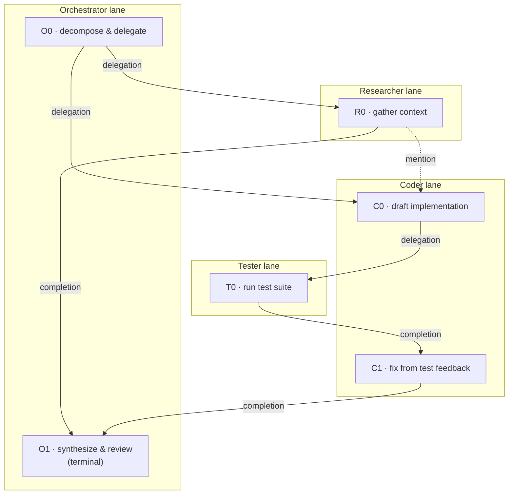
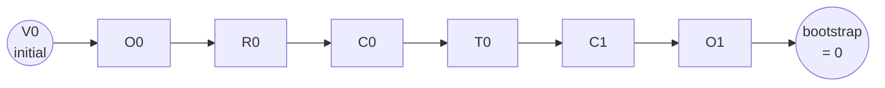
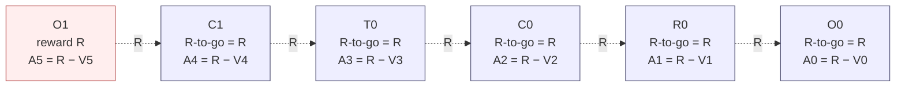

# Co-trained Critic + GAE — Trainer Integration (Phase 3, Tasks 9–10)

This note documents how the torch-free Phase 3 building blocks plug into the
training stack. The wiring below runs only with the full training stack
(`torch` + FSDP/Megatron + a GPU), which is **not available in the unit-test
environment**, so the live smoke/e2e steps are skipped with an explanation (see
`test_trainer_integration.py`, `test_e2e_critic_gae.py`). Everything they depend
on is unit-tested torch-free or behind `pytest.importorskip("torch")`.

## Building blocks (implemented, tested)

| Module | Role |
|--------|------|
| `critic_observation.py` | Global joint-state frontier → critic observation (`V_{t+1}` indexing). |
| `critic_score.py` | Generative critic prompt/parse + differentiable expected-score value over 11 buckets. |
| `gae.py` | Global GAE over the completion-ordered event sequence. |
| `dag_advantage.py` | `assemble_node_advantages(...)` → per-node advantage/return; `explained_variance`. |
| `critic_advantage.py` | Broadcast node advantage → actor tokens; `critic_huber_loss`; `combined_actor_critic_loss`. |
| `config.py` | `advantage_mode=GAE`, `critic_loss_weight`. |

## Per-step training flow (DAG run, `advantage_mode == GAE`)

1. **Online rollout** — when each sub-task turn completes, the critic agent
   builds a global-frontier observation (`build_observation_after_turn`) and the
   shared model in critic mode scores it; store the value as `node.value`
   (`V_{t+1}`). The verifier (Phase 2) sets the terminal reward per session →
   `node.outcome_reward`; per-node process signals → `node.process_reward`.
2. **Advantage assembly** — order the run's nodes by global completion order and
   call `assemble_node_advantages(nodes, initial_value=V0, gamma, lam)`.
3. **Actor** — `broadcast_node_advantages(token_node_ids, adv.advantages)` →
   per-token advantages tensor; feed into the PPO policy-gradient loss
   (replacing the GRPO normalized-return broadcast).
4. **Critic** — recompute the expected-score value (`expected_score_value`) for
   each node's score position; target = `adv.returns[node_id]`; loss =
   `critic_huber_loss(values, targets)`.
5. **Combined update** — `combined_actor_critic_loss(actor_loss, critic_loss,
   critic_loss_weight=cfg.critic_loss_weight)` on the shared trunk.
6. **Metrics** — log actor loss, critic value loss, and
   `explained_variance(values, returns)` (GRPO's group baseline is gone, so
   value quality drives gradient variance).

## Wiring points in the existing trainer

- `customized_areal/tree_search/core/advantage.py::TreeAdvantageComputer` is the
  GRPO computer used today. For DAG runs with `advantage_mode == GAE`, **bypass
  it** and use `assemble_node_advantages` + `broadcast_node_advantages` instead.
- `customized_areal/tree_search/training/trainer.py::CustomizedPPOTrainer`
  follows the `_create_train_engine` / `train` override pattern; the combined
  loss is applied in the actor update (mirror the existing distill-loss patch
  seam). `PPOTrainer.critic` already exists and is checkpointed by
  `_save_hf` / `_save_recover_checkpoint` (the `"critic"` branch) — with the
  shared trunk the critic shares the actor's weights.

## Why the wiring edits are not applied to core training files here

Editing `PPOActor` / `TreeAdvantageComputer` loss paths cannot be verified
without torch + GPU, and per `AGENTS.md` core training/loss changes should be
made where they can be run. The torch-free assembler + torch helpers above are
the complete, tested logic; the remaining change is mechanical glue in the actor
update, to be landed and validated on a GPU node (Task 10).

## How the critic value V_t corresponds to the DAG (framework B)

The critic value `V_t` is the value of the **global joint state** of all agents
and the environment at a moment. In this implementation that moment maps to a
**frontier cut over the DAG = the set of turns (nodes) that have completed up to
that point** in the global completion order.

One-line correspondence:

> The joint state `s_t` = the set of DAG nodes completed by event `t` = a
> **prefix** of the global completion-ordered message timeline,
> `messages[:cut]`, taken across *all* agent lanes.

### Where this lives in code

`critic_observation.build_critic_observations(messages)` takes `messages` in
**global completion order**. The correspondence is:

| Concept | DAG side | Code side |
|---------|----------|-----------|
| A turn output | one DAG node | a message carrying `node_id` |
| Joint state `s_t` | frontier cut = completed-node set | the prefix `messages[:cut]` (across all lanes) |
| Which node owns `V_t` | the node that advanced the frontier | `CriticObservation.value_index = t` + `.node_id` |
| Where the value is stored | that node | `AgentRunNode.value = V_{t+1}` |
| The GAE axis | one topological linearization of the DAG | the order of `events_from_nodes(ordered_nodes)` |

**Prefix = cut.** Because a cause completes before its effect, the completion
order is always a topological order of the causal DAG. Therefore any node in the
prefix `messages[:cut]` also has *all of its DAG ancestors* in that prefix — the
completed-node set is a **causally down-closed set**, which is exactly a valid
frontier/cut over the DAG. "Message prefix" and "DAG frontier" are two views of
the same object.

### Worked example (the e2e test DAG)

DAG: `A0 --delegation--> B0` (planner `A0` delegates to worker `B0`). Global
completion order: `A0, B0`.

```
moment        joint state s_t = DAG cut     code prefix              value at this step
────────────────────────────────────────────────────────────────────────────────────
start         {}  (nothing completed)        messages[:p_A0]          V_0  (node_id=None)
A0 completes  {A0}                            messages[:p_A0 + 1]      V_1  (node_id="A0")
B0 completes  {A0, B0}                        messages[:p_B0 + 1]      V_2  (node_id="B0")
```

- `V_1`'s observation contains only `A0`'s output; `V_2`'s observation contains
  `A0 + B0` — a **cross-lane** frontier, i.e. the joint state of all agents +
  environment (`test_frontier_is_global_across_lanes` asserts this).
- Each `V_{t+1}` is stored on the node that produced it: `dag.get("A0").value`,
  `dag.get("B0").value` (next-state indexing — see `critic_observation`).
- GAE recurs along the global sequence `[A0, B0]` (`compute_global_gae`):
  `δ_t = r_t + γ·V_{t+1} − V_t`; each advantage `A_t` is routed back to its
  node's actor tokens.

### Mermaid illustration

A complete multi-agent example. Four agents collaborate on one task; each
**node is one agent run/turn**, edges are the three real `EdgeType`s:
`delegation` (fan-out, solid), `completion` (fan-in, solid), `mention` (peer
signal, dotted). The orchestrator and coder each take two turns (`O0/O1`,
`C0/C1`).

- **Orchestrator** `O0`: decompose the task and delegate; `O1`: synthesize +
  final review (terminal).
- **Researcher** `R0`: gather context, then peer-`mention` the coder and report
  back to the orchestrator.
- **Coder** `C0`: draft implementation; `C1`: fix using the tester's feedback.
- **Tester** `T0`: run the suite for the coder.



Structural roles in this DAG (queryable via `ExecutionDAG`):

- **Fork node** (`fork_nodes()`): `O0` — fans out to `R0` and `C0`.
- **Join nodes** (`join_nodes()`): `C0` (fed by `O0` + `R0`) and `O1` (fed by
  `R0` + `C1`). These are exactly where the verifier must assign **explicit
  per-agent credit** (decision 8) — there is no fixed aggregation rule.
- **Root**: `O0`; **leaf / terminal**: `O1`.

### From DAG to a linear time flow (temporal linearization)

The DAG is a **partial order** (only causally-linked turns are ordered).
Framework B collapses it into a **single linear trajectory by real completion
time** — the timestamp at which each turn finished. Because a cause always
finishes before its effect, this completion order is *a* topological order of
the DAG (the structural `topological_order()` is the validity check / fallback;
the actual axis is the wall-clock completion time recorded on each turn).

```mermaid
gantt
    dateFormat X
    axisFormat %s
    title Turns over wall-clock time -> linearize by completion (right edge)
    section Orchestrator
        O0 : 0, 1
        O1 : 5, 6
    section Researcher
        R0 : 1, 2
    section Coder
        C0 : 1, 3
        C1 : 4, 5
    section Tester
        T0 : 3, 4
```



`R0` and `C0` run **concurrently** (both start at t=1); `R0` finishes first
(t=2), so it lands earlier in the linear flow. Reading off the completion
(right) edges gives the **global event sequence**:



Global completion order: `O0, R0, C0, T0, C1, O1`. This ordered node list is
exactly what `events_from_nodes(ordered_nodes)` consumes; GAE then recurs
backward along it: `δ_t = r_t + γ·V_{t+1} − V_t`.

### How the critic defines its state

At each step the critic's state is the **frontier cut = the set of turns
completed so far** — equivalently the completion-ordered transcript prefix
across *all* lanes. Walking the linearized flow above:

| step | event | state `s_t` = frontier (completed nodes) | value |
|------|-------|------------------------------------------|-------|
| 0 | (start) | `{}` | `V0` (initial) |
| 1 | `O0` done | `{O0}` | `V1` @ `O0` |
| 2 | `R0` done | `{O0, R0}` | `V2` @ `R0` |
| 3 | `C0` done | `{O0, R0, C0}` | `V3` @ `C0` |
| 4 | `T0` done | `{O0, R0, C0, T0}` | `V4` @ `T0` |
| 5 | `C1` done | `{O0, R0, C0, T0, C1}` | `V5` @ `C1` |
| 6 | `O1` done | `{O0, R0, C0, T0, C1, O1}` | `V6` @ `O1` + `r_terminal` |

`s3 = {O0, R0, C0}` is a **cross-lane** joint state: it already includes the
researcher's `R0` (finished at t=2) when the coder's `C0` finishes at t=3. Had
`C0` finished before `R0`, the frontier would instead be `{O0, C0}` — the
critic's state literally depends on the real completion order.

Concretely, for one step (`V3`, when `C0` completes) the critic state is built
and scored like this:

```mermaid
flowchart LR
    subgraph FRONTIER["frontier @ t=3 (C0 just finished)"]
        direction TB
        o0["O0 output"]
        r0["R0 output"]
        c0["C0 output"]
    end
    FRONTIER -->|"whitelist fields<br/>(drop logprobs / token_ids),<br/>concat in completion order"| OBS["critic observation s_3<br/>= joint-state text"]
    OBS -->|build_critic_score_prompt| P["critic prompt<br/>(asks for &lt;score&gt;N&lt;/score&gt;, 0-10)"]
    P -->|"shared-trunk model,<br/>generative critic mode"| L["11 digit-token logits"]
    L -->|"expected_score_value<br/>= softmax · arange(11) / 10"| V["V3 (stored on C0.value)"]
```



Formal definition of the critic state (framework B):

- **State** `s_t` = the global joint state of all agents + environment = the
  causally down-closed set of completed turns = the transcript prefix
  `messages[:cut]` (built by `build_critic_observations` /
  `build_observation_after_turn`, field-whitelisted to drop `logprobs` /
  `token_ids`).
- **Value** `V_{t+1}` = the generative critic's differentiable expected score
  over the 11 digit buckets for the state *after* turn `t` completes
  (next-state indexing). It is stored on that turn's node (`AgentRunNode.value`).
- **Action-independence**: `s_t` (the baseline `V_t`) is the frontier *before*
  turn `t`'s own output, so the baseline does not peek at the action it scores
  — only `V_{t+1}` reflects it. This is what makes the GAE baseline valid.

### How reward backs up through the DAG

Backup is **not** a tree-style propagation along DAG parent/child edges. The DAG
is linearized to one global completion-ordered trajectory, and credit is
assigned by a **backward GAE recursion over that sequence** (`gae.py`).

Where reward enters: `events_from_nodes` sets each node's step reward to
`process_reward + outcome_reward`. The agentic verifier (Phase 2) writes
`outcome_reward` per RL `session_id` (decision 3) — the explicit per-agent
credit, and the only credit at join nodes (decision 8). `process_reward` is an
optional per-turn signal.

Backward GAE over the global order `O0, R0, C0, T0, C1, O1` (solid = forward
trajectory; dashed = the backward backup), with
`δ_t = r_t + γ·V_{t+1} − V_t`, terminal bootstrap `V_6 = 0`, and `V_t` the
action-independent critic baseline:

```mermaid
flowchart LR
    V0(("V0<br/>initial")):::val
    O0["O0<br/>r0<br/>baseline V0"]:::turn
    R0["R0<br/>r1<br/>baseline V1"]:::turn
    C0["C0<br/>r2<br/>baseline V2"]:::turn
    T0["T0<br/>r3<br/>baseline V3"]:::turn
    C1["C1<br/>r4<br/>baseline V4"]:::turn
    O1["O1 (terminal)<br/>r5 = verifier reward R<br/>baseline V5"]:::term
    B(("bootstrap<br/>= 0")):::val

    V0 --> O0 --> R0 --> C0 --> T0 --> C1 --> O1 --> B

    O1 -. "A5 = δ5" .-> C1
    C1 -. "A4 = δ4 + γλ·A5" .-> T0
    T0 -. "A3 = δ3 + γλ·A4" .-> C0
    C0 -. "A2 = δ2 + γλ·A3" .-> R0
    R0 -. "A1 = δ1 + γλ·A2" .-> O0
    O0 -. "A0 = δ0 + γλ·A1" .-> V0

    classDef turn fill:#eef,stroke:#557;
    classDef term fill:#fee,stroke:#b55;
    classDef val fill:#efe,stroke:#5a5;
```



Concrete trace (`γ = λ = 1`, only the terminal verifier reward `R`): the
recursion telescopes to **return-to-go minus the critic baseline**, so `R` backs
up to every earlier turn and each advantage is `R − V_t`:



The critic value cancels the shared baseline, so only each turn's *relative*
contribution drives the gradient; with `λ < 1` the backup becomes a TD(λ) blend
of `R` and the critic bootstraps instead of the full `R`. Per-node results then
go two ways (Task 8): `advantage` → broadcast onto that turn's actor tokens;
`return_ = A_t + V_t` → the critic's regression target.

Framework-B consequence: credit runs over the **global joint-state** trajectory,
so backup is not routed per-DAG-edge — a turn is credited against the joint
future of *all* agents, not just its own lane's descendants. DAG edges only fix
the causal ordering of the linearization. Agent-specific credit is injected
explicitly via the verifier's per-`session_id` `outcome_reward` (the reason the
verifier is required at join nodes). Caveat: a turn's advantage absorbs reward
from concurrent, causally-unrelated turns that finish later in the
linearization — intentional under framework B, and the per-session verifier
reward is the mechanism meant to counteract the added noise.

### Concurrency (multiple lanes in flight)

If lanes `A` and `B` run truly concurrently (no causal edge between them), their
relative order in the timeline is the **actual completion time**. The state at a
moment is then the union, over all lanes, of each lane's latest completed turn —
an antichain frontier crossing multiple lanes. No special handling is needed:
as long as `messages` is sorted by real completion time, `messages[:cut]` is
exactly that cross-lane cut. Known v1 approximation: two independent turns that
finish almost simultaneously are serialized in an arbitrary-but-deterministic
order.
