# Co-trained Critic + GAE — Trainer Integration (Phase 3, Tasks 9–10)

This note documents how the torch-free Phase 3 building blocks plug into the training
stack. The wiring below runs only with the full training stack (`torch` + FSDP/Megatron
\+ a GPU), which is **not available in the unit-test environment**, so the live smoke/e2e
steps are skipped with an explanation (see `test_trainer_integration.py`,
`test_e2e_critic_gae.py`). Everything they depend on is unit-tested torch-free or behind
`pytest.importorskip("torch")`.

## Building blocks (implemented, tested)

Grouped by role. All modules are torch-free at import time (torch is imported lazily
inside the differentiable helpers) so the package unit-tests without the training stack.

### DAG model & linear-log codec

| Module                   | Role                                                                                                                                                                                                                                                                                                                                   |
| ------------------------ | -------------------------------------------------------------------------------------------------------------------------------------------------------------------------------------------------------------------------------------------------------------------------------------------------------------------------------------- |
| `execution_dag.py`       | In-memory **agent-execution DAG** (`SuperNode`, `Edge`, `EdgeType` = `DELEGATION`/`MENTION`/`COMPLETION`, `ExecutionDAG`). Topological order, fork/join queries, `event_ids()`.                                                                                                                                                        |
| `event_model.py`         | `EdgeRef = (node_id, EdgeType)` alias + `message_timeline` helper that flattens SuperNode payloads into the completion-ordered message list the critic consumes.                                                                                                                                                                       |
| `event_codec.py`         | Bidirectional codec: `dag_to_supernodes` (linearize DAG → completion-ordered SuperNodes) and `supernodes_to_dag` (lossless rebuild from persisted log); `replay_prefix_for` derives a branch-replay prefix shaped for `BranchMaterializer`.                                                                                            |
| `supernode_assembler.py` | `SuperNodeAssembler` — consumes Multica's pre-defined `SegmentSpec`s and proxy interactions, maps each agent's turns into segments, maintains the unified `parent_node_id`/`extra_parent_node_ids` causal chain (delegation, completion fan-in, mention topology-only), stamps `TeamEnvSnapshot` and `session_id` onto each SuperNode. |

### Environment, branching, and integration

| Module                | Role                                                                                                                                                                                                                                                                                                                                                                            |
| --------------------- | ------------------------------------------------------------------------------------------------------------------------------------------------------------------------------------------------------------------------------------------------------------------------------------------------------------------------------------------------------------------------------- |
| `environment.py`      | `ForkableEnvironment` Protocol + `FleetSandboxProvider` / `MulticaSweLegoProvider`; `snapshot` / `fork` / `ForkResult` / `SnapshotResult`; `EnvironmentError`/`SnapshotError`/`ForkError`. Training code sees only this Protocol, never a vendor SDK.                                                                                                                           |
| `integration.py`      | `BranchMaterializer` / `BranchStarter` / `MulticaIssueForker` — snapshot-at-frontier + transcript replay: snapshot the source sandbox, fork a fresh sandbox, fork the Multica issue subtree at `(task_id, seq)`, replay `messages ≤ seq`, drop `PriorSessionID`; paired rollback on failure. Also `finalize_with_verifier`, `materialize_cloud_branch`, `cleanup_cloud_branch`. |
| `branch_selection.py` | Pure branch-point selection over the canonical SuperNode sequence: critic TD-error gate (`td_error`, `passes_gate`) + max-entropy ranking (`select_branch_points`, `lane_successor_value`); emits one `BranchPoint` per `task_id` lane keyed for `replay_prefix_for`. Ports the legacy `select_branch_candidate` criterion.                                                     |

### Verifiers & reward

| Module                        | Role                                                                                                                                                                                                                                                                                                                                                                                          |
| ----------------------------- | --------------------------------------------------------------------------------------------------------------------------------------------------------------------------------------------------------------------------------------------------------------------------------------------------------------------------------------------------------------------------------------------- |
| `verifier.py`                 | Forward-compatible Phase-2 slice: `VerifierResult`, `Verifier` Protocol, deterministic `ObjectiveVerifier`.                                                                                                                                                                                                                                                                                   |
| `agentic_verifier.py`         | `AgenticVerifier` + `PiVerifierLauncher` — pi-agent verifier on a fixed judge model reviews the finished collaboration and assigns a reward per RL `session_id`; `build_verifier_prompt`, `parse_verifier_output`, `VerifierRun`, `VerifierReward`. Falls back to a neutral reward on launch/parse failure.                                                                                   |
| `harvest.py`                  | `VerifierFinalizer` + `TrajectoryHarvester` + `RewardWriter` — run the agentic verifier, write each session's reward authoritatively via the bridge (enforces reward-before-export), then harvest each session's reward-stamped trajectory via `/export_trajectories` (terminal — revokes the session). Supersedes `rl_session.RLSessionRewardWriter` / `integration.finalize_with_verifier`. |
| `rl_session.py`               | `RLSessionRewardWriter` + `RLBridgeClient` Protocol — legacy single-verifier path: `set_reward` then `end_session`; leaves the session open if `set_reward` fails so the trajectory is not lost.                                                                                                                                                                                              |
| `dag_backup.py`               | `distribute_reward_over_dag` — distributes a terminal verifier reward backward along DAG edges; `CreditAssignment` for explicit per-agent credit at fan-in joins (no fixed sum/mean/max rule).                                                                                                                                                                                                |
| `reward/swe_lego_types.py`    | Shared dataclasses: `SweLegoIssue`, `SweLegoRollout`, `SweLegoSetup`, `SweLegoIssueResult`.                                                                                                                                                                                                                                                                                                   |
| `reward/swe_lego_verifier.py` | Hybrid SWE-Lego verifier: objective tests + generative critic + semi-resolved blend (spec §5.3); objective layer short-circuits when decisive, blend runs only in the mixed middle.                                                                                                                                                                                                           |

### Critic + GAE (Phase 3, Tasks 5–9)

| Module                  | Role                                                                                                                                                                                                    |
| ----------------------- | ------------------------------------------------------------------------------------------------------------------------------------------------------------------------------------------------------- |
| `critic_observation.py` | Global joint-state frontier → critic observation (`V_{t+1}` next-state indexing; `build_critic_observations`, `build_observation_after_turn`, `DEFAULT_CRITIC_FIELDS`).                                 |
| `critic_score.py`       | Generative critic prompt/parse (`build_critic_score_prompt`, `parse_score`, `score_to_value`) + differentiable `expected_score_value` over 11 digit-token logits. The critic shares the actor's trunk.  |
| `gae.py`                | Global joint-state GAE over the completion-ordered event sequence: `events_from_nodes`, `compute_global_gae`, `GlobalEvent`, `NodeGAEResult` (`δ_t = r_t + γ·V_{t+1} − V_t`, `A_t = δ_t + γλ·A_{t+1}`). |
| `dag_advantage.py`      | `assemble_node_advantages(...)` → per-node advantage/return; `explained_variance`. The GAE-replaces-GRPO orchestration core.                                                                            |
| `critic_advantage.py`   | `assign_token_advantages` / `broadcast_node_advantages` (node advantage → actor tokens), `value_targets_from_gae`, `critic_huber_loss`, `combined_actor_critic_loss`.                                   |

### Episode orchestration (env-dispatch drivers)

| Module                     | Role                                                                                                                                                                                                                       |
| -------------------------- | -------------------------------------------------------------------------------------------------------------------------------------------------------------------------------------------------------------------------- |
| `multica_client.py`        | `MulticaEnvDispatchClient` — thin HTTP client for the unified env-dispatch API: `POST /api/v1/env`, `DELETE /api/v1/env/{envID}`, `POST /api/v1/env-dispatch`, `DELETE /api/v1/env-dispatch/{projectID}` (spec §6).        |
| `swe_lego_issue_runner.py` | `run_swe_lego_issue` — per-issue orchestration (spec §5.1): atomic env-dispatch, open one RL session per rollout, drive per-lane branching, verify+reward each terminal run, always-cleanup.                               |
| `self_play_runner.py`      | `run_self_play` — mirrors the SWE-Lego runner but dispatches a `SelfPlayQuery` from `query_bank` as a chat message (`domain=self_play`, `dispatch_type=message`); returns `SelfPlayResult` with per-agent rewards/success. |

## Per-step training flow (DAG run, `advantage_mode == GAE`)

1. **Online rollout** — when each sub-task turn completes, the critic agent builds a
   global-frontier observation (`build_observation_after_turn`) and the shared model in
   critic mode scores it; store the value as `node.value` (`V_{t+1}`). The verifier
   (Phase 2) sets the terminal reward per session → `node.outcome_reward`; per-node
   process signals → `node.process_reward`.
1. **Advantage assembly** — order the run's nodes by global completion order and call
   `assemble_node_advantages(nodes, initial_value=V0, gamma, lam)`.
1. **Actor** — `broadcast_node_advantages(token_node_ids, adv.advantages)` → per-token
   advantages tensor; feed into the PPO policy-gradient loss (replacing the GRPO
   normalized-return broadcast).
1. **Critic** — recompute the expected-score value (`expected_score_value`) for each
   node's score position; target = `adv.returns[node_id]`; loss =
   `critic_huber_loss(values, targets)`.
1. **Combined update** —
   `combined_actor_critic_loss(actor_loss, critic_loss, critic_loss_weight=cfg.critic_loss_weight)`
   on the shared trunk.
1. **Metrics** — log actor loss, critic value loss, and
   `explained_variance(values, returns)` (GRPO's group baseline is gone, so value
   quality drives gradient variance).

## Wiring points in the existing trainer

- `customized_areal/tree_search/core/advantage.py::TreeAdvantageComputer` is the GRPO
  computer used today. For DAG runs with `advantage_mode == GAE`, **bypass it** and use
  `assemble_node_advantages` + `broadcast_node_advantages` instead.
- `customized_areal/tree_search/training/trainer.py::CustomizedPPOTrainer` follows the
  `_create_train_engine` / `train` override pattern; the combined loss is applied in the
  actor update (mirror the existing distill-loss patch seam). `PPOTrainer.critic`
  already exists and is checkpointed by `_save_hf` / `_save_recover_checkpoint` (the
  `"critic"` branch) — with the shared trunk the critic shares the actor's weights.

## Why the wiring edits are not applied to core training files here

Editing `PPOActor` / `TreeAdvantageComputer` loss paths cannot be verified without torch
\+ GPU, and per `AGENTS.md` core training/loss changes should be made where they can be
run. The torch-free assembler + torch helpers above are the complete, tested logic; the
remaining change is mechanical glue in the actor update, to be landed and validated on a
GPU node (Task 10).

## How the critic value V_t corresponds to the DAG (framework B)

The critic value `V_t` is the value of the **global joint state** of all agents and the
environment at a moment. In this implementation that moment maps to a **frontier cut
over the DAG = the set of turns (nodes) that have completed up to that point** in the
global completion order.

One-line correspondence:

> The joint state `s_t` = the set of DAG nodes completed by event `t` = a **prefix** of
> the global completion-ordered message timeline, `messages[:cut]`, taken across *all*
> agent lanes.

### Where this lives in code

`critic_observation.build_critic_observations(messages)` takes `messages` in **global
completion order**. The correspondence is:

| Concept                   | DAG side                                 | Code side                                        |
| ------------------------- | ---------------------------------------- | ------------------------------------------------ |
| A turn output             | one DAG node                             | a message carrying `node_id`                     |
| Joint state `s_t`         | frontier cut = completed-node set        | the prefix `messages[:cut]` (across all lanes)   |
| Which node owns `V_t`     | the node that advanced the frontier      | `CriticObservation.value_index = t` + `.node_id` |
| Where the value is stored | that node                                | `AgentRunNode.value = V_{t+1}`                   |
| The GAE axis              | one topological linearization of the DAG | the order of `events_from_nodes(ordered_nodes)`  |

**Prefix = cut.** Because a cause completes before its effect, the completion order is
always a topological order of the causal DAG. Therefore any node in the prefix
`messages[:cut]` also has *all of its DAG ancestors* in that prefix — the completed-node
set is a **causally down-closed set**, which is exactly a valid frontier/cut over the
DAG. "Message prefix" and "DAG frontier" are two views of the same object.

### Worked example (the e2e test DAG)

DAG: `A0 --delegation--> B0` (planner `A0` delegates to worker `B0`). Global completion
order: `A0, B0`.

```
moment        joint state s_t = DAG cut     code prefix              value at this step
────────────────────────────────────────────────────────────────────────────────────
start         {}  (nothing completed)        messages[:p_A0]          V_0  (node_id=None)
A0 completes  {A0}                            messages[:p_A0 + 1]      V_1  (node_id="A0")
B0 completes  {A0, B0}                        messages[:p_B0 + 1]      V_2  (node_id="B0")
```

- `V_1`'s observation contains only `A0`'s output; `V_2`'s observation contains
  `A0 + B0` — a **cross-lane** frontier, i.e. the joint state of all agents +
  environment (`test_frontier_is_global_across_lanes` asserts this).
- Each `V_{t+1}` is stored on the node that produced it: `dag.get("A0").value`,
  `dag.get("B0").value` (next-state indexing — see `critic_observation`).
- GAE recurs along the global sequence `[A0, B0]` (`compute_global_gae`):
  `δ_t = r_t + γ·V_{t+1} − V_t`; each advantage `A_t` is routed back to its node's actor
  tokens.

### Mermaid illustration

A complete multi-agent example. Four agents collaborate on one task; each **node is one
agent run/turn**, edges are the three real `EdgeType`s: `delegation` (fan-out, solid),
`completion` (fan-in, solid), `mention` (peer signal, dotted). The orchestrator and
coder each take two turns (`O0/O1`, `C0/C1`); the tester runs two parallel turns
(`T0/T1`).

- **Orchestrator** `O0`: decompose the task and delegate; `O1`: synthesize + final
  review (terminal).
- **Researcher** `R0`: gather context, then peer-`mention` the coder and report back to
  the orchestrator.
- **Coder** `C0`: draft implementation; `C1`: fix using the testers' feedback.
- **Tester** `T0`: run unit tests for the coder; `T1`: run integration tests in parallel
  with `T0`.

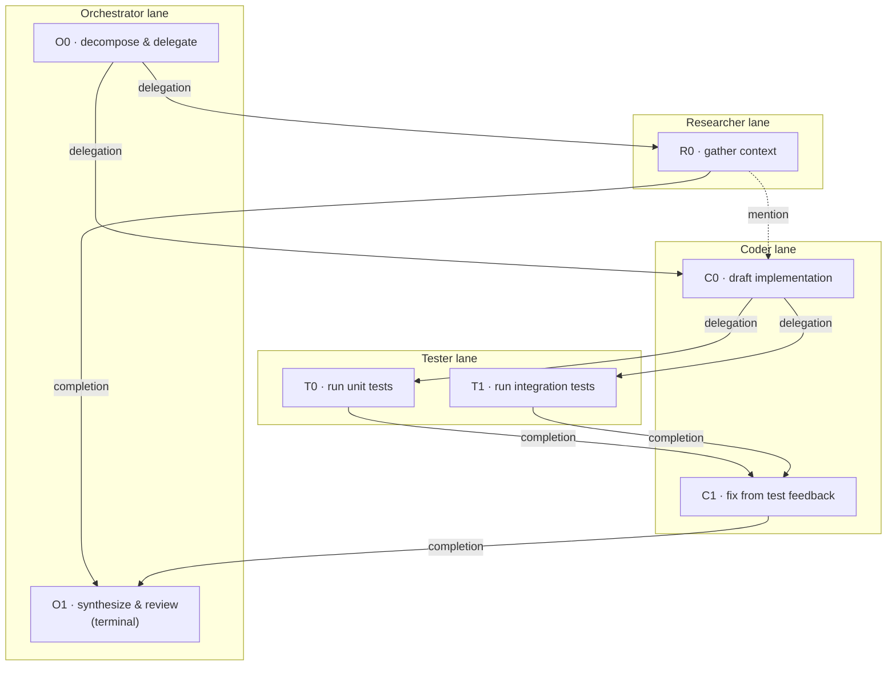

Structural roles in this DAG (queryable via `ExecutionDAG`):

- **Fork nodes** (`fork_nodes()`): `O0` (fans out to `R0` and `C0`) and `C0` (fans out
  to `T0` and `T1` — parallel testers).
- **Join nodes** (`join_nodes()`): `C0` (fed by `O0` + `R0`), `C1` (fed by `T0` + `T1`),
  and `O1` (fed by `R0` + `C1`). These are exactly where the verifier must assign
  **explicit per-agent credit** (decision 8) — there is no fixed aggregation rule.
- **Root**: `O0`; **leaf / terminal**: `O1`.

### From DAG to a linear time flow (temporal linearization)

The DAG is a **partial order** (only causally-linked turns are ordered). Framework B
collapses it into a **single linear trajectory by real completion time** — the timestamp
at which each turn finished. Because a cause always finishes before its effect, this
completion order is *a* topological order of the DAG (the structural
`topological_order()` is the validity check / fallback; the actual axis is the
wall-clock completion time recorded on each turn).

```mermaid
gantt
    dateFormat X
    axisFormat %s
    title Turns over wall-clock time -> linearize by completion (right edge)
    section Orchestrator
        O0 : 0, 1
        O1 : 6, 7
    section Researcher
        R0 : 1, 2
    section Coder
        C0 : 1, 3
        C1 : 5, 6
    section Tester
        T0 : 3, 4
        T1 : 3, 5
```

`R0` and `C0` run **concurrently** (both start at t=1); `R0` finishes first (t=2), so it
lands earlier in the linear flow. `T0` and `T1` also run **concurrently** (both start at
t=3); `T0` finishes first (t=4), so it lands before `T1` in the linear flow. Reading off
the completion (right) edges gives the **global event sequence**:

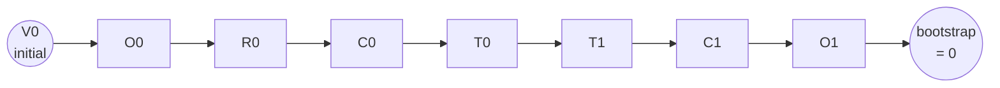

Global completion order: `O0, R0, C0, T0, T1, C1, O1`. This ordered node list is exactly
what `events_from_nodes(ordered_nodes)` consumes; GAE then recurs backward along it:
`δ_t = r_t + γ·V_{t+1} − V_t`.

### How the critic defines its state

At each step the critic's state is the **frontier cut = the set of turns completed so
far** — equivalently the completion-ordered transcript prefix across *all* lanes.
Walking the linearized flow above:

| step | event     | state `s_t` = frontier (completed nodes) | value                      |
| ---- | --------- | ---------------------------------------- | -------------------------- |
| 0    | (start)   | `{}`                                     | `V0` (initial)             |
| 1    | `O0` done | `{O0}`                                   | `V1` @ `O0`                |
| 2    | `R0` done | `{O0, R0}`                               | `V2` @ `R0`                |
| 3    | `C0` done | `{O0, R0, C0}`                           | `V3` @ `C0`                |
| 4    | `T0` done | `{O0, R0, C0, T0}`                       | `V4` @ `T0`                |
| 5    | `T1` done | `{O0, R0, C0, T0, T1}`                   | `V5` @ `T1`                |
| 6    | `C1` done | `{O0, R0, C0, T0, T1, C1}`               | `V6` @ `C1`                |
| 7    | `O1` done | `{O0, R0, C0, T0, T1, C1, O1}`           | `V7` @ `O1` + `r_terminal` |

`s3 = {O0, R0, C0}` is a **cross-lane** joint state: it already includes the
researcher's `R0` (finished at t=2) when the coder's `C0` finishes at t=3. Had `C0`
finished before `R0`, the frontier would instead be `{O0, C0}` — the critic's state
literally depends on the real completion order.

Concretely, for one step (`V3`, when `C0` completes) the critic state is built and
scored like this:

```mermaid
flowchart LR
    subgraph FRONTIER["frontier @ t=3 (C0 just finished)"]
        direction TB
        o0["O0 output"]
        r0["R0 output"]
        c0["C0 output"]
    end
    FRONTIER -->|"whitelist fields<br/>(drop logprobs / token_ids),<br/>concat in completion order"| OBS["critic observation s_3<br/>= joint-state text"]
    OBS -->|build_critic_score_prompt| P["critic prompt<br/>(asks for &lt;score&gt;N&lt;/score&gt;, 0-10)"]
    P -->|"shared-trunk model,<br/>generative critic mode"| L["11 digit-token logits"]
    L -->|"expected_score_value<br/>= softmax · arange(11) / 10"| V["V3 (stored on C0.value)"]
```

Formal definition of the critic state (framework B):

- **State** `s_t` = the global joint state of all agents + environment = the causally
  down-closed set of completed turns = the transcript prefix `messages[:cut]` (built by
  `build_critic_observations` / `build_observation_after_turn`, field-whitelisted to
  drop `logprobs` / `token_ids`).
- **Value** `V_{t+1}` = the generative critic's differentiable expected score over the
  11 digit buckets for the state *after* turn `t` completes (next-state indexing). It is
  stored on that turn's node (`AgentRunNode.value`).
- **Action-independence**: `s_t` (the baseline `V_t`) is the frontier *before* turn
  `t`'s own output, so the baseline does not peek at the action it scores — only
  `V_{t+1}` reflects it. This is what makes the GAE baseline valid.

### How reward backs up through the DAG

Backup is **not** a tree-style propagation along DAG parent/child edges. The DAG is
linearized to one global completion-ordered trajectory, and credit is assigned by a
**backward GAE recursion over that sequence** (`gae.py`).

Where reward enters: `events_from_nodes` sets each node's step reward to
`process_reward + outcome_reward`. The agentic verifier (Phase 2) writes
`outcome_reward` per RL `session_id` (decision 3) — the explicit per-agent credit, and
the only credit at join nodes (decision 8). `process_reward` is an optional per-turn
signal.

Backward GAE over the global order `O0, R0, C0, T0, T1, C1, O1` (solid = forward
trajectory; dashed = the backward backup), with `δ_t = r_t + γ·V_{t+1} − V_t`, terminal
bootstrap `V_7 = 0`, and `V_t` the action-independent critic baseline:

```mermaid
flowchart LR
    V0(("V0<br/>initial")):::val
    O0["O0<br/>r0<br/>baseline V0"]:::turn
    R0["R0<br/>r1<br/>baseline V1"]:::turn
    C0["C0<br/>r2<br/>baseline V2"]:::turn
    T0["T0<br/>r3<br/>baseline V3"]:::turn
    T1["T1<br/>r4<br/>baseline V4"]:::turn
    C1["C1<br/>r5<br/>baseline V5"]:::turn
    O1["O1 (terminal)<br/>r6 = verifier reward R<br/>baseline V6"]:::term
    B(("bootstrap<br/>= 0")):::val

    V0 --> O0 --> R0 --> C0 --> T0 --> T1 --> C1 --> O1 --> B

    O1 -. "A6 = δ6" .-> C1
    C1 -. "A5 = δ5 + γλ·A6" .-> T1
    T1 -. "A4 = δ4 + γλ·A5" .-> T0
    T0 -. "A3 = δ3 + γλ·A4" .-> C0
    C0 -. "A2 = δ2 + γλ·A3" .-> R0
    R0 -. "A1 = δ1 + γλ·A2" .-> O0
    O0 -. "A0 = δ0 + γλ·A1" .-> V0

    classDef turn fill:transparent,stroke:#557;
    classDef term fill:transparent,stroke:#b55;
    classDef val fill:transparent,stroke:#5a5;
```

Concrete trace (`γ = λ = 1`, only the terminal verifier reward `R`): the recursion
telescopes to **return-to-go minus the critic baseline**, so `R` backs up to every
earlier turn and each advantage is `R − V_t`:

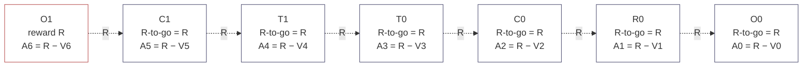

The critic value cancels the shared baseline, so only each turn's *relative*
contribution drives the gradient; with `λ < 1` the backup becomes a TD(λ) blend of `R`
and the critic bootstraps instead of the full `R`. Per-node results then go two ways
(Task 8): `advantage` → broadcast onto that turn's actor tokens; `return_ = A_t + V_t` →
the critic's regression target.

Framework-B consequence: credit runs over the **global joint-state** trajectory, so
backup is not routed per-DAG-edge — a turn is credited against the joint future of *all*
agents, not just its own lane's descendants. DAG edges only fix the causal ordering of
the linearization. Agent-specific credit is injected explicitly via the verifier's
per-`session_id` `outcome_reward` (the reason the verifier is required at join nodes).
Caveat: a turn's advantage absorbs reward from concurrent, causally-unrelated turns that
finish later in the linearization — intentional under framework B, and the per-session
verifier reward is the mechanism meant to counteract the added noise.

### Value V on each DAG node (terminal R=1, no process reward)

With terminal reward `R = 1` at `O1` and `r_t = 0` for every non-terminal step, the
value at each state collapses to the **expected discounted terminal reward**:

```
V_t = E[ γ^(T−t) · R | s_t ]
```

With `γ = 1` this is `V_t = E[R | s_t] = P(success | s_t)` — the critic's estimated
probability of eventually earning the terminal `R = 1`. Each node stores the `V_{t+1}`
for the state **after** its own turn completes (next-state indexing); the terminal `O1`
stores `V_7 = 0` (bootstrap), and the reward `R = 1.0` enters as `r_6`, not as a stored
value.

The DAG below annotates each node with the `V` it stores (illustrative pre-convergence
values — a trained critic converges toward the true `V_t = 1` for every non-terminal
state when `γ = 1`, `R = 1`, no process reward):

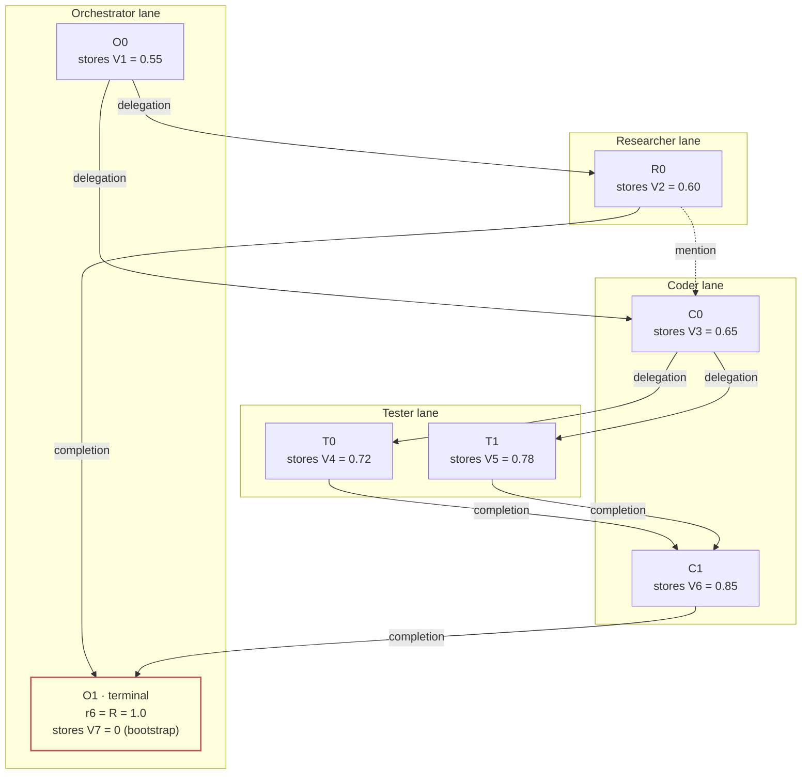

| node   | stores | `V` (illustrative) | meaning                                                       |
| ------ | ------ | ------------------ | ------------------------------------------------------------- |
| (init) | `V0`   | `0.50`             | prior success probability before any turn runs                |
| `O0`   | `V1`   | `0.55`             | after orchestrator decomposes — slight uptick                 |
| `R0`   | `V2`   | `0.60`             | after context gathered — more confident                       |
| `C0`   | `V3`   | `0.65`             | after draft implementation — on track                         |
| `T0`   | `V4`   | `0.72`             | after unit tests pass — implementation looks correct          |
| `T1`   | `V5`   | `0.78`             | after integration tests pass — end-to-end works               |
| `C1`   | `V6`   | `0.85`             | after coder fixes remaining issues — nearly done              |
| `O1`   | `V7`   | `0`                | terminal bootstrap; `r6 = R = 1.0` is the reward, not a value |

The values rise monotonically here because each completed sub-task makes the terminal
`R = 1` more likely — the critic learns that reaching `T0`/`T1`/`C1` is predictive of
success. This is not a structural requirement: if a tester finds bugs, `V` drops at that
step (a negative `δ_t = r_t + γ·V_{t+1} − V_t`), signaling reduced success probability.

Plugging these `V_t` into the telescoped advantage (`γ = λ = 1`, `R = 1`):

| node | `V_t` (baseline) | `A_t = R − V_t`        |
| ---- | ---------------- | ---------------------- |
| `O0` | `V0 = 0.50`      | `A0 = 1 − 0.50 = 0.50` |
| `R0` | `V1 = 0.55`      | `A1 = 1 − 0.55 = 0.45` |
| `C0` | `V2 = 0.60`      | `A2 = 1 − 0.60 = 0.40` |
| `T0` | `V3 = 0.65`      | `A3 = 1 − 0.65 = 0.35` |
| `T1` | `V4 = 0.72`      | `A4 = 1 − 0.72 = 0.28` |
| `C1` | `V5 = 0.78`      | `A5 = 1 − 0.78 = 0.22` |
| `O1` | `V6 = 0.85`      | `A6 = 1 − 0.85 = 0.15` |

Every advantage is positive (the run earned `R = 1`, which exceeds the critic's estimate
at every step), so the gradient reinforces every turn — weighted by how much
`V`-increase that turn produced. As the critic converges to the true `V_t = 1` for
non-terminal states, every `A_t → 0` and the gradient quiets down. The critic's
regression target is `return_ = A_t + V_t`, which telescopes to `R = 1` for every step
under `γ = λ = 1` — so the critic is trained to predict `1` at each non-terminal state,
matching the `P(success | s_t)` interpretation.

### Structural credit along DAG edges (fan-in / fan-out)

The GAE backup above linearizes the DAG — it does not route credit per-edge. A separate
structural mechanism, `distribute_reward_over_dag` (`dag_backup.py`), distributes a
terminal verifier reward **backward along DAG edges**. This is where fan-out and fan-in
are made explicit at the DAG-structural level (the same nodes surfaced by
`fork_events()` / `join_events()`).

Rules (verified by `tests/test_dag_backup.py`):

- **Terminal** node gets the full reward `R`.
- **Single-parent chain**: each ancestor gets its child's full credit (no attenuation —
  credit passes through unchanged).
- **Fan-in (join, ≥ 2 parents)**: the caller supplies a `CreditAssignment` — an explicit
  per-parent share. Each parent's credit is set to `share × credit[join]` via
  **`max()`**, not `+=`. There is no fixed sum/mean/max rule across parents (spec §2
  decision 8); the verifier decides how much each contributing agent earned.
- **Fan-out (fork, ≥ 2 children)**: the fork is a single parent of each child, so it is
  visited once per child and **accumulates** credit from every child path via `+=`. A
  fork merges credit; it does not split it.

On the worked example DAG above (terminal reward `1.0` at `O1`, verifier-assigned fan-in
shares `0.2/0.8` at `O1`, `0.6/0.4` at `C1`, and `0.9/0.1` at `C0` — the coder's fix
`C1` weighted 4× the researcher's `R0` at the terminal join; at `C1` the unit tester
`T0` weighted 1.5× the integration tester `T1`; at `C0` the delegator `O0` weighted 9×
the `R0` mention). The diagram below is the **same DAG** but with arrows reversed (child
→ parent = the direction credit flows). Thick `==>` links are fan-in joins (explicit
`CreditAssignment`, `max()`); thin `-->` links are single-parent chains (full
pass-through):

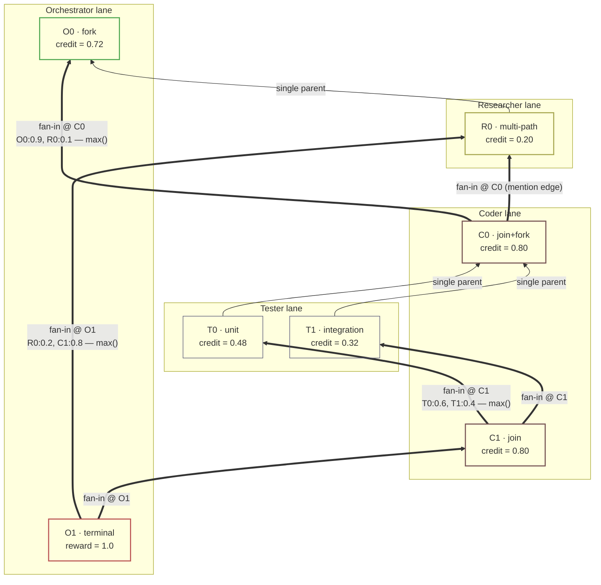

Backward BFS from `O1` (parents scanned in edge-insertion order — `R0→O1` before
`C1→O1`, `O0→C0` before `R0-.→C0`, `T0→C1` before `T1→C1`):

| step | visit | parents    | rule              | credit written                                               |
| ---- | ----- | ---------- | ----------------- | ------------------------------------------------------------ |
| 0    | `O1`  | `[R0, C1]` | fan-in (0.2, 0.8) | `R0 = 0.20`, `C1 = 0.80`                                     |
| 1    | `R0`  | `[O0]`     | single parent     | `O0 += 0.20` → `0.20`                                        |
| 2    | `C1`  | `[T0, T1]` | fan-in (0.6, 0.4) | `T0 = 0.48`, `T1 = 0.32`                                     |
| 3    | `O0`  | `[]`       | root, no parents  | —                                                            |
| 4    | `T0`  | `[C0]`     | single parent     | `C0 += 0.48` → `0.48`                                        |
| 5    | `T1`  | `[C0]`     | single parent     | `C0 += 0.32` → `0.80`                                        |
| 6    | `C0`  | `[O0, R0]` | fan-in (0.9, 0.1) | `O0 = max(0.20, 0.72) = 0.72`, `R0 = max(0.20, 0.08) = 0.20` |

Final credits:

| node | credit | why                                                                                                                  |
| ---- | ------ | -------------------------------------------------------------------------------------------------------------------- |
| `O1` | `1.0`  | terminal                                                                                                             |
| `C1` | `0.80` | fan-in share 0.8 at `O1`                                                                                             |
| `T0` | `0.48` | fan-in share 0.6 at `C1` (parallel-tester join)                                                                      |
| `T1` | `0.32` | fan-in share 0.4 at `C1` (parallel-tester join)                                                                      |
| `C0` | `0.80` | **fan-out**: `0.48 + 0.32` accumulated from `T0` and `T1` via `+=`                                                   |
| `R0` | `0.20` | **multi-path**: `max(0.20` from `O1` fan-in, `0.08` from `C0` fan-in`)` — `O1` path wins                             |
| `O0` | `0.72` | **fan-out**: `max(0.20` from `R0` path (step 1), `0.72` from `C0` fan-in (step 6)`)` — `C0` path overwrites the `+=` |

Four structural takeaways:

- **Fan-in at `O1`** (terminal join): `R0` and `C1` both complete into `O1`. The
  verifier assigns shares `0.2/0.8` — no sum/mean/max rule (decision 8). Here `C1`
  (coder's fix) is judged 4× as important as `R0` (researcher's context).
- **Fan-in at `C1`** (parallel-tester join): `T0` and `T1` both complete into `C1`. The
  verifier assigns shares `0.6/0.4` — `T0` (unit tests) is judged 1.5× as important as
  `T1` (integration tests). This is where the parallel tester's contribution is
  credited: `T1`'s `0.32` flows back through its single-parent chain to `C0` (step 5),
  merging with `T0`'s `0.48` (step 4) via `+=` at the fork.
- **Fan-in at `C0`** (mid-DAG join): `O0` (delegation) and `R0` (mention) both feed
  `C0`. Shares `0.9/0.1` are independent of the `O1` and `C1` shares — the delegator
  `O0` is judged far more important than `R0`'s mention here.
- **Fan-out at `O0`** (fork): `O0` delegates to both `R0` and `C0`, so it is visited
  from two child paths. Step 1 writes `0.20` via `+=`; step 6 overwrites it to `0.72`
  via `max()` — `O0`'s credit is `max(0.20, 0.72) = 0.72`, **not** `0.20 + 0.72 = 0.92`.
  A pure fork whose children are both single-parent chains would accumulate via `+=`
  instead (the `root = 0.7 + 0.3 = 1.0` case in
  `test_fan_in_credit_is_explicit_not_aggregated`).

The verifier's per-`session_id` `outcome_reward` (decision 3) is what supplies the
fan-in shares; without it the default at a join is an equal split, which is rarely the
right credit for a real collaboration.

### How the parallel tester's reward flows back

The parallel tester `T1` earns credit through two complementary mechanisms — one
temporal (GAE over the global trajectory), one structural (fan-in share at the `C1`
join). They are independent and both run.

**1. Process reward in the GAE trajectory (temporal).** If `T1` carries a per-turn
`process_reward` (e.g. `+0.1` for passing integration tests), it enters the global
completion-ordered trajectory at `T1`'s step as `r4`:

```
δ4 = r4 + γ·V5 − V4
A4 = δ4 + γλ·A5          # backs up to T0
A3 = δ3 + γλ·A4          # backs up to C0 (T0's δ now carries T1's signal)
...                      # and on to R0, O0
```

Because the trajectory is global, `T1`'s `r4` reaches **every earlier turn's advantage**
— `T0`, `C0`, `R0`, `O0` all absorb it through the `γλ·A_{t+1}` recursion. This is the
same channel by which the terminal verifier reward `R` at `O1` reaches every turn;
`T1`'s process reward is just an additional `r_t` entry that enters one step earlier.

**2. Fan-in share at `C1` (structural).** `T1`'s contribution to the final outcome is
captured by the verifier's `CreditAssignment` at the `C1` join, independent of any
per-turn reward:

```
T1.credit = share_T1 × C1.credit = 0.4 × 0.80 = 0.32
T0.credit = share_T0 × C1.credit = 0.6 × 0.80 = 0.48
```

`T1`'s `0.32` then flows back along its single-parent chain `T1 → C0` (step 5 in the BFS
trace), where it merges with `T0`'s `0.48` (step 4) at the `C0` fork via `+=`, giving
`C0 = 0.80`. From `C0` the merged credit continues backward through the `C0` fan-in
(`O0:0.9, R0:0.1`) to the root.

**The two channels are independent and composable.** The GAE channel is a per-turn
signal (`r4`) that affects earlier turns' advantages through the temporal recursion; the
fan-in share is the verifier's structural judgment of how much each parallel path
contributed at the join, affecting ancestor credits along DAG edges. A parallel tester
with both a `process_reward` and a non-trivial fan-in share is credited through both —
the process reward moves the advantage at `T1`'s own step and propagates temporally,
while the fan-in share routes credit back along `T1 → C0 → O0` structurally. Neither
channel requires any parallel-tester-specific code: `T1` is just another node in
`events_from_nodes` for GAE, and another parent in `C1.parents` for
`distribute_reward_over_dag`.

### Concurrency (multiple lanes in flight)

If lanes `A` and `B` run truly concurrently (no causal edge between them), their
relative order in the timeline is the **actual completion time**. The state at a moment
is then the union, over all lanes, of each lane's latest completed turn — an antichain
frontier crossing multiple lanes. No special handling is needed: as long as `messages`
is sorted by real completion time, `messages[:cut]` is exactly that cross-lane cut.
Known v1 approximation: two independent turns that finish almost simultaneously are
serialized in an arbitrary-but-deterministic order.

## Reward backprop under shared vs. isolated agent environments

The framework-B machinery above assumes a **shared environment**: every agent observes the
same joint state, so the global completion-ordered trajectory *is* the
information-dependency order, and reward may back up across lanes along wall-clock time.
This section contrasts that with the **multica** paradigm this project uses for multi-agent
collaboration, where each agent runs against an **isolated** environment and agents exchange
information only through the multica message pipe. The two paradigms legitimize *different*
backprop paths, and applying one paradigm's rule inside the other produces spurious credit.

### Paradigm 1 - shared environment (time-order backprop)

All agents observe the **same** environment. When agent A acts and changes it, agent B sees
that change on its next observation; there is no information shielding between agents. Under
this assumption the wall-clock action order *is* the information-dependency order - a later
turn's state genuinely contains every earlier turn's effect, whichever lane produced it - so
reward may be backed up from the terminal state along the single global completion-ordered
trajectory, across lanes, and every step's value is correctly updated by every later step's
reward. This is framework B as drawn above, and it is what `compute_global_gae` over
`events_from_nodes(ordered_nodes)` does.

### Paradigm 2 - isolated environments, multica information pipe

Each agent has its **own** isolated environment; the only channel by which one agent's state
influences another is an explicit **multica** message. Within one supernode segment the
reward-backprop path between nodes must therefore **match the information-dependency path**:
a later node's reward may update an earlier node's value only if the later node actually
consumed the earlier node's output - through its own env's prior state, or via a multica
message. A higher reward downstream changes an upstream value *iff* upstream information
reached downstream. In this codebase that is exactly what `distribute_reward_over_dag` does:
it backs a terminal reward up along `EdgeType` edges (`delegation` / `mention` /
`completion`), and those edges *are* the multica information channels.

### The failure mode: time-order backprop inside isolated environments

If Paradigm 2's isolated environments are nevertheless backed up by Paradigm 1's rule -
pure wall-clock time order - the two paradigms clash. Take two parallel agents A and B whose
actions interleave in wall-clock time but share **no** multica message in this stretch (they
are causally independent). Completion order is `A1 (t1) -> B1 (t2) -> A2 (t3) -> B2 (t4)`,
and A's second step earns a high reward.

- Under Paradigm 1 (shared env) backing A2's reward through B1 is **correct**: A2 observed
  B1's effect on the shared environment, so A2's reward legitimately updates B1's value.
- Under Paradigm 2 (isolated env) the same edge is **spurious**: A2's decision did not
  depend on B1 at all - B1 changed B's isolated environment, which A cannot see, and no
  multica message carried B1's information to A. Pure time-order backprop routes A2's high
  reward straight back through B1 anyway, altering B1's value based on an outcome A reached
  with **no** input from B.

The three diagrams below share the wall-clock timeline `A1, B1, A2, B2` and differ only in
the backprop rule. Solid arrows are the forward time order; dashed arrows are reward
backprop; the thick red arrow is the spurious credit.

**(a) Paradigm 1 - shared environment: time-order backprop is valid.** A2 observed B1's
change on the shared environment, so A2's reward may update B1's value.

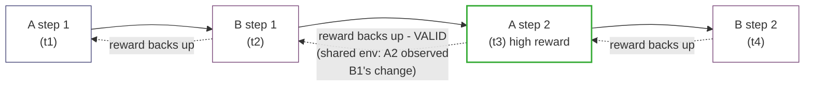

**(b) Paradigm 2 (correct) - isolated environments: backprop follows information dependency
(multica), not wall-clock.** With no A↔B multica message in this stretch, backprop stays
within each lane; A2's reward updates A1 but **not** B1, however much the two lanes
interleave in time.

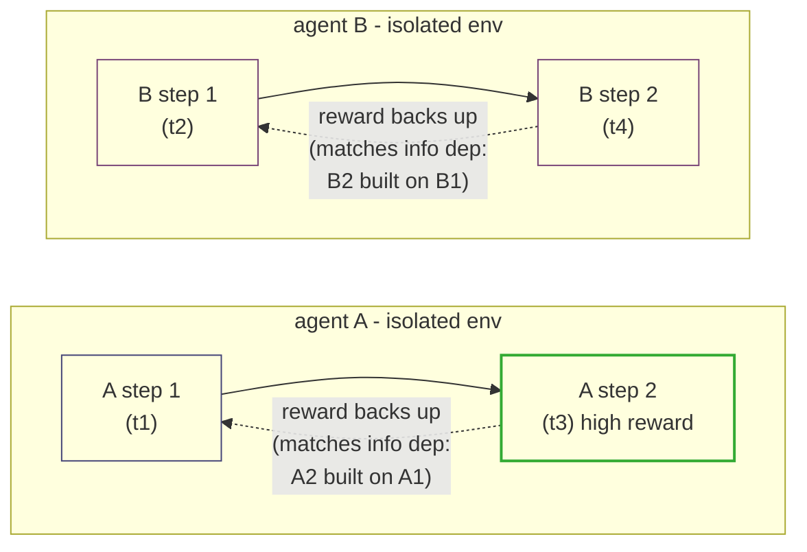

**(c) Paradigm 2 (wrong) - isolated environments, but pure time-order backprop: spurious
cross-lane credit.** Solid arrows are wall-clock time order, **not** information dependency;
the bug is backing reward up along this order as if it were information order. The thick red
edge A2→B1 credits B1 with A2's high reward even though A2 never read B1.

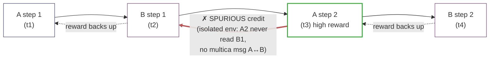

The fix is (b), not (c): in the multica setting the reward-backprop graph is the
**information-dependency graph** - the multica message DAG (`EdgeType` edges) plus each
agent's own in-lane state evolution - not the wall-clock completion-ordered timeline. Two
parallel agents with no multica edge between them must not propagate reward to each other,
however much their actions interleave in time. This is the criterion that selects
`distribute_reward_over_dag` (edge-based) over `compute_global_gae` (time-order) for the
multica path.

## Why the two-layer (isolated-env) MDP converges faster

The isolated-environment prior is not just a bookkeeping choice for where reward backs up -
it **factors the single global MDP into a two-layer (hierarchical) MDP**, and that
factorization is what makes the policy easier to learn. This section gives (a) a provable
horizon reduction, (b) a concrete numeric instance of it, and (c) three supporting
mechanisms, then states the condition under which the claim holds.

### The factorization

Under the prior, the flat problem `M = (S, A, P, R, γ)` (state = full joint frontier, action
= next turn, horizon `T`, one terminal reward `R`) factors as:

- **Inner MDP** `M_k = (S_k, A_k, P_k, R_k, γ)` - one per agent segment. `S_k` = agent `k`'s
  own isolated environment; horizon `h_k` (the turns in one segment); reward `R_k` = the
  verifier's per-`session_id` `outcome_reward` for that segment. Its initial state is set by
  the outer action.
- **Outer MDP** `M_O = (S_O, A_O, P_O, γ_O)` - state = the supernode-segment frontier;
  action = delegate (spawn segment `k` with a task); horizon `N` segments. `T = N · h̄`, but
  no sub-problem has horizon larger than `max(N, h̄)`, which is far below `T`.

The multica pipe is the **boundary channel**: outer action -> inner initial state; inner
terminal output -> outer next state.

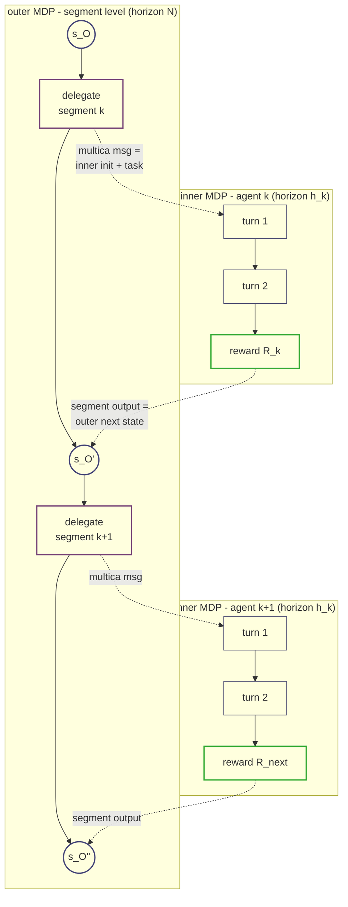

The flat MDP (framework B) is the degenerate single layer: one chain of `T` turns, one
terminal reward, credit assigned over the whole `T`.

Flat vs. layered horizon - the same `T = N · h̄` turns arranged two ways. In the flat MDP
the single terminal reward `R` backs up over all `T` steps (one long backward arrow); in the
two-layer MDP each segment's `R_k` backs up over only its own `h_k` steps (many short
backward arrows):

```mermaid
flowchart TB
    subgraph FLAT["flat MDP (framework B): one chain of T turns, one terminal reward"]
        direction LR
        F1["turn 1"]:::t --> F2["turn 2"]:::t --> FD["..."]:::d --> FT["turn T · reward R"]:::r
        FT -. "credit backs up over all T steps" .-> F1
    end
    subgraph LAYERED["two-layer MDP: N short segments, each with its own reward"]
        direction TB
        subgraph SEG1["segment 1"]
            direction LR
            A1["turn"]:::t --> A2["turn"]:::t --> AR["R_1"]:::r
            AR -. "h_1 steps" .-> A1
        end
        subgraph SEG2["segment 2"]
            direction LR
            B1["turn"]:::t --> B2["turn"]:::t --> BR["R_2"]:::r
            BR -. "h_2 steps" .-> B1
        end
        subgraph SEGN["segment N"]
            direction LR
            N1["turn"]:::t --> N2["turn"]:::t --> NR["R_N"]:::r
            NR -. "h_N steps" .-> N1
        end
    end

    classDef t fill:transparent,stroke:#557;
    classDef r fill:transparent,stroke:#3a3,stroke-width:2px;
    classDef d fill:transparent,stroke:#aaa;
```

Long backup = a long credit-assignment distance (many steps from action to reward) and a
sparse signal (one reward per `T` turns); short backups = a short distance and a dense
signal (one reward per `h_k` turns) - formalized in the horizon proof below.

### Proof: effective-horizon reduction

Define the **credit-assignment distance** `d(a)` as the number of transitions between an
action and the reward it influences - the "intermediate steps from the action to task
completion."

- **flat MDP** - every action can reach only the terminal reward `R` at the end of the whole
  trajectory, so `d_flat(a_t) = T − t`. Average `= (T − 1) / 2`; worst case `= T − 1` (the
  first turn).
- **two-layer** - an action in segment `j` can reach only that segment's reward `R_j`, so
  `d_layer(a in seg j) = h_j − t`. Average `= (h̄ − 1) / 2`; worst case `= h̄ − 1`.

Both shrink by a factor `≈ T / h̄ = N`. The flat-vs-layered diagram above is this proof in
pictures: the backward arrows *are* the credit-assignment distances - one arrow of length `T`
versus `N` arrows of length `h_k`.

**Formal consequence.** Tabular finite-horizon sample complexity to find an `ε`-optimal
policy is `Õ(S · A · H³ / ε²)` (Sidford et al. 2018; Azar et al. 2011), with `H` the episode
horizon. The flat MDP has `H = T`; each inner MDP has `H = h_k`. So the horizon reduction
alone yields `≈ (T / h_k)³ = N³` fewer samples - and since sample complexity grows
(super-linearly) with horizon in essentially every known RL bound, the qualitative
conclusion holds well beyond the tabular regime.

### Concrete instance

Two agents, two steps each, wall-clock order `a_1, b_1, a_2, b_2` (`T = 4`, `h = 2`); flat
reward `R` at the end of turn 4, segment rewards `R_A` / `R_B` at the end of each segment:

| turn | flat `d` (to `R`)        | layered `d` (to `R_k`) |
| ---- | ------------------------ | ---------------------- |
| `a1` | `3` (through `b1,a2,b2`) | `1` (through `a2`)     |
| `b1` | `2`                      | `1`                    |
| `a2` | `1`                      | `0`                    |
| `b2` | `0`                      | `0`                    |
| avg  | `1.5`                    | `0.5`                  |

`a1` waits 3 steps for its reward in the flat MDP but only 1 in the layered one - the 2 extra
steps are exactly `B`'s segment, interposed between `A`'s action and `A`'s reward by the flat
linearization. Distance ratio `1.5 / 0.5 = 3`; horizon ratio `T / h = 2`, so the tabular `H³`
scaling gives `≈ 8×` fewer samples for the inner policy.

### Three supporting mechanisms (real, not quantified here)

- **Reward density / information rate.** The flat MDP emits one reward per `T` turns; each
  inner MDP emits one per `h_k` turns - `T / h_k` times denser. More reward signal per
  trajectory means more gradient information per sample, independent of the distance argument
  above.
- **Information prior -> smaller hypothesis class.** The inner policy's input is its own env
  plus the delegated task (the multica message), **not** the full joint frontier. That other
  agents' envs are irrelevant is built into the architecture rather than learned - a smaller
  hypothesis class (better sample complexity in the PAC sense).
- **Non-stationarity removal (MARL).** From agent `A`'s viewpoint the flat MDP's transition
  `P(s' | s, a)` implicitly contains `B`'s policy - how the joint state evolves depends on
  how `B` acts - and `B`'s policy shifts throughout co-training, so `A`'s environment is
  **non-stationary**. That breaks the single-agent MDP convergence guarantees (the core
  difficulty of multi-agent RL; centralized-training-decentralized-execution and hierarchical
  decomposition are the standard remedies). The two-layer inner MDP is `A` alone: `P_k`
  depends only on `A`'s env and action, `B`'s policy never enters, so it is a **stationary**
  single-agent MDP. This complements rather than repeats the horizon proof: the horizon proof
  gives the sample-complexity *rate* (`Õ(S · A · H³ / ε²)`), and stationarity is the
  *precondition* under which that rate bound holds - a non-stationary environment has no such
  guarantee to invoke.

### Where this lives in code

The two formulations correspond to the two mechanisms already contrasted above:
`compute_global_gae` over `events_from_nodes(ordered_nodes)` is the **flat** time-order
backup - credit propagates over the full `T`-step trajectory (long horizon);
`distribute_reward_over_dag` along `EdgeType` edges, fed by the verifier's per-`session_id`
`outcome_reward` (the observable `R_k`), is the **layered / local** backup - credit
propagates only within each segment's `h_k` steps (short horizon). The horizon reduction is
the formal reason the multica path prefers the latter.

### Caveat: the speedup is conditional on the prior

The horizon argument holds when the prior is valid - rewards decompose over (approximately)
independent segments and agents couple only through multica edges. If the problem is in fact
one tightly-coupled MDP, forcing a two-layer split pushes the coupling into the outer MDP,
which may then be *harder* to learn. The multica setting benefits because agent environments
really are isolated and information really does flow through the message pipe - the structure
the prior assumes.
