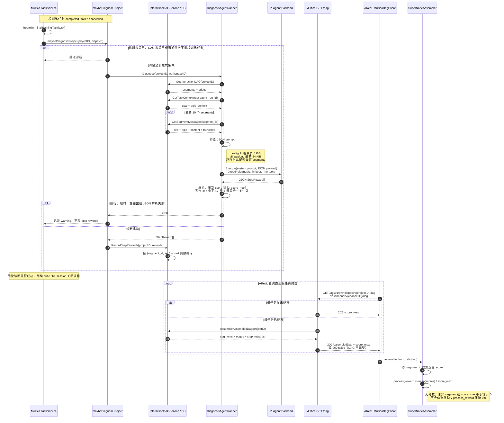
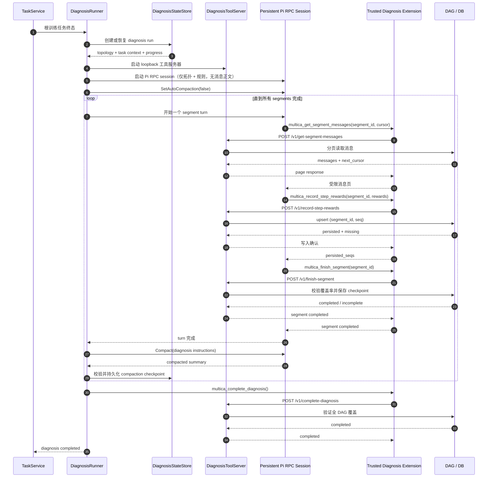

# Multica Diagnose Agent 工作流程

Multica 的 diagnose agent（源码中称 `DiagnosisAgentRunner`）不是协作任务中的一个在线执行 agent，而是根训练任务进入终态后运行的一次性、事后评分器。它读取整个项目的交互 DAG 与各 segment 的消息，让 Pi 模型为每个 assistant/LLM 输出打分，再把逐步分数随 `/dag` 返回给 AReaL。



## 触发条件

诊断只运行一次，位置在 `RouteTerminalTrainingTask` 的根任务终态路径中，并且必须同时满足：

- `DIAGNOSIS_AGENT_ENABLED=true`，默认关闭。
- `INTERACTION_DAG_ENABLED=true`，默认开启。
- 当前终态任务的 `agent_id` 等于 dispatch 的 `train_agent_id`，即它是项目的根训练任务。
- AReaL bridge、数据库 store 和 diagnosis backend 已成功初始化。

它与 scalar critic 是两条独立路径：diagnose agent 查看整个项目 DAG 并产生逐轮 `StepReward`；critic 针对单个 trained task 产生 session 级标量 reward。诊断发生在 critic 分支或普通 RL close hook 之前，但诊断失败不会阻止后续关闭流程。

## 输入、输出与聚合

发送给 Pi 的输入是 JSON，主要包含：

- `task_context.goal` 与 `task_context.gold_context`；
- `segments[]`，其中包含 segment 标识、agent run 标识、序号范围和消息；
- `edges[]`，描述 segment DAG 的连接关系；
- `score_max`，默认值为 `10`。

Pi 被要求只返回 JSON 数组，每项格式为：

```json
{
  "segment_id": "segment-id",
  "seq": 3,
  "score": 8,
  "rationale": "该输出推进了任务目标"
}
```

Multica 将每项按 `(segment_id, seq)` upsert 到 `interaction_dag_step_reward`。`GET /dag` 在组装 DAG 时读取这些记录并附上配置中的 `score_max`。AReaL 随后把同一 segment 的逐轮分数归一化为：

```text
SuperNode.process_reward = mean(segment step scores) / score_max
```

因此最终训练侧消费的是每个 segment 的 `[0, 1]` `process_reward`，而不是逐条 rationale；未评分的 segment 保持稀疏语义，奖励为 `0.0`。

## 关键限制与失败语义

- Pi provider 固定使用 `--no-tools`，诊断完全依赖 Multica 预先注入的 DAG、消息和任务上下文。
- prompt 最多包含前 10 个 segments；任务 goal/gold 各截断到 8 KiB；整体 JSON 超过 64 KiB 时继续从尾部删除 segments。
- 模型分数会被限制到 `[0, score_max]`；`seq < 1` 的记录被忽略；重复 `(segment_id, seq)` 以最后一条为准。
- 模型执行失败、超时、非 completed 状态、空输出、非法 JSON 或落库失败都只记录日志，不让已终态的任务重新失败。
- `/dag` 仅在根任务终态且 segment 覆盖完整时返回可训练 DAG；否则继续返回 `202 in_progress`，或以 `200 {"status":"failed"}` 拒绝不完整 DAG。

## 对应实现

- Multica 触发与软失败：`multica/server/internal/service/training.go`
- prompt、Pi 调用与结果解析：`multica/server/internal/service/diagnosis_agent.go`
- 环境变量与 runner 装配：`multica/server/internal/service/training_config.go`
- step reward 存储与 DAG 组装：`multica/server/internal/service/interaction_dag.go`
- `/dag` 边界与 `score_max`：`multica/server/internal/handler/env_dispatch.go`
- AReaL DAG 客户端：`customized_areal/tree_search/agents/multica_dag_client.py`
- AReaL reward 聚合：`customized_areal/tree_search/agents/supernode_assembler.py`

## On-Demand Diagnosis Flow (Tasks 1-8)

The on-demand diagnosis agent replaces the one-shot JSON prompt with a persistent Pi RPC session and per-segment message paging. Rewards are persisted incrementally through a scoped loopback API rather than returned in a single JSON batch.



### Key Changes from One-Shot Flow

| Aspect | One-Shot (Legacy) | On-Demand (New) |
|--------|------------------|-----------------|
| Pi session | 每次诊断新建 | 持久复用 |
| Initial prompt | 包含所有消息正文 | 仅拓扑 + 规则 |
| Message reading | 一次性 JSON payload | 分页 + opaque cursor |
| Reward persistence | 诊断完成后批量写入 | 每页增量写入 |
| Compaction | 无 | 每 segment 后强制压缩 |
| Tool access | `--no-tools` | `--no-tools` + 5 个诊断工具 |
| Credentials | N/A | Loopback HTTP + bearer token |
| Recovery | 无 | 从 DB checkpoint 恢复 |
| Segment limit | 10 (硬截断) | 无限制 |

### Configuration (On-Demand)

| Env Variable | Default | Description |
|-------------|---------|-------------|
| `DIAGNOSIS_AGENT_ON_DEMAND_ENABLED` | `false` | Enable on-demand flow |
| `DIAGNOSIS_AGENT_PAGE_TURN_LIMIT` | `20` | Max turns per message page |
| `DIAGNOSIS_AGENT_PAGE_BYTE_LIMIT` | `24576` | Max bytes per message page |
| `DIAGNOSIS_AGENT_HARD_CONTEXT_PERCENT` | `80` | Emergency compaction threshold |
| `DIAGNOSIS_AGENT_MAX_REFETCHES_PER_SEGMENT` | `2` | Max repair turns per segment |
| `DIAGNOSIS_AGENT_MAX_RUN_TIMEOUT_SECONDS` | `0` | Run timeout (0 = unset) |

### Tool Isolation

Pi launches with `--no-tools` (disabling all ordinary tools, extensions, skills, and prompt templates) plus exactly one explicit `--extension` pointing to a Multica-generated trusted TypeScript file. The extension registers only five tools that call the loopback HTTP server; no generic HTTP, filesystem, or shell access is exposed. The capability token is read from `MULTICA_DIAGNOSIS_CAPABILITY_TOKEN` at runtime and never appears in argv, prompts, or logs.
