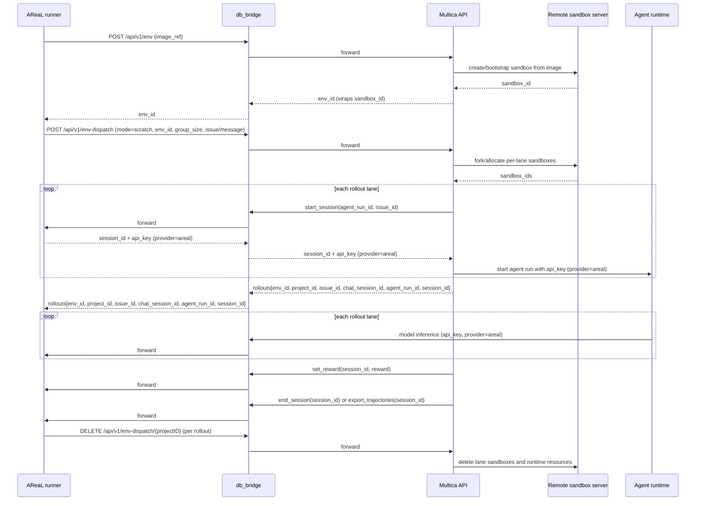
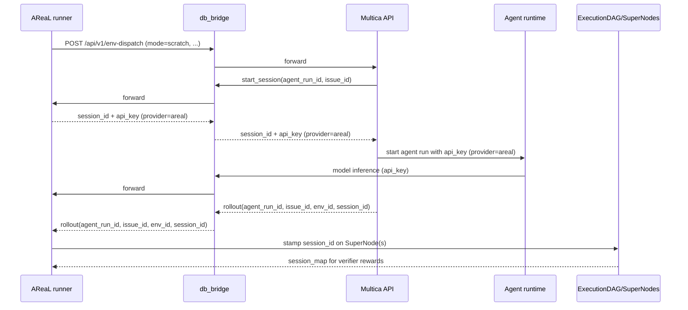
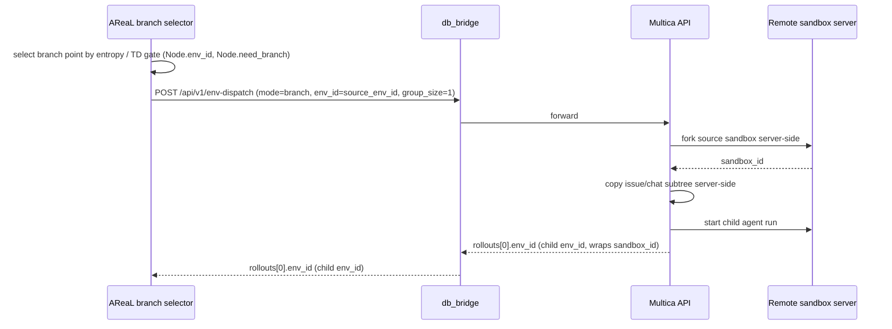

# AReaL, Multica, and Remote Sandbox Environment Protocol

This document explains how AReaL communicates with Multica for multi-agent DAG RL
rollouts, and how rollout environments are created, branched, and cleaned up through the
unified env-dispatch API. The Python training side intentionally sees HTTP seams and
small protocols only; it does not import a sandbox-vendor SDK.

## Actors

| Actor                                 | Responsibility                                                                                                                                                                                                                                                                                                                                                                                  |
| ------------------------------------- | ----------------------------------------------------------------------------------------------------------------------------------------------------------------------------------------------------------------------------------------------------------------------------------------------------------------------------------------------------------------------------------------------- |
| AReaL trainer / tree-search agents    | Starts rollout groups, consumes RL `session_id`s produced by Multica, records trajectories, selects branch points, asks Multica to materialize branches via env-dispatch, verifies rewards, and cleans up.                                                                                                                                                                                      |
| Multica API                           | Owns the unified env-dispatch primitive: base env boot, scratch/branch dispatch, issue/chat/task orchestration, agent-run startup, and the mapping from rollout lanes to projects/issues/sandboxes. Calls `db_bridge.start_session` per rollout to register the RL session and obtain a scoped `api_key`. Server-side owns sandbox snapshot/fork/issue-subtree-copy as part of `mode="branch"`. |
| db_bridge                             | AReaL-hosted control-plane + model-serving bridge. Exposes `start_session` (returns `session_id` + scoped `api_key`), `set_reward`, `end_session`, `export_trajectories`, and the AReaL-served model endpoint. Multica and the agent runtime call it over HTTP; AReaL never imports its internals.                                                                                              |
| Remote sandbox server / cloud runtime | Owns live sandbox lifecycle behind Multica's env-dispatch endpoints. Multica calls this service; AReaL talks to it only through `ForkableEnvironment` providers when an explicit injection path is wired.                                                                                                                                                                                       |
| Agent runtime                         | Runs inside the allocated sandbox, calls the AReaL-served model via db_bridge using the `api_key` Multica handed it (provider `areal`), emits messages/interactions, and carries RL session metadata used by AReaL.                                                                                                                                                                             |

## Design Boundaries

- AReaL treats Multica as the orchestration authority for issues, projects, chat
  sessions, agent runs, rollout groups, and branch materialization.
- AReaL treats sandbox operations as a vendor-neutral `ForkableEnvironment` protocol:
  `snapshot`, `fork`, `restore`, and `cleanup`. This seam is kept for explicit injection
  scenarios; the live branch path does **not** flow through it.
- Branching is **a single env-dispatch call**:
  `env_dispatch(mode="branch", env_id=<source>)`. Multica performs the sandbox fork and
  the issue-subtree copy server-side; AReaL never snapshots, forks, or replays messages
  itself.
- Multica hides the concrete sandbox vendor behind its cloud-runtime endpoints. Today
  the remote side may be Daytona/Fleet-backed, but that detail must not leak into
  trainer code.

### Pipeline Notes

- `env_id` is the canonical Multica-facing environment handle: base envs, lane envs, and
  branch envs are all identified by `env_id`. The `SuperNode.env_id` field is the branch
  frontier captured on each segment's terminal turn; the per-turn `Node.env_id` (in
  `core/tree_store.py`) is the same handle stamped from backend per-turn metadata.
- `sandbox_id` is the remote runtime handle used by `ForkableEnvironment`
  snapshot/fork/restore/delete. It is **not** used by the live branch path; the
  `_BranchDriver` Protocol parameter is named `sandbox_id` only for structural
  compatibility with the runner — the value passed in is the source `env_id`.
- Fresh rollout state is created by `env_dispatch(mode="scratch", ...)`; branch state is
  created by `env_dispatch(mode="branch", env_id=<source>)`. `mode="resume"` is accepted
  at the boundary as an alias for `branch`.
- The verifier writes rewards before trajectory harvest so AReaL never trains on an
  unrewarded terminal trajectory.
- Cleanup flows through Multica env-dispatch; `404` means the resource is already gone
  and is treated as success.

## AReaL → db_bridge → Multica API Surface

`agents/multica_client.py` wraps the unified env-dispatch API through
`MulticaEnvDispatchClient`, and `agents/multica_dag_client.py` polls the assembled
DAG. AReaL addresses the db_bridge stub on the AReaL host, which relays these
endpoints to Multica. AReaL never calls Multica directly for env-dispatch.

These endpoints ride the db_bridge `multica_api` group: the **stub** runs on the
AReaL host (areal side) and the **executor** runs on the multica host, forwarding
each request to the real multica Go server over loopback. The executor injects
`BRIDGE_MULTICA_UPSTREAM_API_KEY` as `Authorization: Bearer <key>` and strips any
caller-supplied credentials, so AReaL's own tokens never reach Multica.

| AReaL call                             | db_bridge → Multica endpoint                         | Purpose                                                                                                                                                             |
| -------------------------------------- | ---------------------------------------------------- | ------------------------------------------------------------------------------------------------------------------------------------------------------------------- |
| `create_base_env(image_ref=...)`       | `POST <db_bridge>/api/v1/env`                        | Boot a reusable base environment from an image reference; returns `env_id`.                                                                                         |
| `delete_env(env_id=...)`               | `DELETE <db_bridge>/api/v1/env/{envID}`              | Delete a base environment; `404` is treated as already-cleaned-up.                                                                                                  |
| `create_env_dispatch(...)`             | `POST <db_bridge>/api/v1/env-dispatch`               | Unified dispatch primitive. Covers fresh rollouts (`mode="scratch"`), branches (`mode="branch"`), and resume (`mode="resume"`, normalized to `branch` server-side). |
| `cleanup_env_dispatch(project_id=...)` | `DELETE <db_bridge>/api/v1/env-dispatch/{projectID}` | Cascade cleanup for one rollout project: issues, chat sessions, tasks, and associated runtime state. `404` is treated as success.                                   |
| `get_dag(project_id=...)`              | `GET <db_bridge>/api/v1/env-dispatch/{projectID}/dag` | Poll the assembled segment DAG: `202` not-ready, `200` assembled DAG, `404` unknown project, `403` cross-workspace. Bridge `502`/`503`/`504` are re-polled. |

The DAG poller (`MulticaDagClient`) is repointed at the AReaL-side stub via
`AREAL_BRIDGE_STUB_URL` (not `MULTICA_BASE_URL`) and sends no `Authorization` --
the multica executor injects the upstream key. It re-polls `202` and bridge
transient responses (`502`/`503`/`504`) up to the configured wall-clock deadline,
then raises `DagTimeout`; `404` maps to `DagNotFound` and `403` to `DagForbidden`.

### Segment close (no reward) via the gateway group

Closing a segment without reward (`POST /rl/close_segment`) flows through the
db_bridge `gateway` group, not `multica_api`: the multica `arealrl` client posts
to the db_bridge stub (le-agent side) with the session-key
`Authorization: Bearer <proxy_key>`, and the AReaL-side executor forwards it to
the real AReaL gateway. The session key passes through end to end, mirroring
`set_reward`; the channel is registered as `rl_close_segment` so the stub no
longer 404s.

`create_env_dispatch` accepts these key fields:

| Field               | Meaning                                                                                                                                                                      |
| ------------------- | ---------------------------------------------------------------------------------------------------------------------------------------------------------------------------- |
| `mode`              | `scratch` for fresh rollouts, `branch` for branching off a source env, `resume` (alias for `branch`).                                                                        |
| `env_id`            | Source environment. Required for `branch`/`resume`; optional for `scratch` (only valid to omit when `domain=self_play` and the workspace has a configured default base env). |
| `dispatch_type`     | `issue` for SWE-Lego or `message` for self-play.                                                                                                                             |
| `agent_id`          | Agent/template to run in each lane. Optional; Multica resolves a workspace default when omitted.                                                                             |
| `squad_id`          | Optional squad identifier for team rollouts.                                                                                                                                 |
| `group_size`        | Number of rollout lanes to create. Defaults to `1`; branch dispatches use `1`.                                                                                               |
| `domain`            | Optional domain label such as `swe_lego` or `self_play`.                                                                                                                     |
| `issue` / `message` | Domain payload. Exactly one is usually populated by the runner.                                                                                                              |

The response is normalized into `SweLegoSetup(rollouts=[...])` — a list with one entry
per lane (so a `group_size=N` scratch dispatch returns N rollouts, and a branch dispatch
returns 1). Each `SweLegoRollout` contains:

| Field             | Meaning                                                                                             |
| ----------------- | --------------------------------------------------------------------------------------------------- |
| `env_id`          | Runtime environment ID assigned to this lane. For a branch dispatch this is the new child `env_id`. |
| `project_id`      | Multica project ID used for cleanup.                                                                |
| `issue_id`        | Issue ID for issue-based runs; empty for message/self-play runs.                                    |
| `chat_session_id` | Chat session created for the agent lane.                                                            |
| `agent_run_id`    | Agent run started by Multica.                                                                       |

## Fresh Rollout Lifecycle



The AReaL orchestration helpers are:

- `run_swe_lego_issue`: dispatches a SWE-Lego issue (`mode="scratch"`,
  `domain="swe_lego"`, `dispatch_type="issue"`), consumes the `session_id` Multica
  obtained from db_bridge for each rollout, drives per-lane branching via the injected
  `_BranchDriver`, hands the terminal `env_id` off to Multica's verifier agent (rewards
  flow Multica → db_bridge → AReaL), and always cleans up each `project_id`.
- `run_self_play`: same lifecycle, but dispatches a `SelfPlayQuery.content` as a chat
  message with `domain=self_play`, `dispatch_type="message"`, and `issue_id=""` on the
  RL session start.

Both runners iterate `setup.rollouts` (not a single rollout), read the `session_id`
Multica produced for each rollout via the `_RlSession` seam, then call
`branch_driver.drive_lane(agent_run_id=..., sandbox_id=r.env_id, session_id=sid)` per
lane. The `sandbox_id` parameter carries the **source `env_id`** for the lane; the
driver returns the **terminal child `env_id`** after any internal branching. The
terminal `env_id` is then handed to Multica's verifier agent, which writes rewards and
ends/exports the session via db_bridge.

## RL Session Start and End

RL sessions are the control-plane link between Multica agent runs and AReaL training
trajectories. During env-dispatch, Multica calls
`db_bridge.start_session(agent_run_id, issue_id)` for each rollout; db_bridge forwards
to the AReaL runner, which creates the session and returns `session_id` + `api_key`
(provider `areal`) back through db_bridge. Multica then hands the `api_key` to the agent
runtime with provider `areal`, and the agent uses it to call the AReaL-served model via
db_bridge (again forwarded to the AReaL runner). AReaL reads the resulting `session_id`
from the rollout to bind trajectory capture, rewards, and export to the correct agent
run.

The runner protocols in `swe_lego_issue_runner.py` and `self_play_runner.py` model the
session handle as:

```python
class _RlSession(Protocol):
    async def start(self, *, agent_run_id: str, issue_id: str) -> str: ...
```

System-level flow:

1. Multica creates `agent_run_id` and `issue_id` during env-dispatch.
1. Multica calls `db_bridge.start_session(agent_run_id, issue_id)` for each rollout;
   db_bridge forwards to the AReaL runner.
1. AReaL runner creates the session and returns `session_id` + `api_key` (provider
   `areal`) through db_bridge.
1. Multica passes the `api_key` to the agent runtime with provider `areal`.
1. The agent runtime uses the `api_key` to call the AReaL-served model via db_bridge
   (db_bridge forwards to the AReaL runner).
1. AReaL reads the `session_id` for the rollout and passes it into
   `branch_driver.drive_lane(...)` so trajectory capture, rewards, and later export are
   bound to the correct agent run.
1. `SuperNodeAssembler` stamps the `session_id` onto every `SuperNode` for that agent
   run. `ExecutionDAG.session_map()` exposes `{super_node_id: session_id}` to the
   verifier.
1. After lane completion, Multica's verifier agent calls `db_bridge.set_reward` and
   `db_bridge.end_session` / `db_bridge.export_trajectories`; db_bridge forwards each to
   the AReaL runner, which persists the reward and revokes the session on export.



Ending a session is driven by Multica's verifier agent, which calls db_bridge to write
the reward and then end or export the session. db_bridge forwards every call to the
AReaL runner; the AReaL-side Python finalizers enforce reward-before-export ordering on
the receiving end. Two paths are supported:

| Path             | Caller → mediator → callee                                           | Calls                                                                                              | When used                                                                        |
| ---------------- | -------------------------------------------------------------------- | -------------------------------------------------------------------------------------------------- | -------------------------------------------------------------------------------- |
| Legacy finalizer | Multica verifier agent → db_bridge → AReaL (`RLSessionRewardWriter`) | `set_reward(session_id, reward)` then `end_session(session_id)`                                    | Backward-compatible single-verifier flow.                                        |
| Verifier harvest | Multica verifier agent → db_bridge → AReaL (`VerifierFinalizer`)     | `set_reward(session_id, reward)` for all sessions, then `export_trajectories(session_id)` for each | Preferred multi-agent verifier flow; export is terminal and revokes the session. |

The reward-before-end/export ordering is mandatory. If `set_reward` fails, the legacy
writer deliberately does **not** call `end_session`; the session stays open so the
caller can retry and avoid losing the trajectory. In the harvest flow, rewards for all
sessions are written first, then each session is exported exactly once.

The verifier agent extension can also call db_bridge directly:

| Verifier command                       | db_bridge call                         | Effect                                                         |
| -------------------------------------- | -------------------------------------- | -------------------------------------------------------------- |
| `/rl/set_reward <session_id> <reward>` | `POST <db_bridge>/rl/set_reward`       | Writes or overwrites the reward for one session.               |
| `/export_trajectories <session_id>`    | `POST <db_bridge>/export_trajectories` | Exports the reward-stamped trajectory and revokes the session. |

The AReaL Python finalizer (`RLSessionRewardWriter` / `VerifierFinalizer`) remains
authoritative for ordering on the receiving side: it ensures rewards are persisted
before any export is acknowledged, even when the Multica verifier agent already issued
`/rl/set_reward` directly.

## ForkableEnvironment Seam (Explicit Injection Only)

`agents/environment.py` defines a vendor-neutral environment seam that remains for
scenarios where AReaL needs direct snapshot/fork/restore/cycle control — for example, an
explicitly injected provider used by the verifier or a future coordinator. The live
branch path does **not** flow through this seam; it uses env-dispatch exclusively.

```python
class ForkableEnvironment(Protocol):
    async def snapshot(self, sandbox_id: str) -> SnapshotResult: ...
    async def fork(self, *, source_sandbox_id: str | None = None, snapshot_id: str | None = None) -> ForkResult: ...
    async def restore(self, sandbox_id: str) -> None: ...
    async def cleanup(self, sandbox_id: str) -> None: ...
```

Two provider implementations currently exist:

| Provider                 | Endpoint prefix         | Intended use                                                                |
| ------------------------ | ----------------------- | --------------------------------------------------------------------------- |
| `FleetSandboxProvider`   | `/sandboxes/...`        | Generic Fleet cloud-runtime proxy. Uses `FLEET_BASE_URL` / `FLEET_API_KEY`. |
| `MulticaSweLegoProvider` | `/api/v1/sandboxes/...` | Multica cloud-runtime proxy. Uses `MULTICA_BASE_URL` / `MULTICA_API_KEY`.   |

The Multica-backed provider calls these endpoints:

| Operation | Endpoint                               | Request                                                        | Response                   |
| --------- | -------------------------------------- | -------------------------------------------------------------- | -------------------------- |
| Snapshot  | `POST /api/v1/sandboxes/{id}/snapshot` | Sandbox ID in path                                             | `{ "snapshot_id": "..." }` |
| Fork      | `POST /api/v1/sandboxes/fork`          | `{ "snapshot_id": "..." }` or `{ "source_sandbox_id": "..." }` | `{ "sandbox_id": "..." }`  |
| Restore   | `POST /api/v1/sandboxes/{id}/restore`  | Sandbox ID in path                                             | `200` or `204`             |
| Cleanup   | `DELETE /api/v1/sandboxes/{id}`        | Sandbox ID in path                                             | `200`, `204`, or `404`     |

`fork` requires exactly one source: either `snapshot_id` or `source_sandbox_id`. The
providers use a semaphore to cap concurrent forks; by default the cap comes from
`GROUP_SIZE`, falling back to `2`.

## Branch / Resume Lifecycle

Branching resumes work from a saved frontier. `agents/branch_driver.py` implements this
in `EnvDispatchBranchDriver`, which satisfies the `_BranchDriver` Protocol used by both
runners (structural typing).



Branch materialization is a single env-dispatch call:

1. **Select branch point**: AReaL picks a `Node` with `need_branch=True` (entropy / TD
   gate) — its `env_id` is the branch frontier. The same handle is mirrored on the
   `SuperNode.env_id` field by `SuperNodeAssembler`.
1. **Dispatch branch**: `EnvDispatchBranchDriver.drive_lane(...)` calls
   `create_env_dispatch(mode="branch", env_id=<source_env_id>, group_size=1, ...)` with
   the same `domain` / `dispatch_type` / `agent_id` as the parent rollout.
1. **Server-side fork**: Multica forks the source sandbox, copies the issue/chat
   subtree, and starts a child agent run. AReaL does **not** snapshot, fork, replay
   messages, or drop `PriorSessionID` itself — those steps are server-side.
1. **Return child env_id**: the driver returns `setup.rollouts[0].env_id`, which the
   runner treats as the terminal `env_id` for the lane and passes to the verifier.

`mode="resume"` is accepted at the boundary as an alias for `branch`; Multica normalizes
it to `branch` server-side and records the original verb only for logging/metrics.

## Rollback and Cleanup Rules

Because branch materialization is a single env-dispatch call, partial-failure rollback
is owned by Multica server-side: the caller sees either a child `env_id` (the fork,
issue copy, and agent run all succeeded) or a non-2xx response (nothing was committed).
AReaL does not need to pair snapshot/ fork/ issue-fork/ start-branch rollback steps.

What AReaL owns is the outer rollout lifecycle, and it is structured for guaranteed
cleanup:

| Failure point                                                            | Rollback action                                                                                                          |
| ------------------------------------------------------------------------ | ------------------------------------------------------------------------------------------------------------------------ |
| `create_env_dispatch(mode="scratch", ...)` fails                         | Nothing was allocated; raise. The runner's `try/finally` is empty.                                                       |
| RL session start, branch drive, or verifier fails after scratch dispatch | The runner's `finally` block issues `DELETE /api/v1/env-dispatch/{projectID}` per rollout.                               |
| `set_reward` fails before export                                         | Legacy writer leaves the session open (no `end_session`); the caller retries. The cleanup still runs in `finally`.       |
| `export_trajectories` fails during harvest                               | The session is left un-exported; the failure is logged. Reward was already written. The cleanup still runs in `finally`. |

Cleanup is intentionally idempotent:

- Env-dispatch cleanup treats `404` as success.
- Sandbox cleanup (via `ForkableEnvironment`) treats `404` as success.
- Cleanup failures during the `finally` block are logged and not allowed to mask the
  original rollout failure.

## ID Flow Summary

| ID             | Produced by                             | Consumed by                                                                  | Purpose                                                                                                                                                               |
| -------------- | --------------------------------------- | ---------------------------------------------------------------------------- | --------------------------------------------------------------------------------------------------------------------------------------------------------------------- |
| `env_id`       | Multica env/env-dispatch                | AReaL runners, branch driver, `SuperNode.env_id`, per-turn `Node.env_id`     | Canonical environment handle: base env, lane env, or branch child env. Branch dispatch takes `env_id=<source>` and returns a new child `env_id`.                      |
| `sandbox_id`   | Remote sandbox server / Multica runtime | `ForkableEnvironment` only                                                   | Live sandbox handle for snapshot/fork/restore/delete through explicit injection. Not used by the env-dispatch branch path.                                            |
| `snapshot_id`  | Remote sandbox server                   | `ForkableEnvironment.fork(snapshot_id=...)`                                  | Durable save point for `ForkableEnvironment`-driven forks. Not produced by the env-dispatch branch path.                                                              |
| `project_id`   | Multica env-dispatch                    | Cleanup calls                                                                | Groups rollout resources for cascade deletion. One per rollout lane.                                                                                                  |
| `issue_id`     | Multica env-dispatch                    | RL session start, verifier                                                   | Identifies the issue subtree for the lane. Branch copies the subtree server-side; AReaL never forks issues itself.                                                    |
| `agent_run_id` | Multica agent runtime                   | RL session start, lane driver, verifier                                      | Identifies one agent execution lane.                                                                                                                                  |
| `session_id`   | db_bridge (`start_session`)             | Lane driver, `SuperNodeAssembler`, verifier/reward writer/trajectory harvest | Binds rewards and exported trajectories to one agent run. Multica creates it via db_bridge and returns it to AReaL in the rollout.                                    |
| `api_key`      | db_bridge (`start_session`)             | Multica → agent runtime                                                      | Scoped credential for one agent run to call the AReaL-served model via db_bridge (provider `areal`). Issued by db_bridge alongside `session_id`; not stored by AReaL. |

## Current Integration Status

The torch-free `agents/` modules define and test the Multica communication contracts,
the env-dispatch branch driver, and the verifier/harvest finalizers. The live
`TreeSearchGroupedRolloutWorkflow` still uses the legacy single-agent TPFC branch path
(`build_branch_task`) unless a future coordinator wires `multica_dag_enabled` /
`multica_dag_client` into the episode loop (see
`docs/superpowers/specs/2026-06-30-supernode-multica-dag-rollout-design.md`). The shared
`SuperNode` store path is already active because single-agent episodes are wrapped as
leaf `SuperNode`s before insertion into `MCTSTreeStore`, and per-turn `Node.env_id` is
stamped from backend metadata so the branch-frontier handle is available wherever a
future coordinator needs it.

## Env Checkpoint Semantics

Env checkpoint creation is pause-in-place. Multica synchronously waits for
sandboxd stop/Cube pause up to the configured timeout and stores the project
subtree inline as JSONB. A completed checkpoint can be resumed through
resume-from-checkpoint, which resumes the same sandbox instances. The API does
not provide immutable fork, branch, snapshot, or copy-on-write semantics.

### Endpoints

- `POST /api/v1/env-checkpoints` - create a checkpoint; body carries
  `project_id`, `event_ref`, `checkpoint_kind`, `env_id_map`, `sandbox_refs`,
  optional `entropy_score`, and optional `save_timeout_ms`. Returns 201 on
  synchronous save completion, 409 on save timeout/failure (non-resumable), 400
  on validation error. Gated by `ENV_CHECKPOINTS_ENABLED` (disabled -> 404).
- `GET /api/v1/env-checkpoints/{checkpointID}` - fetch a single checkpoint,
  workspace-scoped (cross-workspace -> 404).
- `GET /api/v1/projects/{projectID}/env-checkpoints` - list checkpoints for a
  project, newest first.
- `POST /api/v1/env-checkpoints/{checkpointID}/resume` - resume the saved
  sandbox instances; returns a `rollout_handle` AReaL uses to continue
  tree-search. Incomplete checkpoints (pending/timed_out/failed) -> 409.

### Save Statuses

`complete` (resumable), `timed_out` (non-resumable), `failed` (non-resumable),
`pending` (transient, set during synchronous save). Resume rejects anything
other than `complete`.

### AReaL Entropy Gating

AReaL calls `should_create_entropy_checkpoint(entropy, threshold)` before
hitting the create API. When logprobs are unavailable (`entropy is None`) or no
threshold is configured, the checkpoint is skipped silently - the rollout
continues without failing or creating a spurious checkpoint.
