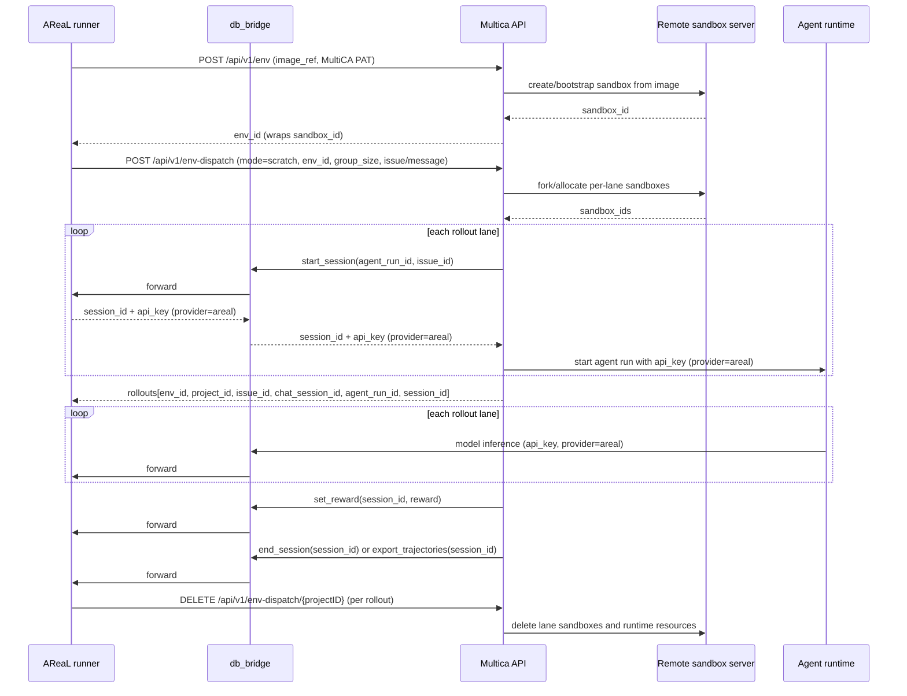
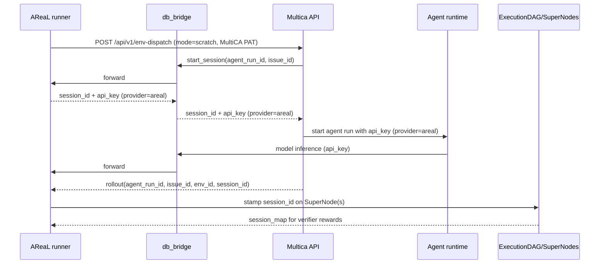
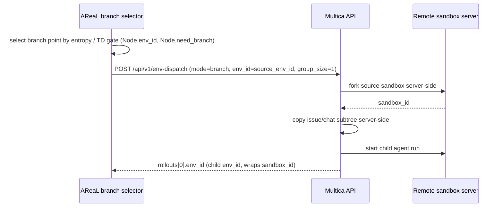

# AReaL, Multica, and Remote Sandbox Environment Protocol

This document explains how AReaL communicates with Multica for multi-agent DAG RL
rollouts, and how rollout environments are created, branched, and cleaned up through the
unified env-dispatch API. The Python training side intentionally sees HTTP seams and
small protocols only; it does not import a sandbox-vendor SDK.

## Actors

| Actor                                 | Responsibility                                                                                                                                                                                                                                                                                                                                                                                  |
| ------------------------------------- | ----------------------------------------------------------------------------------------------------------------------------------------------------------------------------------------------------------------------------------------------------------------------------------------------------------------------------------------------------------------------------------------------- |
| AReaL trainer / tree-search agents    | Starts rollout groups, consumes RL `session_id`s produced by Multica, records trajectories, selects branch points, asks Multica to materialize branches via env-dispatch, verifies rewards, and cleans up.                                                                                                                                                                                      |
| Multica API                           | Owns the unified env-dispatch primitive: base env boot, scratch/branch dispatch, issue/chat/task orchestration, agent-run startup, and the mapping from rollout lanes to projects/issues/sandboxes. Calls `db_bridge.start_session` per rollout to register the RL session and obtain a scoped `api_key`. Server-side owns sandbox snapshot/fork/issue-subtree-copy as part of `mode="branch"`. |
| db_bridge                             | AReaL-hosted control-plane + model-serving bridge. Exposes `start_session` (returns `session_id` + scoped `api_key`), `set_reward`, `end_session`, `export_trajectories`, and the AReaL-served model endpoint. Multica and the agent runtime call it over HTTP; AReaL never imports its internals.                                                                                              |
| Remote sandbox server / cloud runtime | Owns live sandbox lifecycle behind Multica's env-dispatch endpoints. Multica calls this service; AReaL talks to it only through `ForkableEnvironment` providers when an explicit injection path is wired.                                                                                                                                                                                       |
| Agent runtime                         | Runs inside the allocated sandbox, calls the AReaL-served model via db_bridge using the `api_key` Multica handed it (provider `areal`), emits messages/interactions, and carries RL session metadata used by AReaL.                                                                                                                                                                             |

## Design Boundaries

- AReaL treats Multica as the orchestration authority for issues, projects, chat
  sessions, agent runs, rollout groups, and branch materialization.
- AReaL treats sandbox operations as a vendor-neutral `ForkableEnvironment` protocol:
  `snapshot`, `fork`, `restore`, and `cleanup`. This seam is kept for explicit injection
  scenarios; the live branch path does **not** flow through it.
- Branching is **a single env-dispatch call**:
  `env_dispatch(mode="branch", env_id=<source>)`. Multica performs the sandbox fork and
  the issue-subtree copy server-side; AReaL never snapshots, forks, or replays messages
  itself.
- Multica hides the concrete sandbox vendor behind its cloud-runtime endpoints. Today
  the remote side may be Daytona/Fleet-backed, but that detail must not leak into
  trainer code.

### Pipeline Notes

- `env_id` is the canonical Multica-facing environment handle: base envs, lane envs, and
  branch envs are all identified by `env_id`. The `SuperNode.env_id` field is the branch
  frontier captured on each segment's terminal turn; the per-turn `Node.env_id` (in
  `core/tree_store.py`) is the same handle stamped from backend per-turn metadata.
- `sandbox_id` is the remote runtime handle used by `ForkableEnvironment`
  snapshot/fork/restore/delete. It is **not** used by the live branch path; the
  `_BranchDriver` Protocol parameter is named `sandbox_id` only for structural
  compatibility with the runner — the value passed in is the source `env_id`.
- Fresh rollout state is created by `env_dispatch(mode="scratch", ...)`; branch state is
  created by `env_dispatch(mode="branch", env_id=<source>)`. `mode="resume"` is accepted
  at the boundary as an alias for `branch`.
- The verifier writes rewards before trajectory harvest so AReaL never trains on an
  unrewarded terminal trajectory.
- Cleanup flows through Multica env-dispatch; `404` means the resource is already gone
  and is treated as success.

### Per-Agent Ephemeral Sandbox Pipeline (Phase 1–5)

This is the end-to-end flow for a single-agent daemon-enabled scratch dispatch:
AReaL calls `POST /api/v1/env-dispatch`, Multica pre-creates an offline agent
runtime R′, boots a Cube sandbox with an in-sandbox daemon, the daemon registers
and adopts R′, the task is routed to R′, the daemon claims and executes it, and
the sandbox is reclaimed on terminal.

```mermaid
sequenceDiagram
    autonumber

    participant A as 🟦 AReaL<br/>(MulticaEnvDispatchClient)
    participant H as 🟩 Multica Handler<br/>(EnvDispatch)
    participant S as 🟩 EnvDispatchService<br/>(Dispatch)
    participant DB as 🟨 Postgres<br/>(sqlc Queries)
    participant LC as 🟩 EnvSandboxLifecycle<br/>Service
    participant SD as 🟥 Sandboxd / Cube
    participant D as 🟪 In-Sandbox Daemon
    participant TS as 🟩 TaskService

    %% ═══════════════════════════════════════════════════════════════════
    %% PHASE 1: Request ingress & validation
    %% ═══════════════════════════════════════════════════════════════════
    rect rgb(230, 245, 255)
        Note over A,H: Phase 1 — Request ingress & validation
        A->>H: POST /api/v1/env-dispatch<br/>Authorization: Bearer <PAT><br/>mode=scratch, agent_id, group_size=N,<br/>domain=self_play, message, train_agent_id
        H->>H: requireUserID(w, r) → userID
        H->>H: ctxWorkspaceID(r.Context()) → workspaceID
        H->>H: json.Decode → EnvDispatchRequest<br/>UUID-shape validate: env_id, agent_id, …
        H->>S: Dispatch(EnvDispatchInput)
    end

    %% ═══════════════════════════════════════════════════════════════════
    %% PHASE 2: Service validation & base env resolution
    %% ═══════════════════════════════════════════════════════════════════
    rect rgb(255, 245, 230)
        Note over S,DB: Phase 2 — Validate & resolve/create base env
        S->>S: validate(in) — mode, dispatch_type, group_size,<br/>agent_id/squad_id, train_agent_id,<br/>domain↔dispatch_type, issue/message
        S->>S: validatePerAgentEnvSpecsDB — agent membership,<br/>template/base_env_id authorization
        S->>DB: GetDefaultSelfPlayEnv(workspaceID)
        alt no default configured
            S->>LC: CreateSandboxInstance(template, DaemonEnabled=false)
            LC->>DB: InsertSandboxInstance → ref
            LC->>SD: EnqueueSandboxJob("create") + Notify
            S->>DB: CreateEnv(sandboxIDs=[ref.InstanceID], mode=base)
            S->>DB: SetDefaultSelfPlayEnv (conditional, first-writer-wins)
        end
        S->>DB: GetEnv(envID, workspaceID) → sourceEnv
        S->>S: Mode↔env-kind cross-check<br/>(scratch→base, branch→state)
    end

    %% ═══════════════════════════════════════════════════════════════════
    %% PHASE 3: Per-rollout reset (concurrent resetOne × group_size)
    %% ═══════════════════════════════════════════════════════════════════
    rect rgb(230, 255, 230)
        Note over S,LC: Phase 3 — resetOne (concurrent, semaphore-gated)
        par concurrent resetOne per rollout lane
            S->>S: createSandboxInstanceRefs(in, sourceEnv)

            %% 3a: Pre-create R′
            rect rgb(255, 255, 220)
                Note over S,DB: 3a — PrecreateAgentRuntime (offline R′)
                S->>DB: GetAgentInWorkspace(agentID) → provider
                S->>S: daemonID = uuid.NewString()
                S->>DB: PrecreateAgentRuntime(<br/>  workspaceID, daemonID, provider, ownerID<br/>) → runtimeID (R′), status=offline
            end

            %% 3b: Sandbox lifecycle create
            rect rgb(255, 240, 240)
                Note over S,SD: 3b — EnvSandboxLifecycle.Create
                S->>LC: CreateSandboxInstance(<br/>  template, DaemonEnabled=true,<br/>  RuntimeEnv={MULTICA_DAEMON_ID: daemonID}<br/>)
                LC->>DB: InsertSandboxInstance → ref
                LC->>DB: MintSandboxRuntimeEnv →<br/>  SERVER_URL, PAT token,<br/>  WORKSPACE_ID, DAEMON_ENABLED=1,<br/>  PROFILE=instance-{uuid}
                LC->>LC: overlay caller RuntimeEnv<br/>  (MULTICA_DAEMON_ID wins over minted keys)
                LC->>SD: EnqueueSandboxJob("create", payload)<br/>  payload: template, limits, runtime,<br/>  runtime_env (with daemon bootstrap)
                LC->>SD: NotifySandboxJobAvailable(nodeID, jobID)
            end

            %% 3c: Env + project creation
            rect rgb(240, 240, 255)
                Note over S,DB: 3c — Env row + Project
                S->>DB: CreateEnv(workspaceID, [ref.InstanceID],<br/>  parentEnvID=sourceEnv.ID, mode=scratch)
                S->>DB: CreateProject(workspaceID, name, envID)
            end
        end
        S-->>S: WaitGroup.Wait — all resets complete<br/>(all-or-nothing: any failure → rollback all)
    end

    %% ═══════════════════════════════════════════════════════════════════
    %% PHASE 4: Cube boot & daemon registration
    %% ═══════════════════════════════════════════════════════════════════
    rect rgb(255, 230, 255)
        Note over SD,D: Phase 4 — Cube boot & daemon registration
        SD->>SD: Pull image, create Cube container
        SD->>D: Inject runtime_env:<br/>  MULTICA_DAEMON_ID=<daemonID><br/>  SERVER_URL, PAT, WORKSPACE_ID,<br/>  DAEMON_ENABLED=1, PROFILE
        D->>D: Probe installed agent CLIs<br/>  (detectAgentVersion × each agent)
        D->>H: POST /api/daemon/register<br/>  {workspace_id, daemon_id,<br/>   runtimes: [{type, version, status}],<br/>   device_name, cli_version}
        H->>DB: UpsertAgentRuntime(<br/>  workspaceID, daemonID, provider,<br/>  status=online, …<br/>) ON CONFLICT (workspace_id, daemon_id, provider)<br/>→ adopts pre-created R′ offline→online
        H-->>D: 200 {runtimes: [{id: R′, …}], daemon_token}
        D->>D: Cache daemon_token for workspace<br/>Store runtime_id=R′ in runtime map
    end

    %% ═══════════════════════════════════════════════════════════════════
    %% PHASE 5: Task dispatch (concurrent dispatchOne)
    %% ═══════════════════════════════════════════════════════════════════
    rect rgb(230, 255, 255)
        Note over S,TS: Phase 5 — dispatchOne (concurrent per rollout)
        par concurrent dispatchOne per rollout lane
            S->>S: rolloutRuntimeID(in, r) → R′
            S->>S: rolloutSandboxInstanceID(in, r) → instanceID

            alt dispatch_type = issue (swe_lego)
                S->>DB: CreateIssue(projectID, title, description,<br/>  acceptance_criteria, fail_to_pass, pass_to_pass)
            else dispatch_type = message (self_play)
                S->>DB: CreateChatSession(projectID, agentID)
                S->>DB: CreateChatMessage(sessionID, "user", content)
            end

            S->>DB: EnqueueAgentRun(<br/>  workspaceID, agentID,<br/>  issueID|chatSessionID,<br/>  runtimeID=R′,<br/>  sandboxInstanceID=instanceID<br/>)
            Note over DB: mergeEphemeralSandboxContext:<br/>  context.ephemeral_sandbox =<br/>  {sandbox_instance_id: instanceID}
            Note over DB: maybeOpenTrainingSession:<br/>  task_id + train_agent_id →<br/>  training session with areal_proxy

            S->>DB: SaveTrainingDispatch(projectID,<br/>  trainAgentID, criticAgentID, defaultReward)
        end
        S-->>S: best-effort: ≥1 dispatched → 201; all failed → 500
        S-->>H: EnvDispatchResult {projectID, rollouts[]}
        H-->>A: 201 {project_id, rollouts[{env_id, project_id,<br/>  issue_id, chat_session_id, agent_run_id}]}
    end

    %% ═══════════════════════════════════════════════════════════════════
    %% PHASE 6: Daemon poller → claim → execute
    %% ═══════════════════════════════════════════════════════════════════
    rect rgb(240, 255, 240)
        Note over D,TS: Phase 6 — Daemon poller claim & execute
        loop runRuntimePoller per runtime
            D->>D: Acquire task slot (semaphore)
            D->>D: drainInboxTask(runtimeID) — WS-pushed tasks
            alt no inbox task
                D->>H: POST /api/daemon/runtimes/{R′}/claim
                H->>TS: ClaimTaskForRuntime(ctx, R′)
                TS->>DB: claim next queued task for R′<br/>  (UPDATE … SET status='dispatched'<br/>   WHERE runtime_id=R′ AND status='queued'<br/>   ORDER BY priority, created_at LIMIT 1)
                TS-->>H: task | nil
                H-->>D: {task: {id, agent_id, context,<br/>  agent: {name, instructions, skills,<br/>    custom_env, custom_args, mcp_config}}}
            end
            alt task claimed
                D->>D: Parse task context → areal_proxy,<br/>  ephemeral_sandbox, squad_id
                D->>D: Launch agent pi process inside Cube<br/>  with provider=areal, api_key from context
                Note over D: Agent executes: model inference<br/>via db_bridge, tool calls, etc.
                D->>H: POST /api/daemon/runtimes/{R′}/tasks/{id}/start
                D->>H: Stream messages, tool calls,<br/>  usage via WebSocket
            else no task
                D->>D: Sleep poll interval + jitter
            end
        end
    end

    %% ═══════════════════════════════════════════════════════════════════
    %% PHASE 7: Terminal — complete / fail / cancel
    %% ═══════════════════════════════════════════════════════════════════
    rect rgb(255, 240, 230)
        Note over D,SD: Phase 7 — Terminal cleanup
        D->>H: Task terminal: complete | fail | cancel
        H->>TS: RouteTerminalTrainingTask(task)

        rect rgb(255, 220, 220)
            Note over TS,SD: 7a — Ephemeral sandbox reclamation
            TS->>TS: extractEphemeralSandbox(task.Context)
            alt marker found (ephemeral rollout)
                TS->>DB: HasOtherActiveTaskForRuntime(R′)<br/>  exclude=this task
                alt no sibling/retry task on R′
                    TS->>DB: SetAgentRuntimeOffline(R′)
                    TS->>LC: DeleteSandboxInstance(workspaceID, instanceID)
                    LC->>SD: EnqueueSandboxJob("delete") + Notify
                    SD->>SD: Stop Cube, delete sandbox
                else sibling still active
                    Note over TS: Skip — sibling task still on R′
                end
            else no marker
                Note over TS: Not an ephemeral rollout — skip
            end
        end

        rect rgb(220, 240, 255)
            Note over TS: 7b — Training session close
            TS->>TS: maybeDiagnoseProject (Pi agent, soft-fail)
            TS->>TS: maybeCloseTrainingSession →<br/>  db_bridge.set_reward + end_session
        end
    end
```

**Key rows and their lifecycle:**

| Row | Created by | Status transitions | Reclaimed by |
|-----|-----------|-------------------|--------------|
| `agent_runtime` (R′) | `PrecreateAgentRuntime` | `offline` → `online` (UpsertAgentRuntime on daemon register) → `offline` (terminal cleanup) | `SetAgentRuntimeOffline` + 7d GC |
| `sandbox_instance` | `InsertSandboxInstance` | `pending` → `creating` → `running` | `DeleteSandboxInstance` → sandboxd delete job |
| `agent_task_queue` | `EnqueueAgentRun` (CreateAgentTask / CreateChatTask) | `queued` → `dispatched` → `running` → `completed`/`failed`/`cancelled` | Terminal: `RouteTerminalTrainingTask` → `maybeCleanupEphemeralSandbox` |
| `environment` | `CreateEnv` | static (`mode=scratch`) | `DeleteEnv` on rollback or project cleanup |
| `training_dispatch` | `SaveTrainingDispatch` | static | Cascades with project deletion |

**Retry-safety guard:** `maybeCleanupEphemeralSandbox` queries
`HasOtherActiveTaskForRuntime(R′)` excluding the current task before reclaiming.
A retry child that inherited `runtime_id=R′` via `CreateRetryTask` keeps the
sandbox alive; only the last terminal task on R′ triggers cleanup.

**Offline-runtime sweeper backstop:** If the daemon never registers (Cube boot
failure), the `runtime_sweeper` fails tasks whose runtime has been `offline` for
\>5 min (`offlineRuntimeQueuedTTLSeconds=300`) with `failure_reason=runtime_offline`.

## AReaL → Multica API Surface

`agents/multica_client.py` wraps the unified env-dispatch API through
`MulticaEnvDispatchClient`, and `agents/multica_dag_client.py` polls the assembled
DAG. Both address `MULTICA_BASE_URL` directly and attach a MultiCA PAT as
`Authorization: Bearer <key>`. Obtain and save the PAT explicitly before starting
training:

```bash
uv run python -m customized_areal.tree_search.agents.multica_auth login \
  --base-url "$MULTICA_BASE_URL"
```

The clients prefer an explicit `api_key`, then `MULTICA_API_KEY`, then the PAT in
`agents/credentials.json`. The saved PAT is accepted only when its recorded base URL
matches the configured MultiCA server.

For Ray, Slurm, or other distributed launches, every worker must receive a
network-reachable (non-loopback) `MULTICA_BASE_URL`. Inject `MULTICA_API_KEY` through
the launcher's worker environment or secret mechanism, or mount the same checkout-local
`agents/credentials.json` path on every worker. Logging in only on the submission host
is insufficient when workers do not share that filesystem.

| AReaL call                             | Direct Multica endpoint                                        | Purpose                                                                                                                                                             |
| -------------------------------------- | --------------------------------------------------------------- | ------------------------------------------------------------------------------------------------------------------------------------------------------------------- |
| `create_base_env(image_ref=...)`       | `POST <MULTICA_BASE_URL>/api/v1/env`                            | Boot a reusable base environment from an image reference; returns `env_id`.                                                                                         |
| `delete_env(env_id=...)`               | `DELETE <MULTICA_BASE_URL>/api/v1/env/{envID}`                  | Delete a base environment; `404` is treated as already-cleaned-up.                                                                                                  |
| `create_env_dispatch(...)` | `POST <MULTICA_BASE_URL>/api/v1/env-dispatch` | Unified dispatch primitive. Returns an `EnvDispatchHandle` (`channel_id`, `project_id`, `env_id`, `dispatch_type`). For `dispatch_type="message"` the response carries a top-level `channel_id` (validated at the boundary); for `dispatch_type="issue"` `channel_id` is absent and `project_id` is the primary handle. Covers fresh rollouts (`mode="scratch"`), branches (`mode="branch"`), and resume (`mode="resume"`, normalized to `branch` server-side). Fail-closed on per-rollout failure: if any entry in `rollouts[]` carries an `error`, the client raises `RuntimeError("env-dispatch rollout failed: …")` instead of returning a half-formed handle, so a terminal provisioning failure on one lane can never train as success (ARE-5 AC-7). |
| `get_dag(handle=...)` | message: `GET .../api/v1/env-dispatch/channels/{channelID}/dag`; issue: `GET .../api/v1/env-dispatch/{projectID}/dag` | Poll the assembled segment DAG, routed by `handle.dispatch_type`: `202` not-ready, `200` assembled DAG, `404` unknown, `403` cross-workspace. Transient `502`/`503`/`504` are re-polled. |
| `list_checkpoints(handle=...)` | message: `GET .../api/v1/channels/{channelID}/env-checkpoints`; issue: `GET .../api/v1/projects/{projectID}/env-checkpoints` | List env checkpoints for the dispatch, routed by `handle.dispatch_type`, newest first. |
| `cleanup_env_dispatch(handle=...)` | message: `DELETE .../api/v1/env-dispatch/channels/{channelID}`; issue: `DELETE .../api/v1/env-dispatch/{projectID}` | Serialized cascade cleanup for one dispatch: channel/project, issues, chat sessions, tasks, bindings, env, and runtime state. `404` is treated as success (idempotent). |

The DAG poller (`MulticaDagClient.get_dag`) is fail-closed. On `200` it parses the
payload through `AssembledDag.from_dict`, which structurally validates the DAG -
non-empty `segments`, `edges` is a list, `session_to_agent_run` is an object, no
empty/duplicate `segment_id`, every edge references a known segment, no cycles, and
every mapped agent run exists - raising `DagError` on any violation so an
incomplete/malformed DAG can never train as a valid one (ARE-5 AC-7/AC-8). Transient
`202`/`502`/`503`/`504` are re-polled up to the wall-clock deadline, then
`DagTimeout` is raised; `404` maps to `DagNotFound`, `403` to `DagForbidden`, `401`
reports the explicit login command without exposing the PAT, and any other status
raises `DagError`. The debug helper `_poll_dag` (in `multica_client.py`) mirrors this:
it validates the assembled DAG and raises on non-transient status or deadline instead
of silently returning.

### Segment close (no reward) via the gateway group

`POST /rl/close_segment` closes a session's current segment into a ready
trajectory **without** setting a reward. It decouples the trajectory boundary
from reward so each communication-bounded segment is its own exportable
trajectory; the segment's reward is assigned later (AReaL-side judge), not at
close. This is the segment-DAG path that slices one RL session into multiple
per-segment trajectories.

Unlike the env-dispatch calls above (AReaL -> Multica), `close_segment` flows
**Multica -> db_bridge -> AReaL**: the multica `arealrl` client posts to the
db_bridge stub (MultiCA side) over the `gateway` group channel
`rl_close_segment`, and the AReaL-side executor forwards it to the real AReaL
gateway. The session key passes through end to end, mirroring `set_reward` /
`end_session`; the channel is registered as `rl_close_segment` so the stub no
longer 404s.

| Aspect | Value                                                                                                                                                       |
| ------ | ----------------------------------------------------------------------------------------------------------------------------------------------------------- |
| db_bridge channel | `rl_close_segment` (group `gateway`, `POST /rl/close_segment`, `kind=json`, `default_timeout_s=30`, `default_concurrency=4`)                       |
| Auth   | Session key: `Authorization: Bearer <proxy_key>`. The gateway also accepts the admin key, mirroring `/rl/set_reward`.                                       |
| Body   | None / empty `{}`. No `session_id` is sent - the endpoint resolves the session from the bearer token.                                                       |
| Caller | Multica `arealrl.Client.CloseSegment(ctx, proxyKey)`, invoked from `InteractionDAGService.CloseSegmentForEvent`.                                            |

**Gateway** (`areal/v2/inference_service/gateway/app.py`): extracts the bearer
token and body, best-effort reads `model` from the JSON body for router
routing, queries the router for the worker address, and forwards the request
verbatim to `{worker_addr}/rl/close_segment`. The worker's response status,
content, and content-type are returned unchanged.

**Data proxy** (`areal/v2/inference_service/data_proxy/app.py`): resolves the
session from the token (`401` on an invalid/expired key), calls
`session.close_segment()` (`400` on `ValueError`), and returns a
`CloseSegmentResponse`.

**`Session.close_segment()`** (`data_proxy/session.py`): under the session lock,
takes the active segment's `last_interaction_id` as the terminal interaction,
mints the next `trajectory_id`, stores a `ReadyTrajectory`
(`needs_online_callback=False`), and resets `_active_completions` to a fresh
`InteractionCache()` so the next turn starts a new segment. It deliberately
does **not** touch `_last_reward_interaction_id` / `_last_set_reward_time`, so
reward-timeout finalization is unaffected. Raises `ValueError("No interactions
in session")` when the active segment is empty.

Response (`CloseSegmentResponse`):

| Field               | Meaning                                                      |
| ------------------- | ------------------------------------------------------------ |
| `message`           | `"success"`.                                                 |
| `interaction_count` | Number of interactions in the just-closed segment.           |
| `session_id`        | The session the segment belonged to.                         |
| `trajectory_id`     | The just-closed segment's trajectory id (nullable).          |
| `trajectory_ready`  | `true` when `trajectory_id` is present.                      |
| `ready_transition`  | `true` - close always transitions a segment to ready.        |

**Multica-side contract:** the `arealrl` client treats a missing/nil
`trajectory_id` as an error - every close must yield a trajectory to export.
`CloseSegmentForEvent` then runs the per-segment pipeline: (a) resolve
`agent_run_id` + `issue_id` from the session mapping, (b) `close_segment` ->
`trajectory_id`, (c) `export_trajectories` (admin-key auth,
`remove_session=false`) for that trajectory, (d) decode the `tensor_ref`, and
(e) record the segment + env snapshot atomically. The session stays alive
across per-segment exports (`remove_session=false`).

The per-segment close pipeline (one iteration of `CloseSegmentForEvent`):

```mermaid
sequenceDiagram
    participant M as Multica<br/>(InteractionDAGService / arealrl)
    participant B as db_bridge<br/>(gateway group)
    participant A as AReaL<br/>(gateway -> data proxy)

    Note over M: segment boundary reached<br/>(communication-bounded segment)
    M->>M: (a) resolve agent_run_id + issue_id<br/>from session mapping
    M->>B: POST /rl/close_segment<br/>Authorization: Bearer <proxy_key><br/>body {} (no session_id)
    B->>A: forward (rl_close_segment channel)
    Note over A: gateway: router-resolve worker, forward<br/>data proxy: resolve session from token
    A->>A: Session.close_segment()
    Note over A: terminal = last_interaction_id;<br/>mint trajectory_id; store ReadyTrajectory;<br/>reset active completions;<br/>reward state untouched
    A-->>B: CloseSegmentResponse<br/>{trajectory_id, interaction_count,<br/>ready_transition=true}
    B-->>M: trajectory_id

    M->>B: POST /export_trajectories<br/>Authorization: Bearer <admin_key><br/>{session_ids, trajectory_id,<br/>remove_session=false}
    B->>A: forward (gateway group)
    A-->>B: {traj: merged interactions}
    B-->>M: raw traj JSON
    M->>M: (d) decode tensor_ref
    M->>M: (e) record segment + env snapshot<br/>atomically
    Note over M: reward assigned later (AReaL-side judge);<br/>session stays alive for next segment
```

`create_env_dispatch` accepts these key fields:

| Field               | Meaning                                                                                                                                                                      |
| ------------------- | ---------------------------------------------------------------------------------------------------------------------------------------------------------------------------- |
| `mode`              | `scratch` for fresh rollouts, `branch` for branching off a source env, `resume` (alias for `branch`).                                                                        |
| `env_id`            | Source environment. Required for `branch`/`resume`; optional for `scratch` (only valid to omit when `domain=self_play` and the workspace has a configured default base env). |
| `dispatch_type`     | `issue` for SWE-Lego or `message` for self-play.                                                                                                                             |
| `agent_id`          | Agent/template to run in each lane. Optional; Multica resolves a workspace default when omitted.                                                                             |
| `squad_id`          | Optional squad identifier for team rollouts.                                                                                                                                 |
| `group_size`        | Number of rollout lanes to create. Defaults to `1`; branch dispatches use `1`.                                                                                               |
| `domain`            | Optional domain label such as `swe_lego` or `self_play`.                                                                                                                     |
| `issue` / `message` | Domain payload. Exactly one is usually populated by the runner.                                                                                                              |

The response is normalized into `SweLegoSetup(rollouts=[...])` — a list with one entry
per lane (so a `group_size=N` scratch dispatch returns N rollouts, and a branch dispatch
returns 1). Each `SweLegoRollout` contains:

| Field             | Meaning                                                                                             |
| ----------------- | --------------------------------------------------------------------------------------------------- |
| `env_id`          | Runtime environment ID assigned to this lane. For a branch dispatch this is the new child `env_id`. |
| `project_id`      | Multica project ID used for cleanup.                                                                |
| `issue_id`        | Issue ID for issue-based runs; empty for message/self-play runs.                                    |
| `chat_session_id` | Chat session created for the agent lane.                                                            |
| `agent_run_id`    | Agent run started by Multica.                                                                       |

## Fresh Rollout Lifecycle



The AReaL orchestration helpers are:

- `run_swe_lego_issue`: dispatches a SWE-Lego issue (`mode="scratch"`,
  `domain="swe_lego"`, `dispatch_type="issue"`), consumes the `session_id` Multica
  obtained from db_bridge for each rollout, drives per-lane branching via the injected
  `_BranchDriver`, hands the terminal `env_id` off to Multica's verifier agent (rewards
  flow Multica → db_bridge → AReaL), and always cleans up each `project_id`.
- `run_self_play`: same lifecycle, but dispatches a `SelfPlayQuery.content` as a chat
  message with `domain=self_play`, `dispatch_type="message"`, and `issue_id=""` on the
  RL session start.

Both runners iterate `setup.rollouts` (not a single rollout), read the `session_id`
Multica produced for each rollout via the `_RlSession` seam, then call
`branch_driver.drive_lane(agent_run_id=..., sandbox_id=r.env_id, session_id=sid)` per
lane. The `sandbox_id` parameter carries the **source `env_id`** for the lane; the
driver returns the **terminal child `env_id`** after any internal branching. The
terminal `env_id` is then handed to Multica's verifier agent, which writes rewards and
ends/exports the session via db_bridge.

## RL Session Start and End

RL sessions are the control-plane link between Multica agent runs and AReaL training
trajectories. During env-dispatch, Multica calls
`db_bridge.start_session(agent_run_id, issue_id)` for each rollout; db_bridge forwards
to the AReaL runner, which creates the session and returns `session_id` + `api_key`
(provider `areal`) back through db_bridge. Multica then hands the `api_key` to the agent
runtime with provider `areal`, and the agent uses it to call the AReaL-served model via
db_bridge (again forwarded to the AReaL runner). AReaL reads the resulting `session_id`
from the rollout to bind trajectory capture, rewards, and export to the correct agent
run.

The runner protocols in `swe_lego_issue_runner.py` and `self_play_runner.py` model the
session handle as:

```python
class _RlSession(Protocol):
    async def start(self, *, agent_run_id: str, issue_id: str) -> str: ...
```

System-level flow:

1. Multica creates `agent_run_id` and `issue_id` during env-dispatch.
1. Multica calls `db_bridge.start_session(agent_run_id, issue_id)` for each rollout;
   db_bridge forwards to the AReaL runner.
1. AReaL runner creates the session and returns `session_id` + `api_key` (provider
   `areal`) through db_bridge.
1. Multica passes the `api_key` to the agent runtime with provider `areal`.
1. The agent runtime uses the `api_key` to call the AReaL-served model via db_bridge
   (db_bridge forwards to the AReaL runner).
1. AReaL reads the `session_id` for the rollout and passes it into
   `branch_driver.drive_lane(...)` so trajectory capture, rewards, and later export are
   bound to the correct agent run.
1. `SuperNodeAssembler` stamps the `session_id` onto every `SuperNode` for that agent
   run. `ExecutionDAG.session_map()` exposes `{super_node_id: session_id}` to the
   verifier.
1. After lane completion, Multica's verifier agent calls `db_bridge.set_reward` and
   `db_bridge.end_session` / `db_bridge.export_trajectories`; db_bridge forwards each to
   the AReaL runner, which persists the reward and revokes the session on export.



Ending a session is driven by Multica's verifier agent, which calls db_bridge to write
the reward and then end or export the session. db_bridge forwards every call to the
AReaL runner; the AReaL-side Python finalizers enforce reward-before-export ordering on
the receiving end. Two paths are supported:

| Path             | Caller → mediator → callee                                           | Calls                                                                                              | When used                                                                        |
| ---------------- | -------------------------------------------------------------------- | -------------------------------------------------------------------------------------------------- | -------------------------------------------------------------------------------- |
| Legacy finalizer | Multica verifier agent → db_bridge → AReaL (`RLSessionRewardWriter`) | `set_reward(session_id, reward)` then `end_session(session_id)`                                    | Backward-compatible single-verifier flow.                                        |
| Verifier harvest | Multica verifier agent → db_bridge → AReaL (`VerifierFinalizer`)     | `set_reward(session_id, reward)` for all sessions, then `export_trajectories(session_id)` for each | Preferred multi-agent verifier flow; export is terminal and revokes the session. |

The reward-before-end/export ordering is mandatory. If `set_reward` fails, the legacy
writer deliberately does **not** call `end_session`; the session stays open so the
caller can retry and avoid losing the trajectory. In the harvest flow, rewards for all
sessions are written first, then each session is exported exactly once.

The verifier agent extension can also call db_bridge directly:

| Verifier command                       | db_bridge call                         | Effect                                                         |
| -------------------------------------- | -------------------------------------- | -------------------------------------------------------------- |
| `/rl/set_reward <session_id> <reward>` | `POST <db_bridge>/rl/set_reward`       | Writes or overwrites the reward for one session.               |
| `/export_trajectories <session_id>`    | `POST <db_bridge>/export_trajectories` | Exports the reward-stamped trajectory and revokes the session. |

The AReaL Python finalizer (`RLSessionRewardWriter` / `VerifierFinalizer`) remains
authoritative for ordering on the receiving side: it ensures rewards are persisted
before any export is acknowledged, even when the Multica verifier agent already issued
`/rl/set_reward` directly.

## ForkableEnvironment Seam (Explicit Injection Only)

`agents/environment.py` defines a vendor-neutral environment seam that remains for
scenarios where AReaL needs direct snapshot/fork/restore/cycle control — for example, an
explicitly injected provider used by the verifier or a future coordinator. The live
branch path does **not** flow through this seam; it uses env-dispatch exclusively.

```python
class ForkableEnvironment(Protocol):
    async def snapshot(self, sandbox_id: str) -> SnapshotResult: ...
    async def fork(self, *, source_sandbox_id: str | None = None, snapshot_id: str | None = None) -> ForkResult: ...
    async def restore(self, sandbox_id: str) -> None: ...
    async def cleanup(self, sandbox_id: str) -> None: ...
```

Two provider implementations currently exist:

| Provider                 | Endpoint prefix         | Intended use                                                                |
| ------------------------ | ----------------------- | --------------------------------------------------------------------------- |
| `FleetSandboxProvider`   | `/sandboxes/...`        | Generic Fleet cloud-runtime proxy. Uses `FLEET_BASE_URL` / `FLEET_API_KEY`. |
| `MulticaSweLegoProvider` | `/api/v1/sandboxes/...` | Multica cloud-runtime proxy. Uses `MULTICA_BASE_URL` / `MULTICA_API_KEY`.   |

The Multica-backed provider calls these endpoints:

| Operation | Endpoint                               | Request                                                        | Response                   |
| --------- | -------------------------------------- | -------------------------------------------------------------- | -------------------------- |
| Snapshot  | `POST /api/v1/sandboxes/{id}/snapshot` | Sandbox ID in path                                             | `{ "snapshot_id": "..." }` |
| Fork      | `POST /api/v1/sandboxes/fork`          | `{ "snapshot_id": "..." }` or `{ "source_sandbox_id": "..." }` | `{ "sandbox_id": "..." }`  |
| Restore   | `POST /api/v1/sandboxes/{id}/restore`  | Sandbox ID in path                                             | `200` or `204`             |
| Cleanup   | `DELETE /api/v1/sandboxes/{id}`        | Sandbox ID in path                                             | `200`, `204`, or `404`     |

`fork` requires exactly one source: either `snapshot_id` or `source_sandbox_id`. The
providers use a semaphore to cap concurrent forks; by default the cap comes from
`GROUP_SIZE`, falling back to `2`.

## Branch / Resume Lifecycle

Branching resumes work from a saved frontier. `agents/branch_driver.py` implements this
in `EnvDispatchBranchDriver`, which satisfies the `_BranchDriver` Protocol used by both
runners (structural typing).



Branch materialization is a single env-dispatch call:

1. **Select branch point**: AReaL picks a `Node` with `need_branch=True` (entropy / TD
   gate) — its `env_id` is the branch frontier. The same handle is mirrored on the
   `SuperNode.env_id` field by `SuperNodeAssembler`.
1. **Dispatch branch**: `EnvDispatchBranchDriver.drive_lane(...)` calls
   `create_env_dispatch(mode="branch", env_id=<source_env_id>, group_size=1, ...)` with
   the same `domain` / `dispatch_type` / `agent_id` as the parent rollout.
1. **Server-side fork**: Multica forks the source sandbox, copies the issue/chat
   subtree, and starts a child agent run. AReaL does **not** snapshot, fork, replay
   messages, or drop `PriorSessionID` itself — those steps are server-side.
1. **Return child env_id**: the driver returns `setup.rollouts[0].env_id`, which the
   runner treats as the terminal `env_id` for the lane and passes to the verifier.

`mode="resume"` is accepted at the boundary as an alias for `branch`; Multica normalizes
it to `branch` server-side and records the original verb only for logging/metrics.

## Rollback and Cleanup Rules

Because branch materialization is a single env-dispatch call, partial-failure rollback
is owned by Multica server-side: the caller sees either a child `env_id` (the fork,
issue copy, and agent run all succeeded) or a non-2xx response (nothing was committed).
AReaL does not need to pair snapshot/ fork/ issue-fork/ start-branch rollback steps.

What AReaL owns is the outer rollout lifecycle, and it is structured for guaranteed
cleanup:

| Failure point                                                            | Rollback action                                                                                                          |
| ------------------------------------------------------------------------ | ------------------------------------------------------------------------------------------------------------------------ |
| `create_env_dispatch(mode="scratch", ...)` fails                         | Nothing was allocated; raise. The runner's `try/finally` is empty.                                                       |
| RL session start, branch drive, or verifier fails after scratch dispatch | The runner's `finally` block issues `DELETE /api/v1/env-dispatch/{projectID}` per rollout.                               |
| `set_reward` fails before export                                         | Legacy writer leaves the session open (no `end_session`); the caller retries. The cleanup still runs in `finally`.       |
| `export_trajectories` fails during harvest                               | The session is left un-exported; the failure is logged. Reward was already written. The cleanup still runs in `finally`. |

Cleanup is intentionally idempotent:

- Env-dispatch cleanup treats `404` as success.
- Sandbox cleanup (via `ForkableEnvironment`) treats `404` as success.
- Cleanup failures during the `finally` block are logged and not allowed to mask the
  original rollout failure.

## ID Flow Summary

| ID             | Produced by                             | Consumed by                                                                  | Purpose                                                                                                                                                               |
| -------------- | --------------------------------------- | ---------------------------------------------------------------------------- | --------------------------------------------------------------------------------------------------------------------------------------------------------------------- |
| `env_id`       | Multica env/env-dispatch                | AReaL runners, branch driver, `SuperNode.env_id`, per-turn `Node.env_id`     | Canonical environment handle: base env, lane env, or branch child env. Branch dispatch takes `env_id=<source>` and returns a new child `env_id`.                      |
| `sandbox_id`   | Remote sandbox server / Multica runtime | `ForkableEnvironment` only                                                   | Live sandbox handle for snapshot/fork/restore/delete through explicit injection. Not used by the env-dispatch branch path.                                            |
| `snapshot_id`  | Remote sandbox server                   | `ForkableEnvironment.fork(snapshot_id=...)`                                  | Durable save point for `ForkableEnvironment`-driven forks. Not produced by the env-dispatch branch path.                                                              |
| `project_id`   | Multica env-dispatch                    | Cleanup calls                                                                | Groups rollout resources for cascade deletion. One per rollout lane.                                                                                                  |
| `issue_id`     | Multica env-dispatch                    | RL session start, verifier                                                   | Identifies the issue subtree for the lane. Branch copies the subtree server-side; AReaL never forks issues itself.                                                    |
| `agent_run_id` | Multica agent runtime                   | RL session start, lane driver, verifier                                      | Identifies one agent execution lane.                                                                                                                                  |
| `session_id`   | db_bridge (`start_session`)             | Lane driver, `SuperNodeAssembler`, verifier/reward writer/trajectory harvest | Binds rewards and exported trajectories to one agent run. Multica creates it via db_bridge and returns it to AReaL in the rollout.                                    |
| `api_key`      | db_bridge (`start_session`)             | Multica → agent runtime                                                      | Scoped credential for one agent run to call the AReaL-served model via db_bridge (provider `areal`). Issued by db_bridge alongside `session_id`; not stored by AReaL. |

## Current Integration Status

The torch-free `agents/` modules define and test the Multica communication contracts,
the env-dispatch branch driver, and the verifier/harvest finalizers. The live
`TreeSearchGroupedRolloutWorkflow` still uses the legacy single-agent TPFC branch path
(`build_branch_task`) unless a future coordinator wires `multica_dag_enabled` /
`multica_dag_client` into the episode loop (see
`docs/superpowers/specs/2026-06-30-supernode-multica-dag-rollout-design.md`). The shared
`SuperNode` store path is already active because single-agent episodes are wrapped as
leaf `SuperNode`s before insertion into `MCTSTreeStore`, and per-turn `Node.env_id` is
stamped from backend metadata so the branch-frontier handle is available wherever a
future coordinator needs it.

## Env Checkpoint Semantics

Env checkpoint creation is pause-in-place. Multica synchronously waits for
sandboxd stop/Cube pause up to the configured timeout and stores the project
subtree inline as JSONB. A completed checkpoint can be resumed through
resume-from-checkpoint, which resumes the same sandbox instances. The API does
not provide immutable fork, branch, snapshot, or copy-on-write semantics.

### Endpoints

- `POST /api/v1/env-checkpoints` - create a checkpoint; body carries
  `project_id`, `event_ref`, `checkpoint_kind`, `env_id_map`, `sandbox_refs`,
  optional `entropy_score`, and optional `save_timeout_ms`. Returns 201 on
  synchronous save completion, 409 on save timeout/failure (non-resumable), 400
  on validation error. Gated by `ENV_CHECKPOINTS_ENABLED` (disabled -> 404).
- `GET /api/v1/env-checkpoints/{checkpointID}` - fetch a single checkpoint,
  workspace-scoped (cross-workspace -> 404).
- `GET /api/v1/projects/{projectID}/env-checkpoints` - list checkpoints for a
  project, newest first.
- `POST /api/v1/env-checkpoints/{checkpointID}/resume` - resume the saved
  sandbox instances; returns a `rollout_handle` AReaL uses to continue
  tree-search. Incomplete checkpoints (pending/timed_out/failed) -> 409.

### Save Statuses

`complete` (resumable), `timed_out` (non-resumable), `failed` (non-resumable),
`pending` (transient, set during synchronous save). Resume rejects anything
other than `complete`.

### AReaL Entropy Gating

AReaL calls `should_create_entropy_checkpoint(entropy, threshold)` before
hitting the create API. When logprobs are unavailable (`entropy is None`) or no
threshold is configured, the checkpoint is skipped silently - the rollout
continues without failing or creating a spurious checkpoint.

## Channel-first message dispatch & branch collaboration

`dispatch_type="message"` (self_play, multi-agent chat) is **channel-first**: the
channel is the long-lived collaboration handle, and the dispatch lifecycle routes
through it. `dispatch_type="issue"` (swe_lego) stays **project-first**. AReaL never
infers which mode it is from the presence of an arbitrary string - it routes by the
`dispatch_type` carried on the handle returned at creation.

### EnvDispatchHandle

`create_env_dispatch` returns an immutable `EnvDispatchHandle`:

| Field           | Meaning                                                                                       |
| --------------- | --------------------------------------------------------------------------------------------- |
| `channel_id`    | Present for `dispatch_type="message"`; the primary handle. Absent for `dispatch_type="issue"`. |
| `project_id`    | Always present; the primary handle for `dispatch_type="issue"`.                              |
| `env_id`        | The lane env id from `rollouts[0].env_id` (empty if absent).                                 |
| `dispatch_type` | `"message"` or `"issue"`; drives all downstream routing.                                      |

`handle.primary_id` resolves to `channel_id` for message dispatches and
`project_id` for issue dispatches. Message responses are validated at the creation
boundary: a `dispatch_type="message"` response missing `channel_id` raises
immediately rather than producing a half-formed handle.

### Channel-first routes (Task 7)

Message dispatches expose their lifecycle on the channel; issue dispatches keep the
legacy project routes:

| Operation          | Message route                                          | Issue route                                          |
| ------------------ | ------------------------------------------------------ | ---------------------------------------------------- |
| DAG poll           | `GET /api/v1/env-dispatch/channels/{channelID}/dag`    | `GET /api/v1/env-dispatch/{projectID}/dag`           |
| List checkpoints   | `GET /api/v1/channels/{channelID}/env-checkpoints`     | `GET /api/v1/projects/{projectID}/env-checkpoints`   |
| Cleanup            | `DELETE /api/v1/env-dispatch/channels/{channelID}`     | `DELETE /api/v1/env-dispatch/{projectID}`            |

`create_checkpoint` stays project-internal (it carries `project_id` in its body) and
is unchanged.

### Leader-only wake on branch

A `mode="branch"` message dispatch resumes a channel collaboration from a source
trigger without re-running the whole squad. Only the **trigger agent** is woken:

1. The branch source is validated pre-write: the source trigger, its source sandbox
   binding, and the channel message roster are resolved before any state is copied.
2. Channel history is copied transactionally into the branch (message ids remapped so
   the branch can append without mutating the source channel).
3. The trigger agent is provisioned from the **cloned source sandbox instance**
   (`CloneSandboxInstance` on the source binding's `sandbox_instance_id`), not a fresh
   sandbox and not a Fleet fork. The trigger is re-enqueued on the channel run.
4. Peer (non-trigger) agents are left **pending** - they are not provisioned at branch
   time. Their sandbox bindings are created in a pending state and materialized lazily
   only when the collaboration actually mentions them (see below).

This means a branch appends new message content without changing the trigger agent's
prior state beyond the cloned filesystem, and without paying the cost of booting peers
that may never participate.

### Lazy agent provisioning

Agents are not all provisioned at dispatch time. The dispatch records the
`environment_agent_sandbox` binding for each agent in a pending state; a sandbox is
materialized only when the collaboration routes to that agent (a mention or an
explicit turn handoff). Provisioning uses a single-flight claim
(`claimProvisioning`) so a concurrently-mentioned agent is booted exactly once. The
binding's `SourceSandboxInstanceID` is the clone source for the trigger/mention path.

### Branch errors

Branch validation is pre-write, so a malformed branch fails fast before any channel
history is copied or sandboxes are cloned:

| Condition                                                | Outcome                                                                                |
| -------------------------------------------------------- | -------------------------------------------------------------------------------------- |
| Source trigger / channel / message roster not resolvable | 4xx before any write; no branch project, channel copy, or clone is created.            |
| Source sandbox binding missing `sandbox_instance_id`     | Clone source cannot be resolved; the branch is rejected before provisioning.           |
| Clone of the source sandbox instance fails               | Branch provisioning fails; the trigger agent is not enqueued and the error propagates. |
| Branch message source fails shape validation             | `ValidateBranchMessageSource` rejects before `Dispatch` commits.                      |

Because the copy and clone are server-side and ordered after validation, a failed
branch leaves no orphaned channel copy or half-cloned trigger sandbox.
