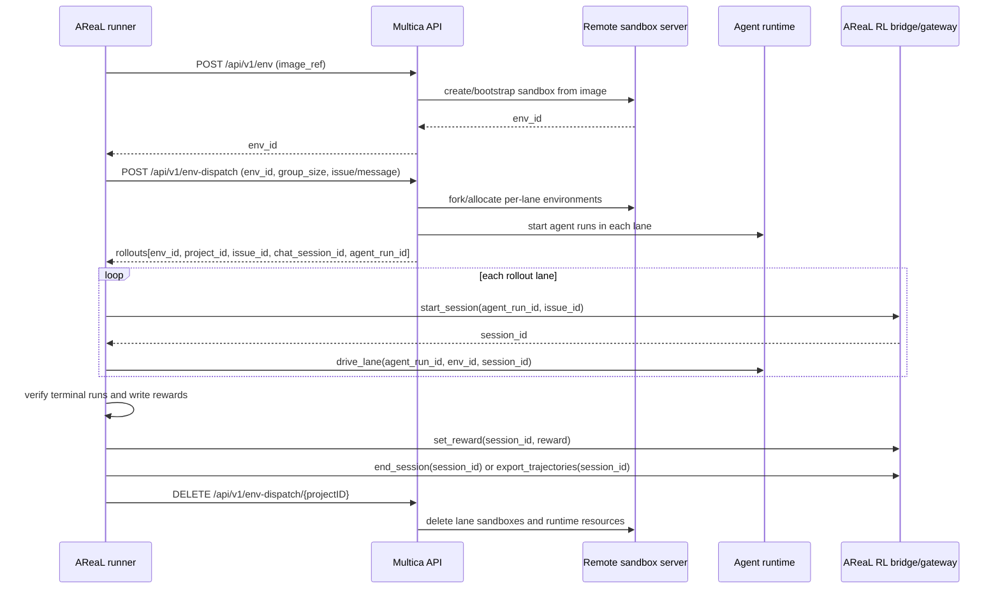
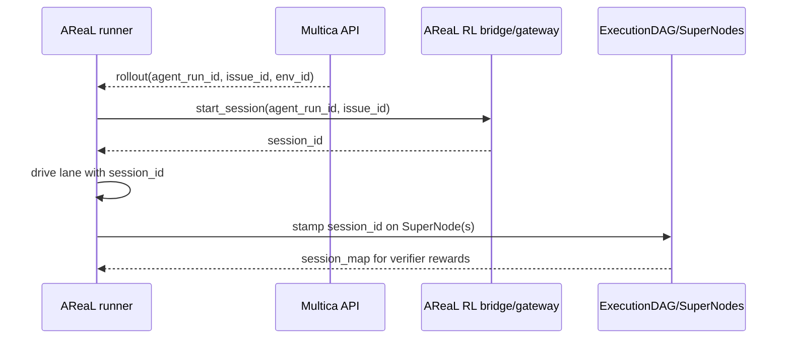
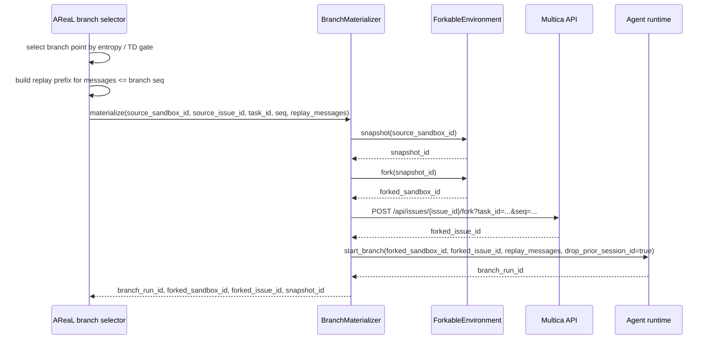

# AReaL, Multica, and Remote Sandbox Environment Protocol

This document explains how AReaL communicates with Multica for multi-agent DAG RL
rollouts, and how Multica saves/resumes execution environments by talking to the remote
sandbox server. The Python training side intentionally sees HTTP seams and small
protocols only; it does not import a sandbox-vendor SDK.

## Actors

| Actor | Responsibility |
| ----- | -------------- |
| AReaL trainer / tree-search agents | Starts rollout groups, opens RL sessions, records trajectories, selects branch points, asks Multica to materialize branches, verifies rewards, and cleans up. |
| Multica API | Owns env-dispatch, issue/chat/task orchestration, issue subtree forks, agent-run startup, and the mapping from rollout lanes to projects/issues/sandboxes. |
| Remote sandbox server / cloud runtime | Owns live sandbox lifecycle: create, snapshot, fork, restore, and delete. Multica calls this service; AReaL talks to it only through `ForkableEnvironment` providers when explicitly injected. |
| Agent runtime | Runs inside the allocated sandbox, emits messages/interactions, and carries RL session metadata used by AReaL. |

## Design Boundaries

- AReaL treats Multica as the orchestration authority for issues, projects, chat sessions,
  agent runs, and rollout groups.
- AReaL treats sandbox operations as a vendor-neutral `ForkableEnvironment` protocol:
  `snapshot`, `fork`, `restore`, and `cleanup`.
- Multica hides the concrete sandbox vendor behind its cloud-runtime endpoints. Today the
  remote side may be Daytona/Fleet-backed, but that detail must not leak into trainer
  code.
- Branch replay is transcript-based: AReaL supplies the replay prefix and requests a new
  branch run with prior session state dropped.

### Pipeline Notes

- `env_id` is the Multica-facing environment handle used for base and lane dispatch.
- `sandbox_id` is the remote runtime handle used for snapshot/fork/restore/delete.
- Fresh rollout state is created by env-dispatch; branch state is resumed from a sandbox
  snapshot plus replayed messages.
- The verifier writes rewards before trajectory harvest so AReaL never trains on an
  unrewarded terminal trajectory.
- Cleanup flows through Multica and/or `ForkableEnvironment`; `404` means the resource is
  already gone and is treated as success.

## AReaL -> Multica API Surface

`agents/swe_lego_client.py` wraps the unified env-dispatch API through
`MulticaEnvDispatchClient`.

| AReaL call | Multica endpoint | Purpose |
| ---------- | ---------------- | ------- |
| `create_base_env(image_ref=...)` | `POST /api/v1/env` | Boot a reusable base environment from an image reference; returns `env_id`. |
| `delete_env(env_id=...)` | `DELETE /api/v1/env/{envID}` | Delete a base environment; `404` is treated as already-cleaned-up. |
| `create_env_dispatch(...)` | `POST /api/v1/env-dispatch` | Create a rollout group from a base env. Supports SWE-Lego issues and self-play messages. |
| `cleanup_env_dispatch(project_id=...)` | `DELETE /api/v1/env-dispatch/{projectID}` | Cascade cleanup for one rollout project: issues, chat sessions, tasks, and associated runtime state. |

`create_env_dispatch` accepts these key fields:

| Field | Meaning |
| ----- | ------- |
| `mode` | Dispatch mode, usually `scratch` for fresh rollouts. |
| `env_id` | Base environment to clone/dispatch from. |
| `dispatch_type` | `issue` for SWE-Lego or `message` for self-play. |
| `group_size` | Number of rollout lanes to create. |
| `agent_id` | Agent/template to run in each lane. |
| `domain` | Optional domain label such as `swe_lego` or `self_play`. |
| `issue` / `message` | Domain payload. Exactly one is usually populated by the runner. |

The response is normalized into `SweLegoSetup(rollouts=[...])`. Each rollout contains:

| Field | Meaning |
| ----- | ------- |
| `env_id` | Runtime/sandbox environment ID assigned to this lane. |
| `project_id` | Multica project ID used for cleanup. |
| `issue_id` | Issue ID for issue-based runs; empty for message/self-play runs. |
| `chat_session_id` | Chat session created for the agent lane. |
| `agent_run_id` | Agent run started by Multica. |

## Fresh Rollout Lifecycle



The AReaL orchestration helpers are:

- `run_swe_lego_issue`: dispatches a SWE-Lego issue, starts one RL session per lane,
  drives branch-capable agent runs, verifies/rewards terminal runs, and always cleans up
  each `project_id`.
- `run_self_play`: same lifecycle, but dispatches a `query_bank` message with
  `domain=self_play` and `dispatch_type=message`.

## RL Session Start and End

RL sessions are the control-plane bridge between Multica agent runs and AReaL training
trajectories. Multica creates `agent_run_id`s during env-dispatch; AReaL then starts one
RL session for each run before driving the lane.

The runner protocols in `swe_lego_issue_runner.py` and `self_play_runner.py` model the
session starter as:

```python
class _RlSession(Protocol):
    async def start(self, *, agent_run_id: str, issue_id: str) -> str: ...
```

Expected call order:

1. Multica returns `agent_run_id` and `issue_id` in each env-dispatch rollout.
2. AReaL calls `rl_session.start(agent_run_id=..., issue_id=...)`.
3. The RL bridge returns `session_id`.
4. AReaL passes `session_id` into `branch_driver.drive_lane(...)` so trajectory capture,
   rewards, and later export are bound to the correct agent run.
5. `SuperNodeAssembler` stamps the `session_id` onto every `SuperNode` for that agent
   run. `ExecutionDAG.session_map()` exposes `{super_node_id: session_id}` to the
   verifier.



Ending a session has two supported paths:

| Path | Code | Calls | When used |
| ---- | ---- | ----- | --------- |
| Legacy finalizer | `RLSessionRewardWriter.finalize(...)` | `set_reward(session_id, reward)` then `end_session(session_id)` | Backward-compatible single-verifier flow. |
| Verifier harvest | `VerifierFinalizer.finalize(...)` | `set_reward(session_id, reward)` then `export_trajectories(session_id)` | Preferred multi-agent verifier flow; export is terminal and revokes the session. |

The reward-before-end/export ordering is mandatory. If `set_reward` fails, the legacy
writer deliberately does **not** call `end_session`; the session stays open so the caller
can retry and avoid losing the trajectory. In the harvest flow, rewards for all sessions
are written first, then each session is exported exactly once.

The verifier agent extension can also call the RL gateway directly:

| Verifier command | Gateway call | Effect |
| ---------------- | ------------ | ------ |
| `/rl/set_reward <session_id> <reward>` | `POST <gateway>/rl/set_reward` | Writes or overwrites the reward for one session. |
| `/export_trajectories <session_id>` | `POST <gateway>/export_trajectories` | Exports the reward-stamped trajectory and revokes the session. |

The Python finalizer remains authoritative for ordering: it writes rewards before any
export even if the verifier agent already issued `/rl/set_reward`.

## Environment Save and Resume

`agents/environment.py` defines the remote environment seam:

```python
class ForkableEnvironment(Protocol):
    async def snapshot(self, sandbox_id: str) -> SnapshotResult: ...
    async def fork(self, *, source_sandbox_id: str | None = None, snapshot_id: str | None = None) -> ForkResult: ...
    async def restore(self, sandbox_id: str) -> None: ...
    async def cleanup(self, sandbox_id: str) -> None: ...
```

Two provider implementations currently exist:

| Provider | Endpoint prefix | Intended use |
| -------- | --------------- | ------------ |
| `FleetSandboxProvider` | `/sandboxes/...` | Generic Fleet cloud-runtime proxy. Uses `FLEET_BASE_URL` / `FLEET_API_KEY`. |
| `MulticaSweLegoProvider` | `/api/v1/sandboxes/...` | Multica cloud-runtime proxy. Uses `MULTICA_BASE_URL` / `MULTICA_API_KEY`. |

The Multica-backed provider calls these endpoints:

| Operation | Endpoint | Request | Response |
| --------- | -------- | ------- | -------- |
| Snapshot | `POST /api/v1/sandboxes/{id}/snapshot` | Sandbox ID in path | `{ "snapshot_id": "..." }` |
| Fork | `POST /api/v1/sandboxes/fork` | `{ "snapshot_id": "..." }` or `{ "source_sandbox_id": "..." }` | `{ "sandbox_id": "..." }` |
| Restore | `POST /api/v1/sandboxes/{id}/restore` | Sandbox ID in path | `200` or `204` |
| Cleanup | `DELETE /api/v1/sandboxes/{id}` | Sandbox ID in path | `200`, `204`, or `404` |

`fork` requires exactly one source: either `snapshot_id` or `source_sandbox_id`. The
providers use a semaphore to cap concurrent forks; by default the cap comes from
`GROUP_SIZE`, falling back to `2`.

## Branch / Resume Lifecycle

Branching resumes work from a saved frontier. `agents/integration.py` implements this in
`BranchMaterializer`.



Resume has two parts:

1. **Environment resume**: the remote sandbox server creates a snapshot of the source
   sandbox and forks a new runnable sandbox from that snapshot.
2. **Task/message resume**: Multica forks the issue subtree at `(task_id, seq)`, then the
   branch starter binds the forked sandbox and forked issue, replays messages up to the
   selected sequence, drops `PriorSessionID`, and starts a new agent run.

The replay prefix is produced by `replay_prefix_for(...)` in `event_codec.py` from the
completion-ordered `SuperNode` log. This keeps branch restart deterministic from AReaL's
point of view: the environment state comes from the sandbox snapshot, while the agent
conversation state comes from replayed messages.

## Rollback and Cleanup Rules

Branch materialization is staged so partial failures do not leak remote resources:

| Failure point | Rollback action |
| ------------- | --------------- |
| Snapshot fails | Nothing was allocated; raise `SnapshotError`. |
| Sandbox fork fails | Snapshot can be garbage-collected by the remote service; raise `ForkError`. |
| Issue fork fails after sandbox fork | Delete the forked sandbox with `env.cleanup(...)`. |
| Branch start fails after sandbox + issue fork | Delete the forked sandbox and delete the forked issue. |

Cleanup is intentionally idempotent:

- Sandbox cleanup treats `404` as success.
- Issue fork delete treats `404` as success.
- Env-dispatch cleanup treats `404` as success.
- Cleanup failures during rollback are logged and not allowed to hide the original
  branch-materialization failure.

## ID Flow Summary

| ID | Produced by | Consumed by | Purpose |
| -- | ----------- | ----------- | ------- |
| `env_id` | Multica env/env-dispatch | AReaL runners, branch drivers | Identifies a base or lane environment. |
| `sandbox_id` | Remote sandbox server / Multica runtime | `ForkableEnvironment`, branch starter | Identifies a live sandbox to snapshot, fork, restore, or delete. |
| `snapshot_id` | Remote sandbox server | `fork(snapshot_id=...)` | Durable save point for resuming a branch. |
| `project_id` | Multica env-dispatch | Cleanup calls | Groups rollout resources for cascade deletion. |
| `issue_id` | Multica issue dispatch/fork | Issue fork and verifier flows | Identifies the original or forked issue subtree. |
| `agent_run_id` | Multica agent runtime | RL session start, lane driver, verifier | Identifies one agent execution lane. |
| `session_id` | RL bridge/session service | Lane driver, `SuperNodeAssembler`, verifier/reward writer/trajectory harvest | Binds rewards and exported trajectories to one agent run. |

## Current Integration Status

The torch-free `agents/` modules define and test the Multica communication contracts and
cloud branch helpers. The live `TreeSearchGroupedRolloutWorkflow` still uses the legacy
single-agent TPFC branch path (`build_branch_task`) unless a future coordinator wires
`multica_dag_enabled` / `multica_dag_client` into the episode loop. The shared
`SuperNode` store path is already active because single-agent episodes are wrapped as
leaf `SuperNode`s before insertion into `MCTSTreeStore`.
