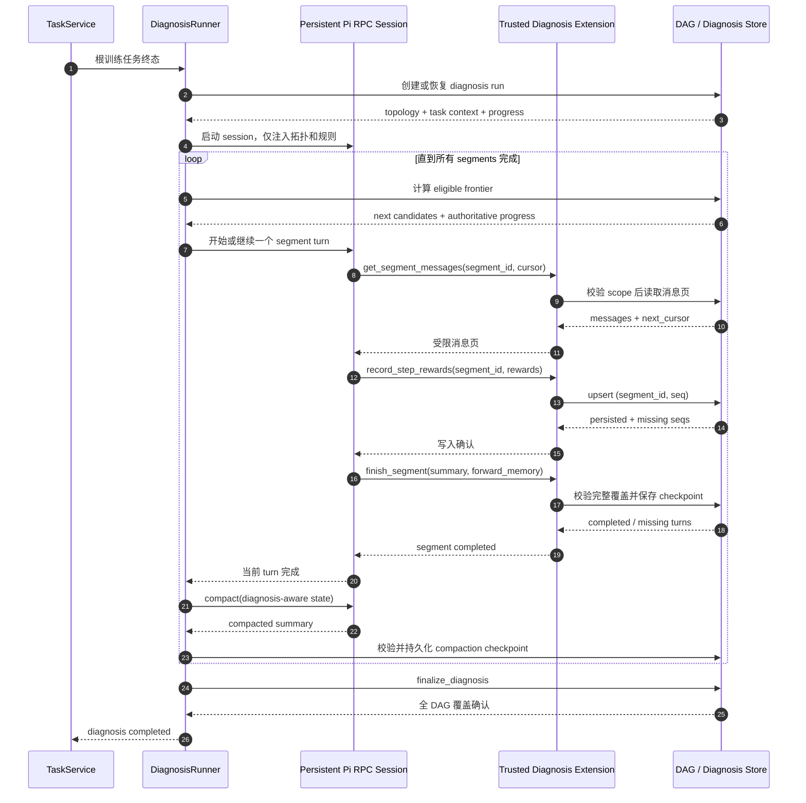

# Multica Diagnosis Agent 按需取证与逐 Segment 压缩设计

日期：2026-07-22

状态：待用户审阅

## 1. 背景

当前 `DiagnosisAgentRunner` 在根训练任务进入终态后，把任务上下文、segment DAG、每个 segment 的消息一次性编码为 JSON prompt，再调用 Pi agent 生成逐 LLM 输出的 `StepReward`。为限制 prompt，现实现最多保留 10 个 segments，goal 和 gold context 各限制为 8 KiB，整体 payload 限制为 64 KiB；超过限制时从尾部删除 segments。

这种方式有两个问题：

1. 大 DAG 会产生较大的初始上下文。
1. 被裁掉的 segment 无法获得 step reward，AReaL 最终只能把对应 `SuperNode.process_reward` 保持为 `0.0`。

本设计把 diagnosis agent 改为一个持久 Pi RPC session。Pi 初始只接收任务上下文和 DAG 拓扑，通过受限工具按需读取 segment 消息，评分后立即将 reward 写入 Multica。每完成一个 segment，Pi 保存面向后续评分的结构化记忆，随后强制压缩上下文，再处理下一个 segment。

## 2. 目标

- 一个项目的诊断由单个持久 Pi session 完成。
- 初始 prompt 不包含 segment 消息正文。
- Pi 可以按 DAG 依赖关系读取所有 segments，并为每个 assistant/LLM 输出评分。
- Step reward 增量、幂等地写入 Multica，不依赖最终一次性输出。
- 每完成一个 segment 都压缩一次，活动上下文不随 segment 数量线性增长。
- 压缩保留评分标尺、跨 segment 因果关系、未解决问题和后续评分所需事实。
- 诊断可从 Pi、网络或进程故障中恢复，不重复破坏已写入的结果。
- Pi 只能使用诊断专用工具，不能访问 shell、文件系统或任意 Multica API。

## 3. 非目标

- 不改变 AReaL 的 `/dag` 读取协议和 `process_reward` 聚合公式。
- 不改变 scalar critic 的行为；diagnosis agent 仍是独立的 whole-project step reward 路径。
- 不让 Pi 修改 segment、edge 或其他 DAG 结构。
- 不允许 diagnosis agent 创建任务、发送消息或调用外部网络。
- 第一版不并行处理多个 segments；单 session 按顺序处理，以保持评分校准一致。

## 4. 核心决策

### 4.1 一个持久 session，多个 segment turns

一个项目只创建一个 Pi RPC 子进程和 session 文件。每个 segment 对应一个独立 Pi turn：

1. Multica 提示 Pi 从 eligible frontier 选择或继续一个 segment。
1. Pi 分页读取该 segment 的消息。
1. Pi 为读取到的 assistant turns 增量写入 reward。
1. Pi 调用 `finish_segment` 提交 segment summary 和 forward memory。
1. 服务端验证该 segment 的所有应评分 turns 已覆盖。
1. 当前 turn 结束。
1. Multica 对同一个 Pi session 执行 diagnosis-aware compaction。
1. Multica 校验 checkpoint，然后启动下一个 turn。

这样保持“同一个 Pi agent 持续理解整个协作过程”，同时把压缩放在稳定的 turn 边界，避免在工具执行中途改变上下文。

### 4.2 每个 segment 后强制压缩

压缩策略固定为：

```text
compaction_policy = after_every_segment
```

不使用 60% 或 70% 作为正常触发阈值。每个 segment 成功完成并落库后都执行压缩，无论当前 context usage 是多少。

保留一个 80% 紧急保护：如果单个超大 segment 在分页处理中就把上下文推到 80%，Pi 必须在消息页边界保存部分评分与 partial checkpoint，结束当前 turn，压缩后继续同一个 segment。正常路径不会在 segment 中间压缩。

为避免 Pi 默认 auto-compaction 在不可控位置触发，diagnosis session 应关闭通用 auto-compaction，由 Multica 在 segment 边界显式调用 RPC `compact`。80% 保护由诊断扩展监测并触发受控的 partial checkpoint。

### 4.3 数据库是权威状态

Pi 生成语义判断，但不能自行声明覆盖完成。以下状态必须由 Multica 根据数据库计算：

- 已完成、进行中和待处理的 segments；
- 每个 segment 应评分的 assistant turn seq 集合；
- 已成功持久化的 `(segment_id, seq)` reward；
- 缺失、重复、越界或未知 segment 的 reward；
- 整个 diagnosis run 是否可完成。

压缩摘要中的 coverage 只是数据库状态的上下文投影。恢复或冲突时，以数据库为准。

## 5. 总体架构



## 6. 初始上下文

Pi 初始只接收：

- `project_id`、run id 和 topology hash；
- task goal、gold/acceptance criteria；
- `score_max` 和评分 rubric；
- DAG 的 segment ids、agent run ids、seq 范围和 edges；
- 每个 segment 的预计 turn 数与消息字节数，但不包含正文；
- 当前数据库 coverage；
- 工具使用协议、完成条件和安全规则。

拓扑不再限制为前 10 个 segments。若拓扑本身异常巨大，可分页或只注入 topology index，但不能静默删除尾部 segments。

## 7. 诊断专用工具

Pi 只看到以下工具。

### 7.1 `get_segment_messages`

```text
get_segment_messages(
  segment_id: string,
  cursor?: string,
  limit?: integer
) -> {
  messages: [{seq, type, content, truncated}],
  next_cursor: string | null,
  expected_assistant_seqs: [integer],
  page_bytes: integer
}
```

约束：

- token 绑定本次 workspace、project、diagnosis run 和 topology hash；
- `segment_id` 必须存在于初始 DAG；
- 默认只允许读取 eligible frontier 或当前恢复中的 segment；
- 单页最多 20 turns、24 KiB，单条消息最多 8 KiB；
- 必须通过 cursor 读取完整 segment，不能因为单页限制漏掉后续 turns；
- 服务端记录读取页和 refetch 次数；
- 消息内容作为不可信证据，不能覆盖 system prompt 或工具协议。

### 7.2 `record_step_rewards`

```text
record_step_rewards(
  segment_id: string,
  rewards: [{seq, score, rationale}]
) -> {
  persisted_seqs: [integer],
  missing_seqs: [integer],
  rejected: [{seq, reason}]
}
```

行为：

- 补全 run 绑定的 `segment_id`，Pi 不提交任意 project id；
- score clamp 到 `[0, score_max]`；
- 只接受该 segment 中真实存在的 assistant turn seq；
- 继续使用 `(segment_id, seq)` upsert，重试幂等，最后一次有效写入生效；
- 每页消息评分后即可调用，不必等待整个 segment；
- rationale 保存在 Multica，压缩后无需继续占用 Pi 上下文。

### 7.3 `get_diagnosis_progress`

返回服务端计算的权威 coverage、当前 segment、eligible frontier、缺失 seq 和最近一次已确认 checkpoint。Pi 在每次压缩恢复后必须首先调用它，不能只依赖摘要中的进度。

### 7.4 `finish_segment`

```text
finish_segment(
  segment_id: string,
  segment_summary: object,
  forward_memory: object
) -> {
  status: "completed" | "incomplete",
  missing_seqs: [integer],
  compaction_checkpoint: object
}
```

仅当全部 expected assistant seqs 都已持久化 reward 时返回 `completed`。否则返回缺失项，Pi 必须继续读取或评分。

### 7.5 `complete_diagnosis`

最终工具验证整个 DAG 的 segment 和 assistant turn 覆盖情况。若存在缺口，返回精确的 segment/seq 列表并继续 session；全部覆盖时才将 run 标为 completed。

## 8. 诊断状态存储

现有 `interaction_dag_step_reward` 继续保存逐 turn reward。新增持久状态需要表达 run 和 segment 两个层次。

### 8.1 Diagnosis run

建议新增 `interaction_dag_diagnosis_run`：

- `project_id` / `workspace_id`；
- `status`: pending、running、compacting、completed、failed；
- `topology_hash`；
- `pi_session_id`；
- `current_segment_id`；
- `compaction_index`；
- `diagnosis_memory` JSONB；
- `last_error`；
- `created_at` / `updated_at` / `completed_at`。

### 8.2 Segment diagnosis state

建议新增 `interaction_dag_segment_diagnosis`：

- `segment_id`；
- `project_id`；
- `status`: pending、in_progress、completed；
- `expected_assistant_seqs`；
- `persisted_assistant_seqs`；
- `last_cursor`；
- `segment_summary` JSONB；
- `forward_memory` JSONB；
- `compaction_index`；
- timestamps。

这些表保存恢复和完整性信息；实际训练 reward 仍只从 `interaction_dag_step_reward` 读取。

## 9. 压缩摘要

### 9.1 三层记忆

1. **权威层**：Multica DB 中的 step rewards、coverage、segment completion。
1. **活动层**：压缩摘要，保留未来评分需要的任务理解、评分校准和跨 segment 状态。
1. **冷证据层**：原始 segment messages；压缩后移出上下文，发生冲突时可受限 refetch。

### 9.2 摘要结构

```json
{
  "schema_version": "diagnosis_compaction.v1",
  "run": {
    "project_id": "project-id",
    "topology_hash": "hash",
    "score_max": 10,
    "compaction_index": 3,
    "last_completed_segment": "s3"
  },
  "task_understanding": {
    "goal": "任务核心目标",
    "acceptance_criteria": ["验收条件"],
    "known_constraints": ["约束"]
  },
  "scoring_calibration": {
    "rubric": {"0": "无贡献", "5": "有效推进", "10": "决定性贡献"},
    "positive_anchors": [
      {"segment_id": "s2", "seq": 8, "score": 9, "reason": "确认根因"}
    ],
    "negative_anchors": [],
    "calibration_notes": ["不要把表达长度当作贡献"]
  },
  "coverage": {
    "completed_segments": ["s1", "s2", "s3"],
    "current_segment": null,
    "eligible_frontier": ["s4"],
    "pending_segments": ["s4", "s5"],
    "missing_turns": []
  },
  "processed_segment_memory": [
    {
      "segment_id": "s3",
      "objective": "验证实现方案",
      "outcome": "方案 B 通过验证",
      "useful_contributions": ["发现约束 X"],
      "errors_or_dead_ends": ["否定假设 Y"],
      "facts_needed_later": ["s5 必须满足约束 X"],
      "notable_turns": [{"seq": 7, "score": 8, "reason": "定义验收标准"}],
      "confidence": "high"
    }
  ],
  "cross_segment_state": {
    "causal_links": [
      {"from": "s1:7", "to": "s3:7", "relation": "enabled", "fact": "定义验证标准"}
    ],
    "dependencies": [],
    "conflicts": [],
    "credit_attribution": []
  },
  "forward_relevance": {
    "facts_to_carry": [
      {"fact": "接口必须向后兼容", "relevant_to": ["s5"], "expires_after": "s5"}
    ],
    "open_questions": [],
    "hypotheses": [],
    "next_read_plan": [{"segment_id": "s4", "reason": "eligible frontier"}]
  },
  "integrity": {
    "server_confirmed": true,
    "segments_requiring_recheck": [],
    "unknown_rewards_dropped": []
  },
  "discard_manifest": {
    "safe_to_forget": ["s3 原始消息和已落库逐字 rationale"],
    "refetch_if_needed": []
  }
}
```

### 9.3 摘要生成与合并

Pi 在 `finish_segment` 时负责生成语义字段：

- segment objective、outcome 和关键贡献；
- 错误、死路和冲突；
- 对后续 segments 有用的事实；
- 跨 segment 因果关系和信用归属；
- open questions、hypotheses 和下一步读取建议。

Multica 负责覆盖并签名权威字段：

- topology hash；
- completed/current/pending segments；
- missing turns；
- persisted reward 边界；
- compaction index 和 server-confirmed 标志。

诊断扩展在 `session_before_compact` 中使用这个合并后的 checkpoint 生成自定义 compaction summary。不得让通用摘要模型重新猜测 coverage 或重写已确认的分数。

### 9.4 摘要淘汰规则

- 已落库的完整逐 turn score/rationale 不保留在活动摘要中。
- 已结束且不再影响未来的 segment 只保留一行 outcome。
- `facts_to_carry` 在 `expires_after` segment 完成后移除。
- 尚未解决的冲突、依赖和评分 calibration anchors 不得因压缩删除。
- 若后续证据与摘要冲突，Pi 必须 refetch 原始 segment，而不是只修改摘要记忆。

## 10. Pi 执行隔离

直接去掉 `--no-tools` 会重新暴露 Pi 的完整工具集，不可接受。Diagnosis session 应使用 restricted profile：

- `DisableTools=true`，关闭自动发现的 extensions、skills、prompt templates、context files 和内置 tools；
- 显式加载一个由 Multica 生成或安装的 trusted diagnosis extension；
- agent backend 新增受控的 trusted extension 传入机制，不能让普通 `CustomArgs` 绕过 restricted profile；
- extension 只注册本设计中的五个工具；
- 工具通过 loopback-only endpoint 与 Multica 通信；
- credential 使用短期、单 run capability token，通过环境变量传递，不出现在 prompt、命令行和日志中；
- token 绑定 workspace、project、topology hash 和允许的工具集合，并在 session 关闭时失效。

## 11. 遍历和信用分配

服务端根据已完成父节点计算 eligible frontier。Pi 可以在 frontier 中选择下一个 segment，但不能读取尚未满足依赖的 segment，除非恢复或显式 refetch。

默认使用稳定拓扑顺序作为 tie-breaker，保证重试和测试可复现。压缩摘要保留 causal links 与 credit attribution，避免把最终输出的全部信用错误地分配给最后一个 agent，而忽略前序发现、验证或任务拆分的贡献。

## 12. 错误与恢复

### 12.1 工具或数据库错误

- reward 写入失败时，`record_step_rewards` 返回失败，Pi 不得调用 `finish_segment`。
- 重试使用相同 `(segment_id, seq)` key，upsert 保证幂等。
- 连续失败超过 runner 限制时 run 标为 failed，但不阻塞根任务原有 close path。

### 12.2 Pi 进程退出或超时

- 已持久化 reward 和 segment checkpoints 保留。
- runner 关闭旧 capability token。
- 若 session 文件可安全恢复，则恢复同一 Pi session；否则启动新 session，并从 DB 生成完整压缩摘要作为初始记忆。
- `get_diagnosis_progress` 返回 current segment 与 missing seq，避免重复评分完整 segment。

### 12.3 压缩失败

- run 保持 `compacting` 或回退为 `running`，不启动下一个 segment。
- 原始 session 尚未删除；可以重试 compaction。
- 只有 compaction checkpoint 写入成功并通过 schema/coverage 校验后，才能进入下一 turn。

### 12.4 单个超大 segment

- 消息始终分页读取和评分。
- context usage 达到 80% 时，在页边界保存 partial cursor、已评分 seq 和 forward memory。
- 当前 turn 结束并压缩，然后恢复同一 segment。
- `finish_segment` 仍必须等到所有 assistant seq 完整覆盖后才能成功。

### 12.5 最终完整性失败

`complete_diagnosis` 返回缺失的 segment/seq，Pi 回到对应 segment 补齐。达到总超时仍无法覆盖时，保持已产生的稀疏 rewards，run 标为 failed，并沿用现有 soft-fail 语义继续训练 session 关闭流程。

## 13. 配置

建议新增 Multica 配置：

```text
DIAGNOSIS_AGENT_COMPACTION_POLICY=after_every_segment
DIAGNOSIS_AGENT_HARD_CONTEXT_PERCENT=80
DIAGNOSIS_AGENT_MESSAGE_PAGE_TURNS=20
DIAGNOSIS_AGENT_MESSAGE_PAGE_BYTES=24576
DIAGNOSIS_AGENT_MAX_REFETCHES_PER_SEGMENT=2
DIAGNOSIS_AGENT_MAX_RUN_TIMEOUT_SECONDS=<value>
```

第一版只支持 `after_every_segment`，字段保留策略名是为了可观测性和未来迁移，不在第一版实现其他模式。

## 14. 观测性

每个 diagnosis run 记录：

- project/run/session id；
- segment started/completed；
- message pages 和 refetch 次数；
- persisted/missing/rejected reward 数量；
- compaction index、tokens before/after、持续时间和失败原因；
- 每 segment 评分耗时与总诊断耗时；
- 恢复次数和最终 coverage 百分比。

日志不能包含 capability token、完整消息正文或未脱敏 rationale。

## 15. 测试策略

### 15.1 单元测试

- 工具 workspace/project/topology scope 校验；
- cursor 分页覆盖全部 messages；
- step reward clamp、unknown seq rejection 和 upsert 幂等；
- `finish_segment` 拒绝缺失 assistant seq；
- diagnosis memory schema 合并时服务端字段覆盖 Pi 字段；
- expired forward facts 淘汰，未解决依赖保留；
- restricted Pi args 只加载 trusted extension；
- compaction 每个 completed segment 恰好触发一次。

### 15.2 状态机测试

- 正常多 segment DAG：读、评、存、压缩、继续、完成；
- segment 中途写入失败并重试；
- compaction 失败后不进入下一个 segment；
- Pi crash 后从 DB checkpoint 恢复；
- 80% 紧急保护下同一 segment 分两次处理；
- finalization 发现缺失 turn 后返回补齐；
- diagnosis 最终失败仍不阻塞原有 RL close hook。

### 15.3 集成测试

使用 fake Pi RPC 和真实 extension 协议验证：

- 单一子进程和 session 被多个 turns 复用；
- 每个 segment 后发送一次 RPC compact；
- 压缩后旧 tool results 不再进入下一次 provider request；
- 活动摘要包含服务端确认的 coverage 和前序 forward memory；
- `/dag` 返回全部持久化 step rewards，AReaL 聚合公式不变。

## 16. 实现影响面

主要涉及：

- `multica/server/internal/service/diagnosis_agent.go`：runner 改为持久 session 状态机；
- `multica/server/internal/service/diagnosis_tools.go`：内部 helpers 扩展为分页、coverage 和 checkpoint seams；
- `multica/server/internal/service/interaction_dag.go`：run/segment 状态与 reward 完整性；
- `multica/server/pkg/agent/pi_rpc.go`：受控 compact、auto-compaction 配置和 diagnosis session surface；
- `multica/server/pkg/agent/pi.go`：restricted profile 下显式 trusted extension；
- Multica migrations/queries：diagnosis run 与 segment checkpoint；
- diagnosis extension：五个受限工具和 custom compaction hook；
- 现有 `/dag` 与 AReaL `MulticaDagClient`/`SuperNodeAssembler`：协议保持兼容，主要增加覆盖测试。

## 17. 验收标准

1. 初始 Pi provider request 不含任何 segment 消息正文。
1. 一个普通项目仅创建一个 Pi RPC session，并跨 segment turns 复用。
1. 每个 completed segment 后恰好执行一次受控 compaction。
1. 每个 assistant turn 的 reward 在处理期间增量写入 Multica。
1. 压缩后的活动上下文不包含已完成 segment 的原始 tool result，只包含结构化 diagnosis memory。
1. 数据库 coverage 不完整时，segment 或 run 无法标记 completed。
1. Pi crash、写入重试和 compaction 重试不会生成重复 reward 行或错误推进进度。
1. Pi 无法调用 diagnosis tools 以外的工具，也无法跨 workspace/project 读取消息。
1. `/dag` 和 AReaL reward 聚合保持向后兼容。
1. diagnosis 失败仍遵循 best-effort soft-fail，不阻塞训练任务终态处理。
